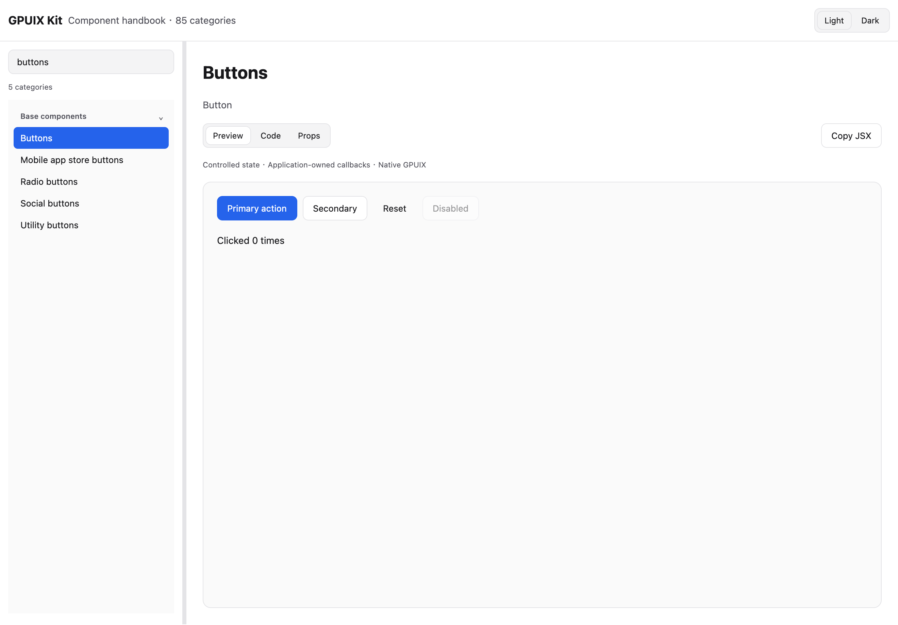

# GPUIX Kit

A native UIKit for GPUIX, with Darwin-inspired light and dark themes. Build native applications with Bun and React using one public package.

**v0.20.0: installable release assets, two standalone starters, and a searchable component handbook.**

[中文](README.md) · [Quick start](docs/getting-started.md) · [Component handbook](docs/components/index.md) · [Release](https://github.com/leyugod/GPUIX-Kit/releases/tag/v0.20.0) · [API index](docs/api-index.md)

## Start an application

Download the [minimal starter](https://github.com/leyugod/GPUIX-Kit/releases/download/v0.20.0/gpuix-kit-minimal-0.20.0.tar.gz) or [Apple-style sidebar starter](https://github.com/leyugod/GPUIX-Kit/releases/download/v0.20.0/gpuix-kit-sidebar-0.20.0.tar.gz). Extract, then run:

```sh
bun install --frozen-lockfile
bun run dev
```

Edit `src/app.tsx`. Each release archive includes the UIKit tarball and a dependency lockfile; no workspace checkout is required.

## Install into an existing application

```sh
bun add https://github.com/leyugod/GPUIX-Kit/releases/download/v0.20.0/mirai-gpuix-kit-0.20.0.tgz
bun add @gpuix/react@0.7.0 react@19.2.4
```

```tsx
import { UIKitProvider, AppShell, Button, Input, SourceListSidebar } from "@mirai/gpuix-kit";
```

Set `jsx: "react-jsx"`, `jsxImportSource: "@gpuix/react"`, and `moduleResolution: "Bundler"` in your tsconfig. Render components inside `UIKitProvider` and `AppShell`. No CSS or DOM runtime is required. The package is distributed through GitHub Releases; it is not published to npm.

## Browse the library

The [handbook](docs/components/index.md) covers 30 base, 37 application and 18 marketing categories with runnable examples, light/dark previews and Props extracted from the public TypeScript API. Supporting primitives, models and adapters appear in the full API index.

Run `bun install --frozen-lockfile` and `bun run dev` in this repository for searchable native previews, Code/Props tabs, theme switching and Copy JSX on macOS. Historical galleries remain under their existing `dev:*` commands; `dev:legacy` opens the original base gallery.



## Scope

The kit provides UI components, pure models and adapter interfaces. Applications own state, persistence, accounts, network services and platform capabilities. Category coverage does not claim parity with every commercial variation or browser behavior.

Validated on macOS ARM64, Bun 1.4.2, GPUIX/native 0.7.0 and React 19.2.4. Windows/Linux, IME composition, screen readers and full native vibrancy remain unverified or unsupported. See [release validation](docs/releases/validation-0.20.0.md), [compatibility](docs/compatibility.json) and [third-party notices](THIRD_PARTY_NOTICES.md).

Run `bun run check`, `bun run test:native:all`, `bun run test:starters`, `bun run test:live:handbook`, `bun run test:package` and `bun run test:source` for the documented verification flow.
