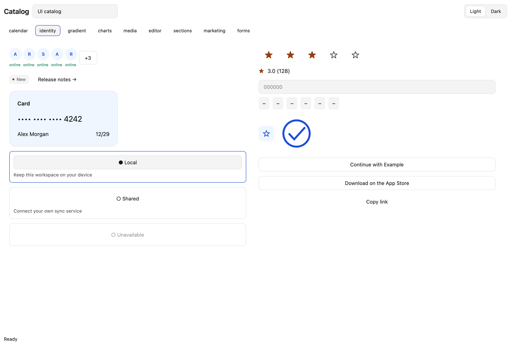
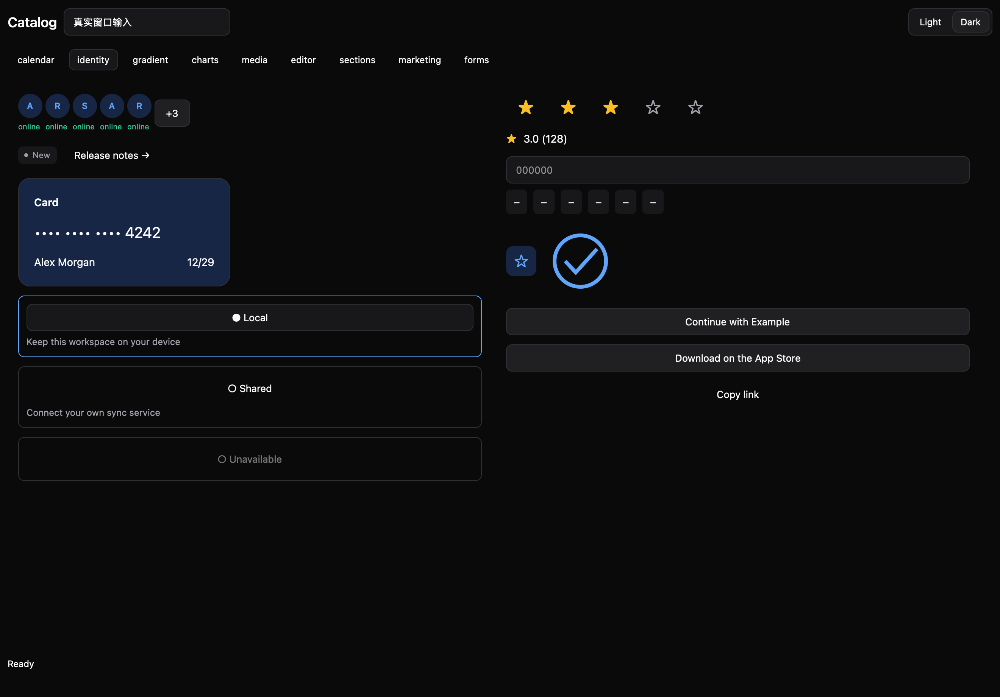
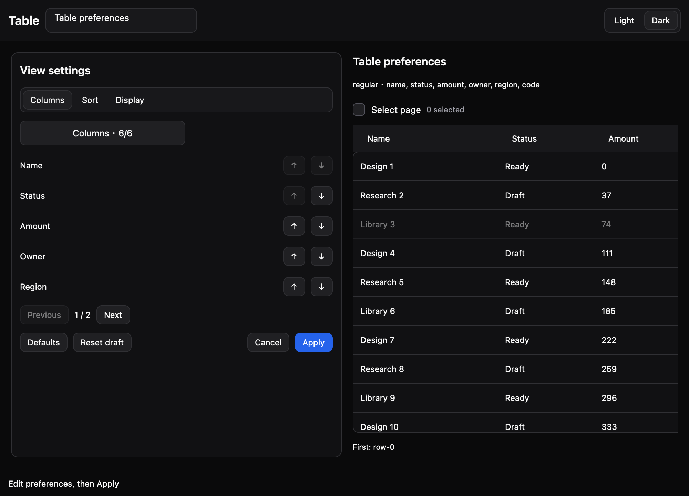
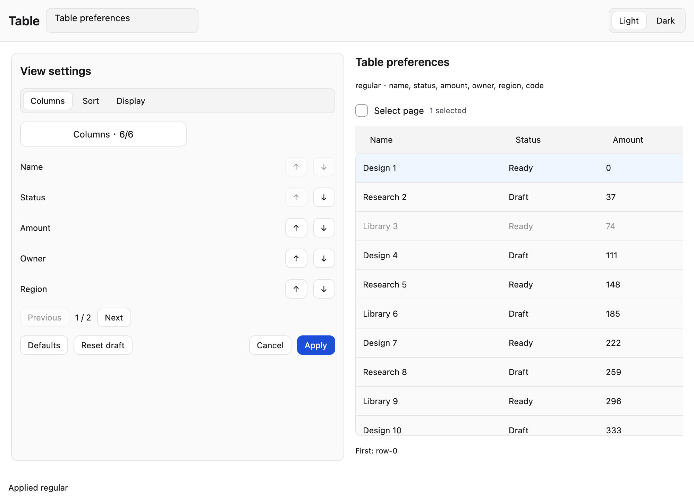

# gpuixKit

**当前 v0.19.0：85 类 UI 目录对应的原生封装与适配接口已完成本地验收。**

[English](README.en.md) · [首版组件清单](docs/releases/0.19.0.md) · [API 索引](docs/api-index.md) · [验收记录](docs/releases/validation-0.19.0.md) · [发布流程](docs/releasing.md)

178 个纯规则测试、57 个原生脚本、真实窗口、独立安装包和源码归档复验通过。官方仓库为 [leyugod/GPUIX-Kit](https://github.com/leyugod/GPUIX-Kit)，npm 尚未发布。远端 CI 结果见仓库 Actions。

首个 GitHub 开源版本只交付组件、纯模型、适配接口、文档与示例；数据库、登录、邮件、云存储等业务服务由使用方提供。见[首版范围与验收](docs/plans/first-open-source-release.md)。高级 UI 能力继续按组件路线推进。

独立的 GPUIX 原生 UIKit 工程。可复用包 `@mirai/gpuix-kit` 与独立组件展示应用共存于 Bun Workspace。

参考 [Untitled UI 的分层组织](https://www.untitledui.com/react/docs/introduction) 和 [Darwin UI 的组件与深浅视觉设计](https://github.com/surajmandalcell/darwin-ui)，使用 [GPUIX](https://gpuix.dev/) 原生元素实现。

[Untitled UI 逐项目录映射](docs/untitled-ui-coverage.md) · [新增组件 API](packages/uikit/docs/catalog-completion.md)




## 运行

```sh
bun install --frozen-lockfile
bun run dev:catalog # 官网目录补齐组件 Gallery
bun run dev:table-prefs # v0.18 列显隐/顺序、三层排序与显示密度
bun run dev           # 原基础组件 Gallery
bun run dev:desktop   # v0.2 桌面导航/分栏/命令/选择器 Gallery
bun run dev:workbench # v0.3 数据/树/文档/表单/内容工作台
bun run dev:studio    # v0.4 图表/活动/消息/仪表盘与窗口端口
bun run dev:controls  # v0.5 滑块/日历/日期范围选择
bun run dev:choices   # v0.6 三态选择/批量选择/标签输入
bun run dev:time      # v0.7 时间输入/分页列表/弹出选择
bun run dev:tracks    # v0.8 滑块轨道点击/刻度/只读
bun run dev:filters # v0.17 筛选条件、草稿与保存视图
bun run dev:collections # v0.16 集合、异步列表与懒加载树
bun run dev:sidebars  # v0.15 Apple 风格来源侧栏与两栏/三栏
bun run dev:modals    # v0.14 对话框、Sheet/Drawer 与任务面板
bun run dev:tokens    # v0.13 标签建议、改名与草稿选择
bun run dev:notifications # v0.12 通知队列、撤销与任务进度
bun run dev:colors    # v0.11 颜色输入、调色板与选择器
bun run dev:actions   # v0.10 动作组、工具栏、路径与工作区/账户菜单
bun run dev:dates     # v0.9 月/年、双月日历与范围工作流
```

展示应用含 Overview、Form controls、Data display、Layout & navigation、Feedback & overlays 五个页面。右上角实时切换 Light / Dark；所有展示操作仅修改内存。

```sh
bun run test:native:all # 顺序执行全部 57 个原生 TestRenderer 脚本
bun run check:catalog # 85 类组件映射与公开导出检查
bun run test:catalog:states
bun run test:live:catalog
bun run test:table-prefs # 表格偏好完整交互
bun run test:table-prefs:narrow
bun run test:table-prefs:states
bun run test:live:table-prefs
bun run docs:api:check # 检查 API 索引
bun run check:release-source # 开源源码清单与边界审计
bun run release:source # 生成源码归档及 SHA-256 清单
bun run check          # 类型、包边界、纯规则
bun run test:ui        # 原生 TestRenderer：交互与深浅截图
bun run test:ui:narrow # 1000×720 窄窗口
bun run test:desktop   # 首批桌面组件原生交互
bun run test:desktop:narrow # 桌面组件窄窗口
bun run test:desktop:states # 加载/空/禁用与嵌套交互
bun run test:filters # 筛选与保存视图完整操作
bun run test:filters:narrow # 深浅主题窄窗口
bun run test:filters:states # 类型、分页、草稿、异步与焦点
bun run test:live:filters # 真实 macOS 窗口
bun run test:collections # 集合与树、状态、键盘与主题
bun run test:collections:narrow # 窄窗口
bun run test:collections:states # 异步、版本、选择与焦点
bun run test:live:collections # 真实 macOS 窗口
bun run test:sidebars # 来源导航、动作和分栏宽度
bun run test:sidebars:narrow # 深浅色窄窗口
bun run test:sidebars:states # 集合边界、滚动、焦点与紧凑布局
bun run test:live:sidebars # 真实 macOS 窗口
bun run test:modals # 六个对话与面板组件
bun run test:modals:narrow # 深浅色窄窗口
bun run test:modals:states # 异步、嵌套、焦点与尺寸
bun run test:live:modals # 真实 macOS 窗口
bun run test:tokens # 六个标签建议/编辑组件
bun run test:tokens:narrow # 深浅色窄窗口
bun run test:tokens:states # 身份、保护、草稿与焦点
bun run test:live:tokens # 真实 macOS 窗口
bun run test:notifications # 七个通知/任务组件
bun run test:notifications:narrow # 深浅色窄窗口
bun run test:notifications:states # 计时、异步、键盘与受控状态
bun run test:live:notifications # 真实 macOS 窗口
bun run test:colors # 六个原生颜色组件
bun run test:colors:narrow # 深浅色窄窗口
bun run test:colors:states # 草稿、分页、Tab 和拖动取消
bun run test:live:colors # 真实颜色窗口
bun run test:actions # 六组件原生交互和菜单分页
bun run test:actions:narrow # 动作组合窄窗口
bun run test:actions:states # 禁用/加载/动态集合/嵌套焦点
bun run test:live:actions # 真实 macOS 窗口
bun run test:dates # 日期导航/双月/范围草稿与提交
bun run test:dates:narrow # 日期组合窄窗口
bun run test:dates:states # 年份边界、外部值、焦点与禁选范围
bun run test:live:dates # 日期展示真实窗口
bun run test:tracks # 轨道点击/刻度/范围拇指
bun run test:tracks:narrow # 刻度窄窗口
bun run test:tracks:states # 上限、只读、受控与标签布局
bun run test:live:tracks # 刻度真实 macOS 窗口
bun run test:time # 时间草稿/提交/步进/分页/弹层
bun run test:time:narrow # 时间控件窄窗口
bun run test:time:states # 空/错误/只读/禁用与嵌套焦点
bun run test:live:time # 时间控件真实 macOS 窗口
bun run test:choices # 三态选择与标签交互
bun run test:choices:narrow # 标签与选择窄窗口
bun run test:choices:states # 保护状态、原子校验与焦点顺序
bun run test:live:choices # 真实 macOS 窗口
bun run test:controls # 滑块/日历/日期弹层交互
bun run test:controls:narrow # 控件窄窗口
bun run test:controls:states # 非法参数、边界与嵌套焦点
bun run test:live:controls # 控件真实 macOS 窗口
bun run test:studio    # 第三批图表与消息交互
bun run test:studio:narrow # Studio 窄窗口
bun run test:studio:states # 无效数据、附件、提交失败与锁
bun run test:live:studio # Studio 真实 macOS 窗口
bun run test:workbench # 第二批工作台交互
bun run test:workbench:narrow # 工作台窄窗口
bun run test:workbench:states # 提交失败、加载和焦点等状态
bun run test:live:workbench # 工作台真实 macOS 窗口
bun run test:live:desktop # 新 Gallery 真实窗口验证
bun run test:live      # 真实 macOS 窗口输入与截图
bun run test:package   # 外部临时项目安装 tgz、类型检查、原生渲染
bun run pack           # 本地 tgz，不发布 npm
```

原生测试需要 macOS 图形服务权限。依赖固定 GPUIX 0.7.0 / React 19.2.4。不要使用 live simulateClick；真实窗口另行验证启动、输入与截图。

## 复用

其他 GPUIX 项目只需复制 packages/uikit 到自己的 Workspace，或安装 artifacts 中打包生成的 tgz。组件包没有外部业务依赖，也不依赖本仓库的 tsconfig。

- [v0.14 对话与面板 API](packages/uikit/docs/modals.md)
- [v0.17 筛选与保存视图 API](packages/uikit/docs/filters.md)
- [v0.16 集合与异步资源 API](packages/uikit/docs/collections.md)
- [v0.15 Apple 风格侧栏 API](packages/uikit/docs/sidebars.md)
- [侧栏规划交付核对与剩余项](docs/plans/apple-sidebar.md)
- [v0.13 标签建议与编辑 API](packages/uikit/docs/token-input.md)
- [v0.12 通知与任务反馈 API](packages/uikit/docs/notifications.md)
- [v0.11 颜色组件 API](packages/uikit/docs/colors.md)
- [v0.10 桌面动作与导航 API](packages/uikit/docs/actions.md)
- [v0.9 日期导航与范围工作流 API](packages/uikit/docs/date-navigation.md)
- [v0.8 滑块轨道与刻度 API](packages/uikit/docs/slider-tracks.md)
- [v0.7 时间输入和选择 API](packages/uikit/docs/time.md)
- [v0.6 三态选择与标签输入 API](packages/uikit/docs/choices.md)
- [v0.5 滑块、日历和日期选择 API](packages/uikit/docs/controls.md)
- [v0.4 图表、消息与布局 API 和边界](packages/uikit/docs/studio.md)
- [v0.3 工作台组件 API 与边界](packages/uikit/docs/workbench.md)
- [v0.2 桌面组件 API 与已验证边界](packages/uikit/docs/desktop.md)
- [通用框架目标与覆盖矩阵](docs/component-coverage.md)
- [组件 API 与接入示例](packages/uikit/README.md)
- [架构和边界](docs/architecture.md)
- [实际兼容性记录](docs/compatibility.json)
- [第三方来源与许可证](packages/uikit/THIRD_PARTY_NOTICES.md)

现有实现覆盖基础输入、布局、数据展示、反馈和常用弹层；不是两个参考库全部组件的等价复现。缺项在组件 README 中明确列出。

已验证 macOS ARM64 的两种窗口尺寸、深浅主题、实际原生输入与独立 tgz 消费。Windows/Linux、真实 IME 组合输入、屏幕阅读器与完整毛玻璃效果尚未验证或实现。

版本按整数 minor 递增：当前 v0.18.0 已补齐首版表格偏好与应用宿主端口。高级 UI 增强保留在覆盖矩阵；业务服务由使用方提供。

## 首版展示

可操作表格配置示例运行 `bun run dev:table-prefs`；Apple 风格侧栏运行 `bun run dev:sidebars`。




