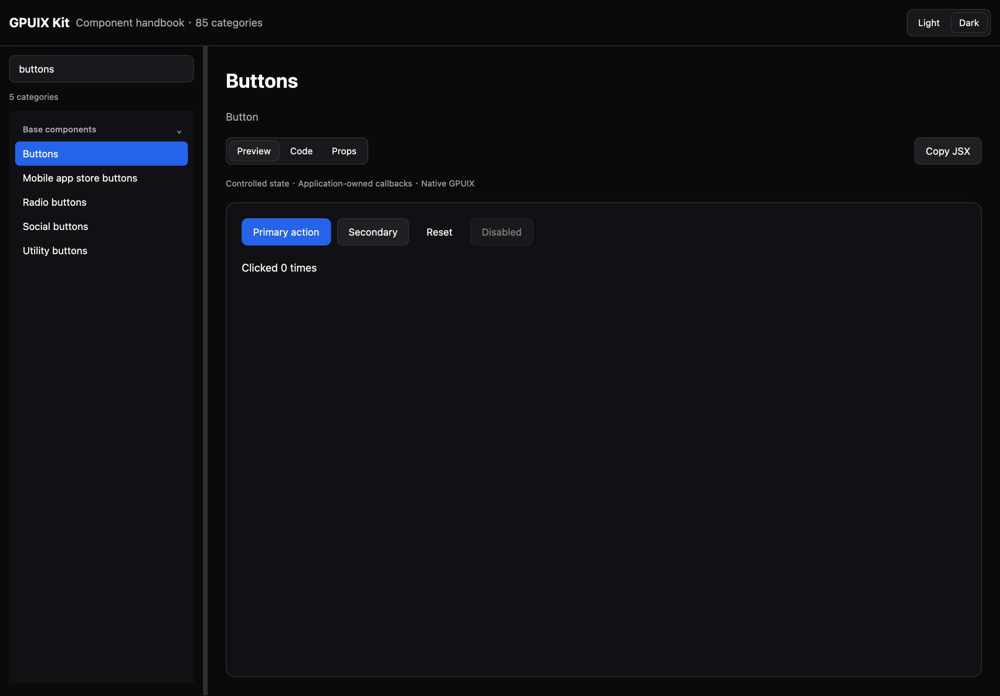

# GPUIX Kit

用于 GPUIX 的原生 UIKit，Darwin 风格，支持浅色和深色主题。一个包导入组件，使用 Bun + React 开发原生应用。

**v0.20.0 提供安装包、两个应用模板和统一组件手册。**

[English](README.en.md) · [快速开始](docs/getting-started.md) · [组件手册](docs/components/index.md) · [下载 Release](https://github.com/leyugod/GPUIX-Kit/releases/tag/v0.20.0) · [API 索引](docs/api-index.md)

## 从模板开始

下载 [最小窗口](https://github.com/leyugod/GPUIX-Kit/releases/download/v0.20.0/gpuix-kit-minimal-0.20.0.tar.gz) 或 [Apple 风格侧栏](https://github.com/leyugod/GPUIX-Kit/releases/download/v0.20.0/gpuix-kit-sidebar-0.20.0.tar.gz)，解压后：

```sh
bun install --frozen-lockfile
bun run dev
```

模板包含固定版本的 UIKit 安装包和依赖 lockfile，可直接在独立目录使用。修改 `src/app.tsx` 开始开发。

## 在已有项目中使用

```sh
bun add https://github.com/leyugod/GPUIX-Kit/releases/download/v0.20.0/mirai-gpuix-kit-0.20.0.tgz
bun add @gpuix/react@0.7.0 react@19.2.4
```

```tsx
import { UIKitProvider, AppShell, Button, Input, SourceListSidebar } from "@mirai/gpuix-kit";
```

JSX 配置、完整应用示例和适配接口见 [快速开始](docs/getting-started.md)。无需复制库目录，无需 CSS。npm 尚未发布。

## 浏览组件

[统一手册](docs/components/index.md) 包含 30 类基础组件、37 类应用组件和 18 类营销组件的可运行示例、深浅预览、Props 与行为边界。分类命名参考 [Untitled UI](https://www.untitledui.com/resources/icons)，已有公开 API 保持兼容。

```sh
bun install --frozen-lockfile
bun run dev
```

默认打开可搜索的原生组件手册，支持 Preview / Code / Props、复制 JSX 和切换主题。深入的 Apple 侧栏组合见 [侧栏指南](packages/uikit/docs/sidebars.md)。历史专题 Gallery 仍可通过 `dev:sidebars`、`dev:catalog` 等命令访问，原基础 Gallery 使用 `dev:legacy`。




## 范围与验证

只交付组件、纯模型和适配接口。存储、数据库、登录、邮件、云服务由应用提供。85 类目录映射不表示所有商业变体或浏览器行为完全等价。

已验证 macOS ARM64、Bun 1.4.2、GPUIX/native 0.7.0、React 19.2.4。Windows/Linux、真实 IME 组合输入、屏幕阅读器和完整毛玻璃效果尚未验证或实现。详见 [兼容性](docs/compatibility.json)、[本版验收](docs/releases/validation-0.20.0.md) 和 [组件映射](docs/untitled-ui-coverage.md)。

```sh
bun run check                # 类型、依赖边界和纯规则
bun run test:native:all      # 顺序执行原生回归
bun run test:starters        # 独立模板安装、交互和真实窗口
bun run test:live:handbook   # 手册真实窗口
bun run test:package         # 独立组件包消费
bun run test:source          # 源码归档复验
```

[架构](docs/architecture.md) · [贡献](CONTRIBUTING.md) · [发布](docs/releasing.md) · [更新记录](CHANGELOG.md) · [第三方来源与许可证](THIRD_PARTY_NOTICES.md)

视觉参考 [Darwin UI](https://github.com/surajmandalcell/darwin-ui)，组织参考 [Untitled UI](https://www.untitledui.com/react/docs/introduction)。使用 GPUIX 原生 JSX 实现。
