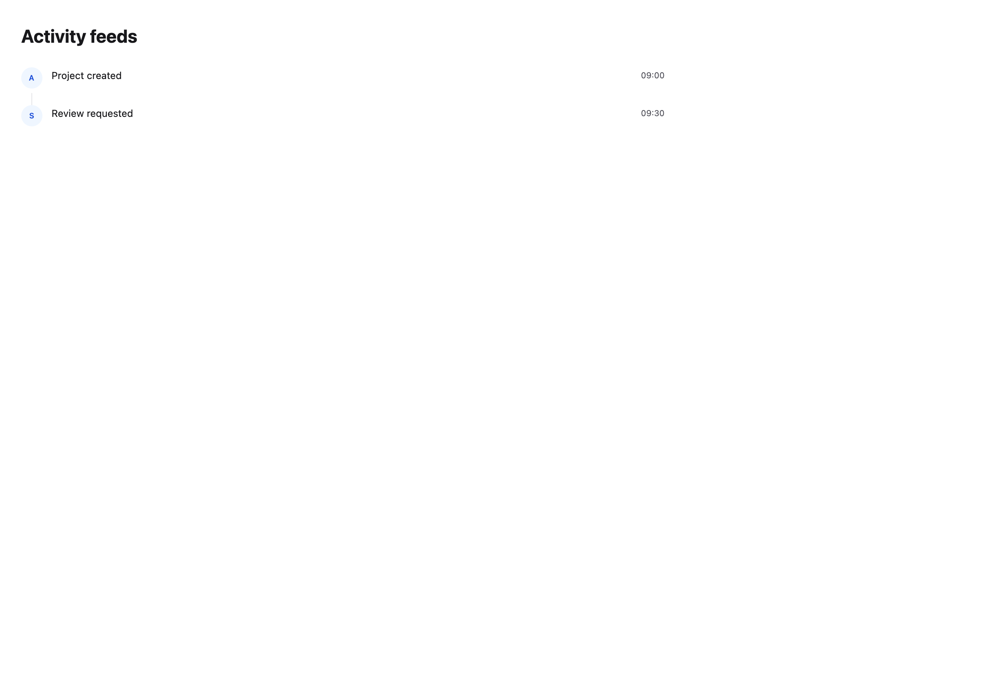
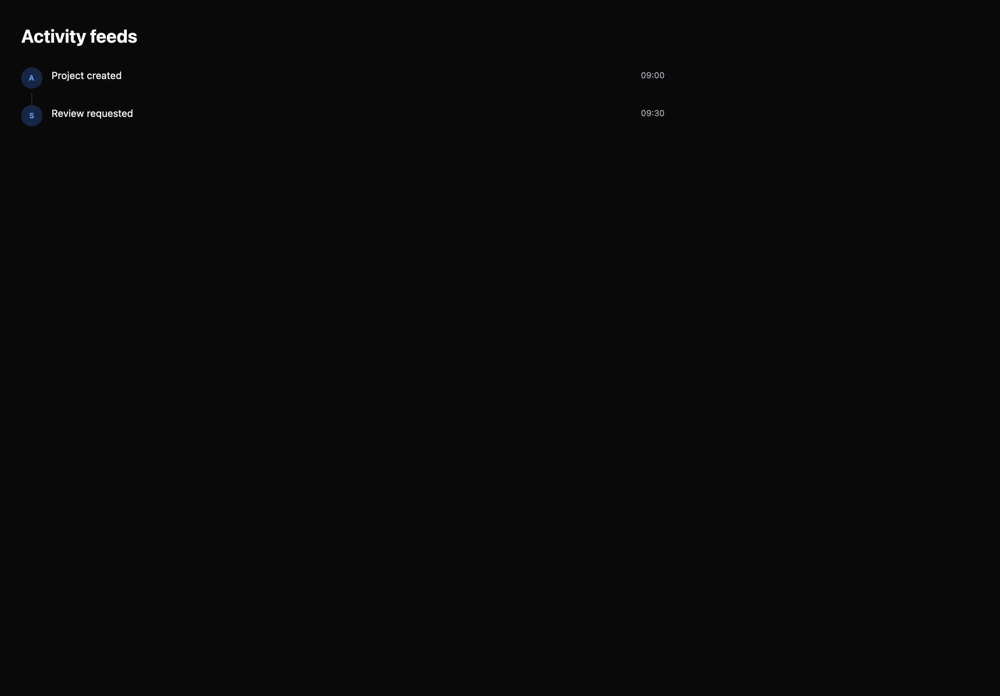

# Activity feeds

[All components](index.md) · Application components · 应用组件

Public imports: `ActivityFeed`, `Timeline` from `@mirai/gpuix-kit`.

[Behavior and host boundaries](../../packages/uikit/README.md) · [Runnable source](../../apps/gallery/src/examples/application-activity-feeds.tsx)





## Example

Render inside `UIKitProvider` and `AppShell`; see [quick start](../getting-started.md). State and service callbacks belong to your application.

```tsx
import { useState } from "react";
import * as UI from "@mirai/gpuix-kit";
// 状态由应用管理；接入时替换示例回调。
export default function Example() {
  return (
    <UI.ActivityFeed
      testId="example"
      items={[
        {
          id: "created",
          title: "Project created",
          actor: "Alex",
          timeLabel: "09:00",
        },
        {
          id: "review",
          title: "Review requested",
          actor: "Sam",
          timeLabel: "09:30",
        },
      ]}
    />
  );
}
```

## Props

Generated from the shipped TypeScript API. For model types and supporting helpers see the [full API index](../api-index.md).

### ActivityFeed

[Implementation](../../packages/uikit/src/components/timeline/index.tsx)

| Prop | Required | Type | Description |
| --- | --- | --- | --- |
| items | yes | `readonly ActivityItem[]` |  |
| testId | yes | `string` |  |
| loading | no | `boolean \| undefined` |  |
| emptyLabel | no | `string \| undefined` |  |
| hasMore | no | `boolean \| undefined` |  |
| onLoadMore | no | `(() => void) \| undefined` |  |

### Timeline

[Implementation](../../packages/uikit/src/components/timeline/index.tsx)

| Prop | Required | Type | Description |
| --- | --- | --- | --- |
| items | yes | `readonly ActivityItem[]` |  |
| testId | yes | `string` |  |
| loading | no | `boolean \| undefined` |  |
| emptyLabel | no | `string \| undefined` |  |
| hasMore | no | `boolean \| undefined` |  |
| onLoadMore | no | `(() => void) \| undefined` |  |
