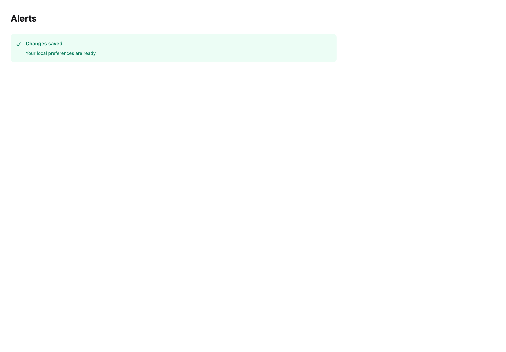
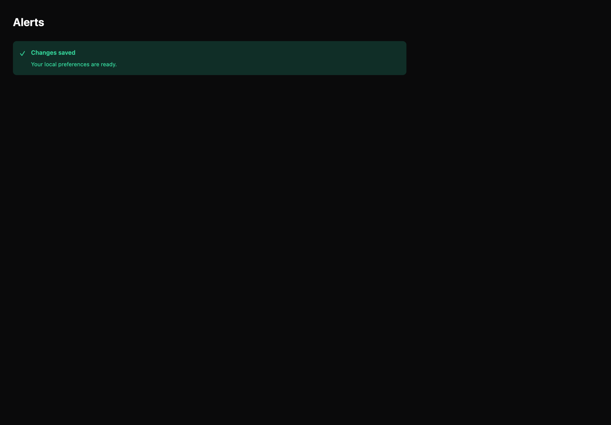

# Alerts

[All components](index.md) · Application components · 应用组件

Public imports: `Alert` from `@mirai/gpuix-kit`.

[Behavior and host boundaries](../../packages/uikit/README.md) · [Runnable source](../../apps/gallery/src/examples/application-alerts.tsx)





## Example

Render inside `UIKitProvider` and `AppShell`; see [quick start](../getting-started.md). State and service callbacks belong to your application.

```tsx
import { useState } from "react";
import * as UI from "@mirai/gpuix-kit";
// 状态由应用管理；接入时替换示例回调。
export default function Example() {
  return (
    <UI.Alert
      title="Changes saved"
      description="Your local preferences are ready."
      tone="success"
    />
  );
}
```

## Props

Generated from the shipped TypeScript API. For model types and supporting helpers see the [full API index](../api-index.md).

### Alert

[Implementation](../../packages/uikit/src/feedback/index.tsx)

| Prop | Required | Type | Description |
| --- | --- | --- | --- |
| title | yes | `string` |  |
| description | no | `string \| undefined` |  |
| tone | no | `Tone \| undefined` |  |
| action | no | `ReactNode` |  |
| testId | no | `string \| undefined` |  |
