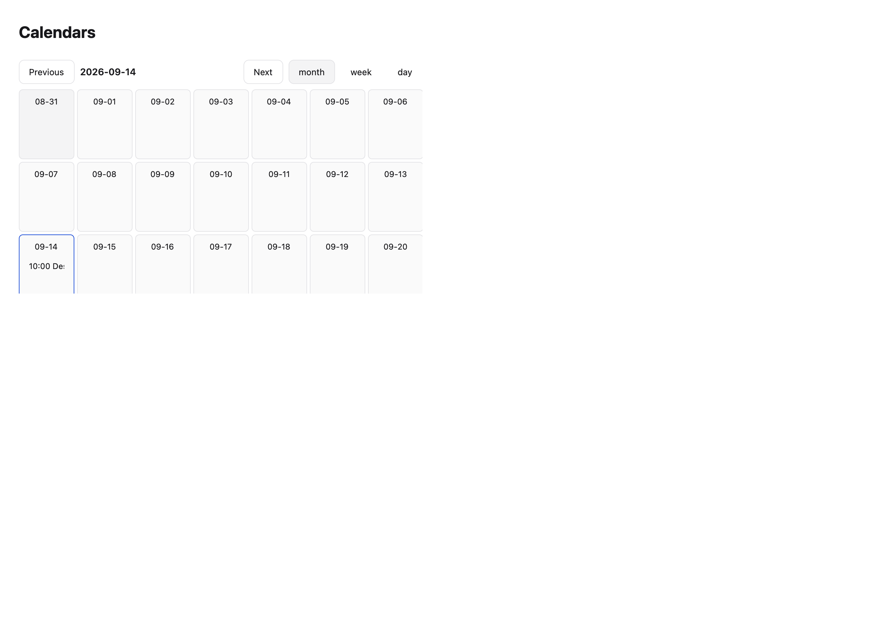
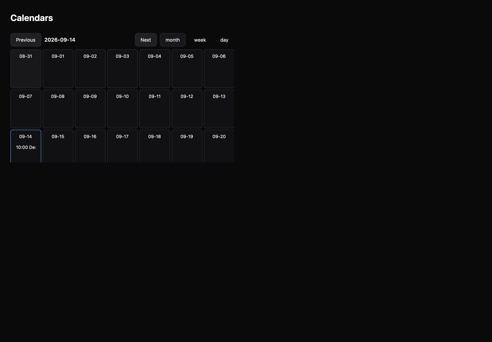

# Calendars

[All components](index.md) · Application components · 应用组件

Public imports: `EventCalendar` from `@mirai/gpuix-kit`.

[Behavior and host boundaries](../../packages/uikit/docs/catalog-completion.md) · [Runnable source](../../apps/gallery/src/examples/application-calendars.tsx)





## Example

Render inside `UIKitProvider` and `AppShell`; see [quick start](../getting-started.md). State and service callbacks belong to your application.

```tsx
import { useState } from "react";
import * as UI from "@mirai/gpuix-kit";
// 状态由应用管理；接入时替换示例回调。
export default function Example() {
  const [date, setDate] = useState("2026-09-14");
  const [view, setView] = useState<UI.EventCalendarView>("month");
  return (
    <UI.EventCalendar
      testId="example"
      date={date}
      onDateChange={setDate}
      view={view}
      onViewChange={setView}
      width={600}
      height={400}
      events={[
        {
          id: "review",
          title: "Design review",
          date: "2026-09-14",
          startTime: "10:00",
          endTime: "11:00",
        },
      ]}
      onEventPress={() => {}}
    />
  );
}
```

## Props

Generated from the shipped TypeScript API. For model types and supporting helpers see the [full API index](../api-index.md).

### EventCalendar

[Implementation](../../packages/uikit/src/components/event-calendar/index.tsx)

| Prop | Required | Type | Description |
| --- | --- | --- | --- |
| events | yes | `readonly CalendarEvent[]` |  |
| date | yes | `string` |  |
| onDateChange | yes | `(date: string) => void` |  |
| view | yes | `EventCalendarView` |  |
| onViewChange | yes | `(view: EventCalendarView) => void` |  |
| onEventPress | no | `((id: string) => void) \| undefined` |  |
| onCreate | no | `((date: string) => void) \| undefined` |  |
| width | no | `number \| undefined` |  |
| height | no | `number \| undefined` |  |
| disabled | no | `boolean \| undefined` |  |
| testId | yes | `string` |  |
