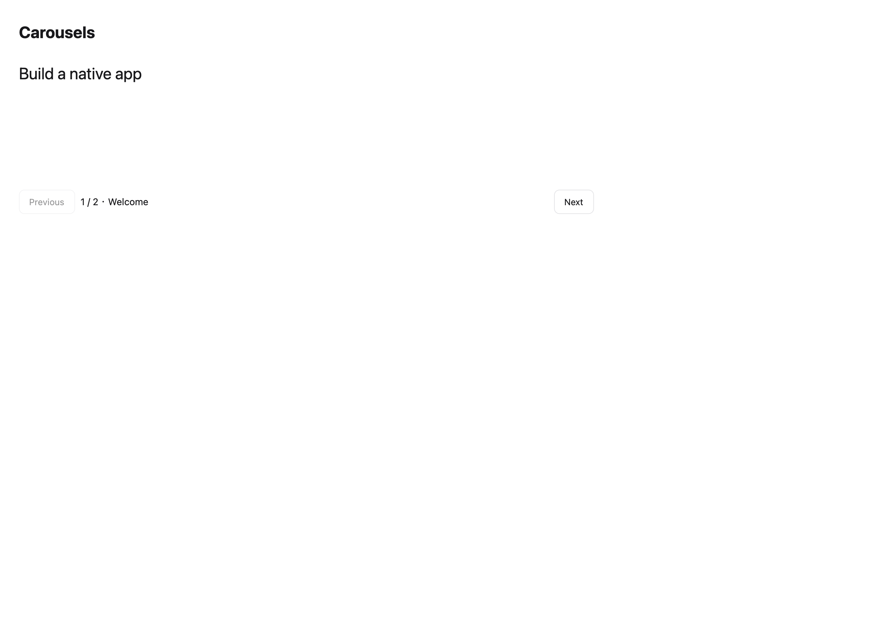

# Carousels

[All components](index.md) · Application components · 应用组件

Public imports: `Carousel` from `@mirai/gpuix-kit`.

[Behavior and host boundaries](../../packages/uikit/docs/catalog-completion.md) · [Runnable source](../../apps/gallery/src/examples/application-carousels.tsx)




## Example

Render inside `UIKitProvider` and `AppShell`; see [quick start](../getting-started.md). State and service callbacks belong to your application.

```tsx
import { useState } from "react";
import * as UI from "@mirai/gpuix-kit";
// 状态由应用管理；接入时替换示例回调。
export default function Example() {
  const [value, setValue] = useState<string | null>("one");
  return (
    <UI.Carousel
      testId="example"
      value={value}
      onValueChange={setValue}
      items={[
        {
          id: "one",
          label: "Welcome",
          content: <UI.Text size={24}>Build a native app</UI.Text>,
        },
        {
          id: "two",
          label: "Theme",
          content: <UI.Text size={24}>Light and dark themes</UI.Text>,
        },
      ]}
    />
  );
}
```

## Props

Generated from the shipped TypeScript API. For model types and supporting helpers see the [full API index](../api-index.md).

### Carousel

[Implementation](../../packages/uikit/src/components/media/index.tsx)

| Prop | Required | Type | Description |
| --- | --- | --- | --- |
| items | yes | `readonly CarouselItem[]` |  |
| value | yes | `string \| null` |  |
| onValueChange | yes | `(id: string) => void` |  |
| loop | no | `boolean \| undefined` |  |
| disabled | no | `boolean \| undefined` |  |
| height | no | `number \| undefined` |  |
| testId | yes | `string` |  |
