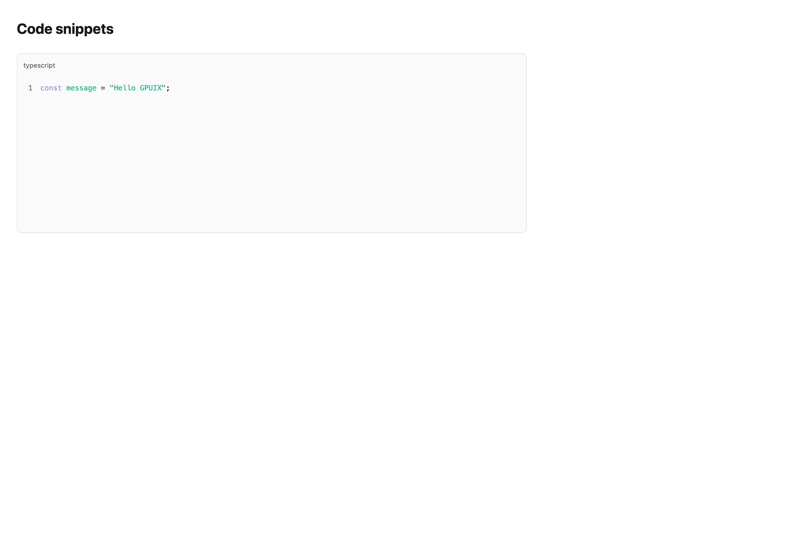
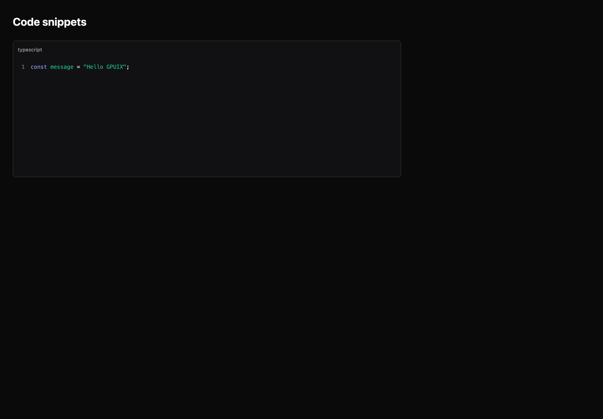

# Code snippets

[All components](index.md) · Application components · 应用组件

Public imports: `CodeBlock` from `@mirai/gpuix-kit`.

[Behavior and host boundaries](../../packages/uikit/README.md) · [Runnable source](../../apps/gallery/src/examples/application-code-snippets.tsx)





## Example

Render inside `UIKitProvider` and `AppShell`; see [quick start](../getting-started.md). State and service callbacks belong to your application.

```tsx
import { useState } from "react";
import * as UI from "@mirai/gpuix-kit";
// 状态由应用管理；接入时替换示例回调。
export default function Example() {
  return (
    <UI.CodeBlock
      testId="example"
      code={'const message = "Hello GPUIX";'}
      language="typescript"
    />
  );
}
```

## Props

Generated from the shipped TypeScript API. For model types and supporting helpers see the [full API index](../api-index.md).

### CodeBlock

[Implementation](../../packages/uikit/src/components/content/index.tsx)

| Prop | Required | Type | Description |
| --- | --- | --- | --- |
| code | yes | `string` |  |
| language | no | `string \| undefined` |  |
| path | no | `string \| undefined` |  |
| showLineNumbers | no | `boolean \| undefined` |  |
| testId | yes | `string` |  |
| height | no | `number \| undefined` |  |
