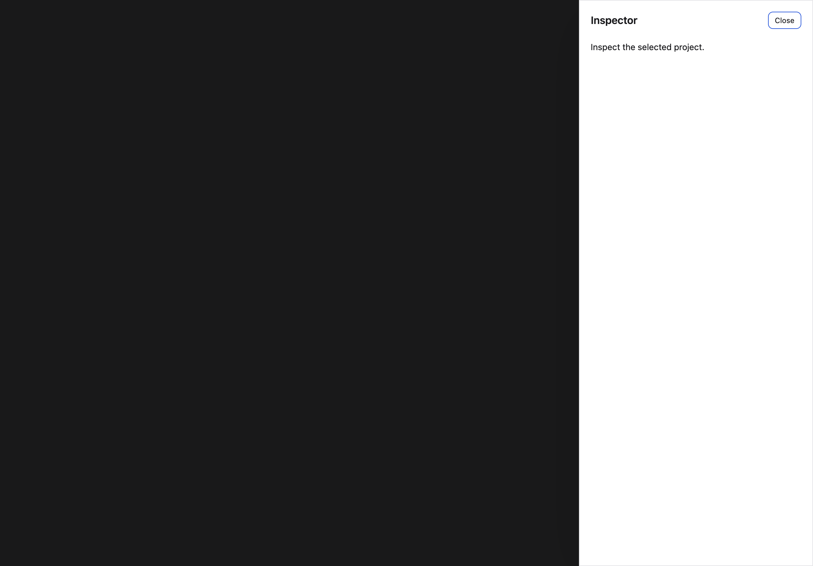
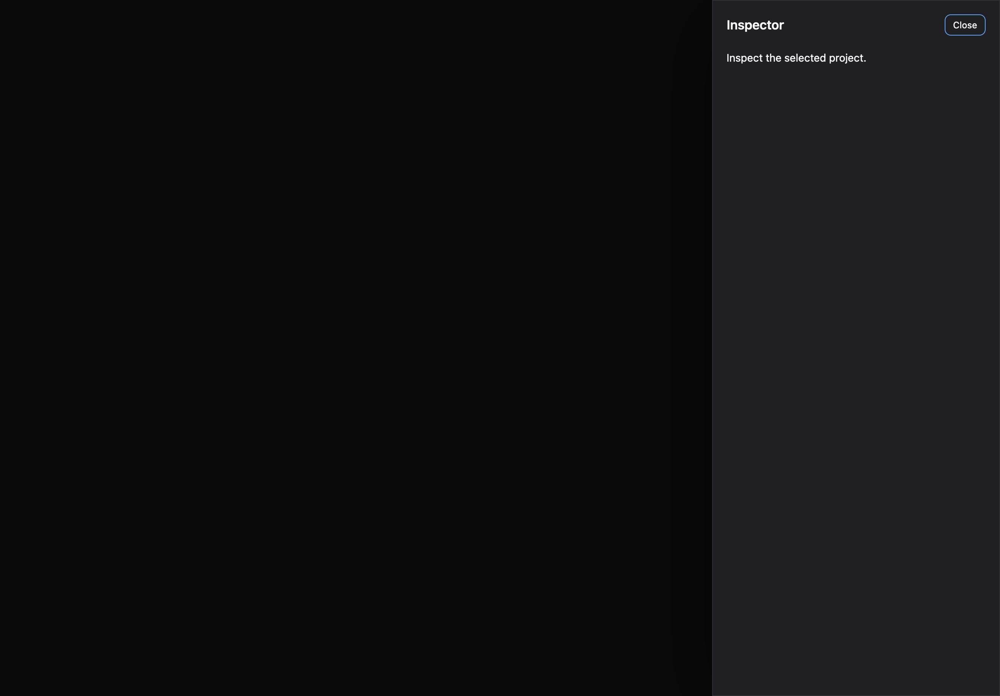

# Drawers

[All components](index.md) · Application components · 应用组件

Public imports: `Drawer`, `Sheet` from `@mirai/gpuix-kit`.

[Behavior and host boundaries](../../packages/uikit/README.md) · [Runnable source](../../apps/gallery/src/examples/application-drawers.tsx)





## Example

Render inside `UIKitProvider` and `AppShell`; see [quick start](../getting-started.md). State and service callbacks belong to your application.

```tsx
import { useState } from "react";
import * as UI from "@mirai/gpuix-kit";
// 状态由应用管理；接入时替换示例回调。
export default function Example() {
  const [open, setOpen] = useState(false);
  return (
    <UI.Stack>
      <UI.Button testId="example-open" onPress={() => setOpen(true)}>
        Open drawer
      </UI.Button>
      <UI.Drawer
        testId="example"
        open={open}
        onOpenChange={setOpen}
        title="Inspector"
      >
        <UI.Text>Inspect the selected project.</UI.Text>
      </UI.Drawer>
    </UI.Stack>
  );
}
```

## Props

Generated from the shipped TypeScript API. For model types and supporting helpers see the [full API index](../api-index.md).

### Drawer

[Implementation](../../packages/uikit/src/components/modal/index.tsx)

| Prop | Required | Type | Description |
| --- | --- | --- | --- |
| height | no | `number \| undefined` |  |
| testId | yes | `string` |  |
| open | yes | `boolean` |  |
| onOpenChange | yes | `(open: boolean) => void` |  |
| children | no | `ReactNode` |  |
| restoreFocusRef | no | `RefObject<Instance \| null> \| undefined` |  |
| width | no | `number \| undefined` |  |
| title | yes | `string` |  |
| description | no | `string \| undefined` |  |
| footer | no | `ReactNode` |  |
| closeLabel | no | `string \| undefined` |  |
| dismissOnBackdrop | no | `boolean \| undefined` |  |
| initialFocusRef | no | `RefObject<Instance \| null> \| undefined` |  |
| bodyScrollOffset | no | `number \| undefined` |  |
| surfaceRef | no | `RefObject<Instance \| null> \| undefined` |  |
| dismissible | no | `boolean \| undefined` |  |
| showClose | no | `boolean \| undefined` |  |
| side | no | `"left" \| "right" \| undefined` |  |

### Sheet

[Implementation](../../packages/uikit/src/components/modal/index.tsx)

| Prop | Required | Type | Description |
| --- | --- | --- | --- |
| height | no | `number \| undefined` |  |
| testId | yes | `string` |  |
| open | yes | `boolean` |  |
| onOpenChange | yes | `(open: boolean) => void` |  |
| children | no | `ReactNode` |  |
| restoreFocusRef | no | `RefObject<Instance \| null> \| undefined` |  |
| width | no | `number \| undefined` |  |
| title | yes | `string` |  |
| description | no | `string \| undefined` |  |
| footer | no | `ReactNode` |  |
| closeLabel | no | `string \| undefined` |  |
| dismissOnBackdrop | no | `boolean \| undefined` |  |
| initialFocusRef | no | `RefObject<Instance \| null> \| undefined` |  |
| bodyScrollOffset | no | `number \| undefined` |  |
| surfaceRef | no | `RefObject<Instance \| null> \| undefined` |  |
| dismissible | no | `boolean \| undefined` |  |
| showClose | no | `boolean \| undefined` |  |
