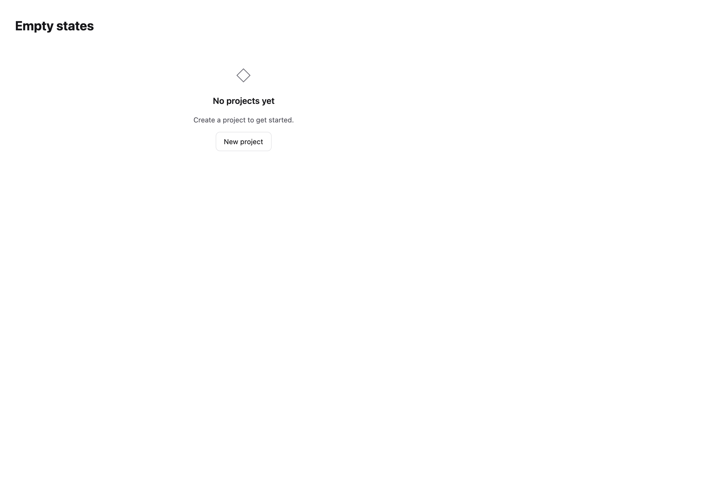
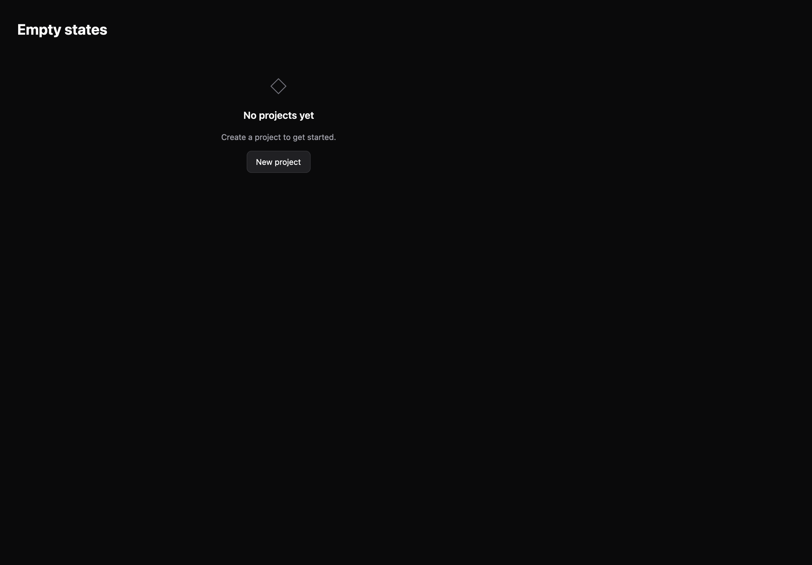

# Empty states

[All components](index.md) · Application components · 应用组件

Public imports: `EmptyState`, `ResourceState` from `@mirai/gpuix-kit`.

[Behavior and host boundaries](../../packages/uikit/README.md) · [Runnable source](../../apps/gallery/src/examples/application-empty-states.tsx)





## Example

Render inside `UIKitProvider` and `AppShell`; see [quick start](../getting-started.md). State and service callbacks belong to your application.

```tsx
import { useState } from "react";
import * as UI from "@mirai/gpuix-kit";
// 状态由应用管理；接入时替换示例回调。
export default function Example() {
  const [value, setValue] = useState("");
  return (
    <UI.EmptyState
      title="No projects yet"
      description="Create a project to get started."
      action={
        <UI.Button
          testId="example"
          onPress={() => setValue("Project requested")}
        >
          {value || "New project"}
        </UI.Button>
      }
    />
  );
}
```

## Props

Generated from the shipped TypeScript API. For model types and supporting helpers see the [full API index](../api-index.md).

### EmptyState

[Implementation](../../packages/uikit/src/feedback/index.tsx)

| Prop | Required | Type | Description |
| --- | --- | --- | --- |
| title | yes | `string` |  |
| description | yes | `string` |  |
| action | no | `ReactNode` |  |
| testId | no | `string \| undefined` |  |

### ResourceState

[Implementation](../../packages/uikit/src/components/resource-state/index.tsx)

| Prop | Required | Type | Description |
| --- | --- | --- | --- |
| state | yes | `"loading" \| "empty" \| "error"` |  |
| testId | yes | `string` |  |
| title | no | `string \| undefined` |  |
| description | no | `string \| undefined` |  |
| onRetry | no | `(() => void \| Promise<void>) \| undefined` |  |
| retryLabel | no | `string \| undefined` |  |
| workingLabel | no | `string \| undefined` |  |
| failureLabel | no | `string \| undefined` |  |
| resourceKey | no | `string \| undefined` |  |
| revision | no | `string \| number \| undefined` |  |
| disabled | no | `boolean \| undefined` |  |
| height | no | `number \| undefined` |  |
