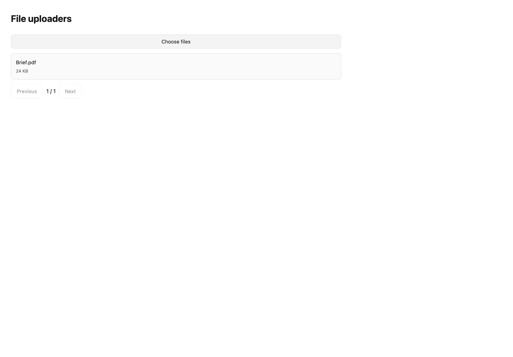
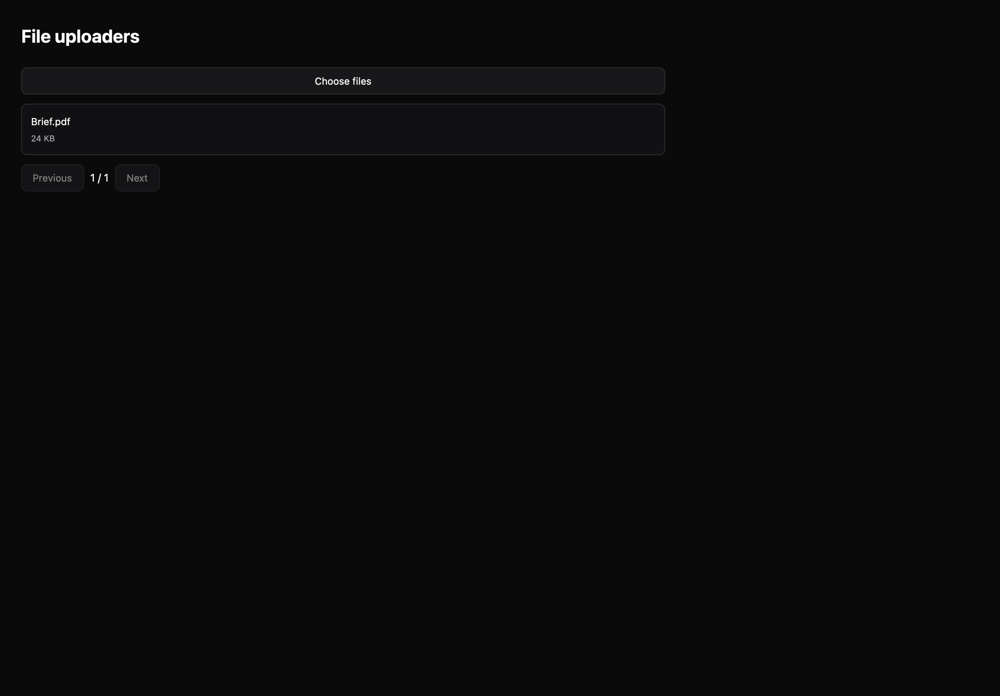

# File uploaders

[All components](index.md) · Application components · 应用组件

Public imports: `FileUploader` from `@mirai/gpuix-kit`.

[Behavior and host boundaries](../../packages/uikit/docs/catalog-completion.md) · [Runnable source](../../apps/gallery/src/examples/application-file-uploaders.tsx)





## Example

Render inside `UIKitProvider` and `AppShell`; see [quick start](../getting-started.md). State and service callbacks belong to your application.

```tsx
import { useState } from "react";
import * as UI from "@mirai/gpuix-kit";
// 状态由应用管理；接入时替换示例回调。
export default function Example() {
  const [value, setValue] = useState("");
  return (
    <UI.Stack>
      <UI.FileUploader
        testId="example"
        files={[
          { id: "brief", name: "Brief.pdf", status: "ready", detail: "24 KB" },
        ]}
        onChoose={() => {
          setValue("File selection requested");
        }}
      />
      <UI.Text>{value}</UI.Text>
    </UI.Stack>
  );
}
```

## Props

Generated from the shipped TypeScript API. For model types and supporting helpers see the [full API index](../api-index.md).

### FileUploader

[Implementation](../../packages/uikit/src/components/media/index.tsx)

| Prop | Required | Type | Description |
| --- | --- | --- | --- |
| files | yes | `readonly FileItem[]` |  |
| onChoose | no | `(() => void \| Promise<void>) \| undefined` |  |
| onRetry | no | `((id: string) => void \| Promise<void>) \| undefined` |  |
| onRemove | no | `((id: string) => void \| Promise<void>) \| undefined` |  |
| onOpen | no | `((id: string) => void \| Promise<void>) \| undefined` |  |
| disabled | no | `boolean \| undefined` |  |
| revision | no | `string \| number \| undefined` |  |
| testId | yes | `string` |  |
