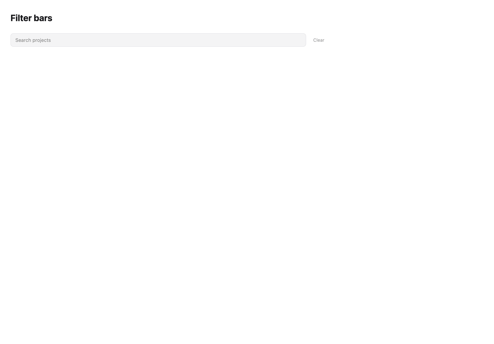
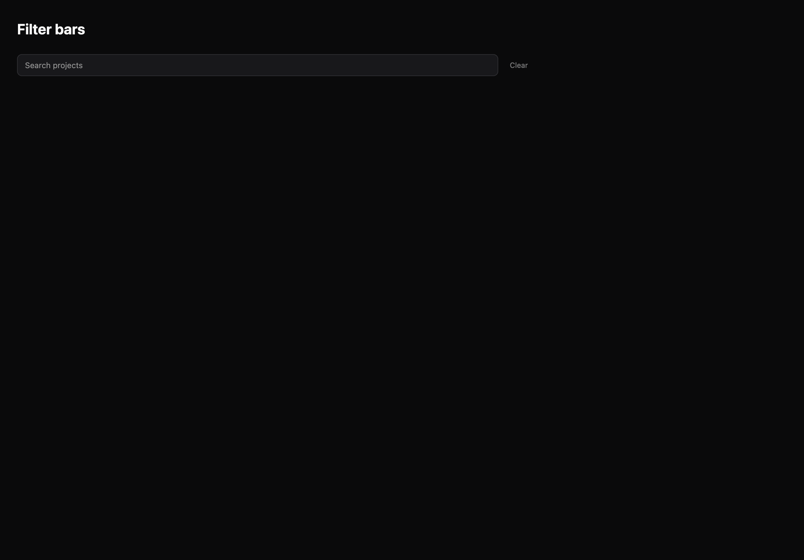

# Filter bars

[All components](index.md) · Application components · 应用组件

Public imports: `FilterBar`, `FilterBuilder`, `SavedViewPicker` from `@mirai/gpuix-kit`.

[Behavior and host boundaries](../../packages/uikit/README.md) · [Runnable source](../../apps/gallery/src/examples/application-filter-bars.tsx)





## Example

Render inside `UIKitProvider` and `AppShell`; see [quick start](../getting-started.md). State and service callbacks belong to your application.

```tsx
import { useState } from "react";
import * as UI from "@mirai/gpuix-kit";
// 状态由应用管理；接入时替换示例回调。
export default function Example() {
  const [value, setValue] = useState<UI.FilterState>({ query: "", values: {} });
  return (
    <UI.FilterBar
      testId="example"
      value={value}
      onValueChange={setValue}
      placeholder="Search projects"
    />
  );
}
```

## Props

Generated from the shipped TypeScript API. For model types and supporting helpers see the [full API index](../api-index.md).

### FilterBar

[Implementation](../../packages/uikit/src/components/filter-bar/index.tsx)

| Prop | Required | Type | Description |
| --- | --- | --- | --- |
| value | yes | `FilterState` |  |
| onValueChange | yes | `(value: FilterState) => void` |  |
| filters | no | `readonly FilterDefinition[] \| undefined` |  |
| testId | yes | `string` |  |
| placeholder | no | `string \| undefined` |  |
| disabled | no | `boolean \| undefined` |  |

### FilterBuilder

[Implementation](../../packages/uikit/src/components/filters/index.tsx)

| Prop | Required | Type | Description |
| --- | --- | --- | --- |
| fields | yes | `readonly FilterField[]` |  |
| value | yes | `FilterExpression` |  |
| onValueChange | yes | `(value: FilterExpression) => void` |  |
| testId | yes | `string` |  |
| disabled | no | `boolean \| undefined` |  |
| pageSize | no | `number \| undefined` |  |

### SavedViewPicker

[Implementation](../../packages/uikit/src/components/filters/index.tsx)

| Prop | Required | Type | Description |
| --- | --- | --- | --- |
| fields | yes | `readonly FilterField[]` |  |
| views | yes | `readonly SavedFilterView[]` |  |
| value | yes | `string \| null` |  |
| filter | yes | `FilterExpression` |  |
| onValueChange | yes | `(id: string) => void` |  |
| testId | yes | `string` |  |
| disabled | no | `boolean \| undefined` |  |
| revision | no | `string \| number \| undefined` |  |
| onCreate | no | `((name: string, filter: FilterExpression) => void \| Promise<void>) \| undefined` |  |
| onUpdate | no | `((id: string, filter: FilterExpression) => void \| Promise<void>) \| undefined` |  |
| onRename | no | `((id: string, name: string) => void \| Promise<void>) \| undefined` |  |
| onRemove | no | `((id: string) => void \| Promise<void>) \| undefined` |  |
