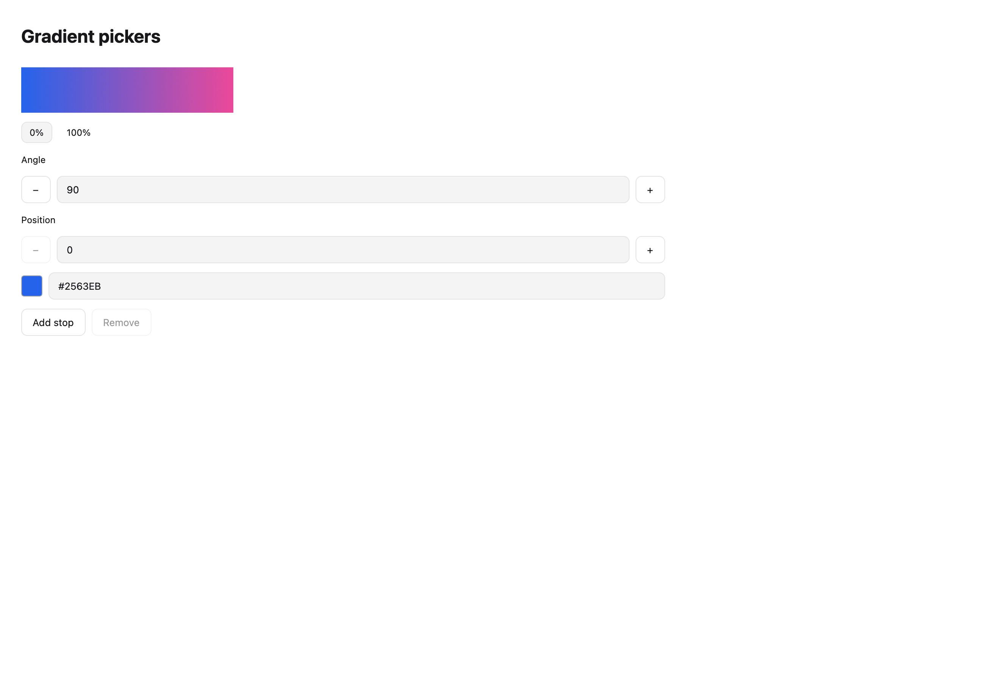
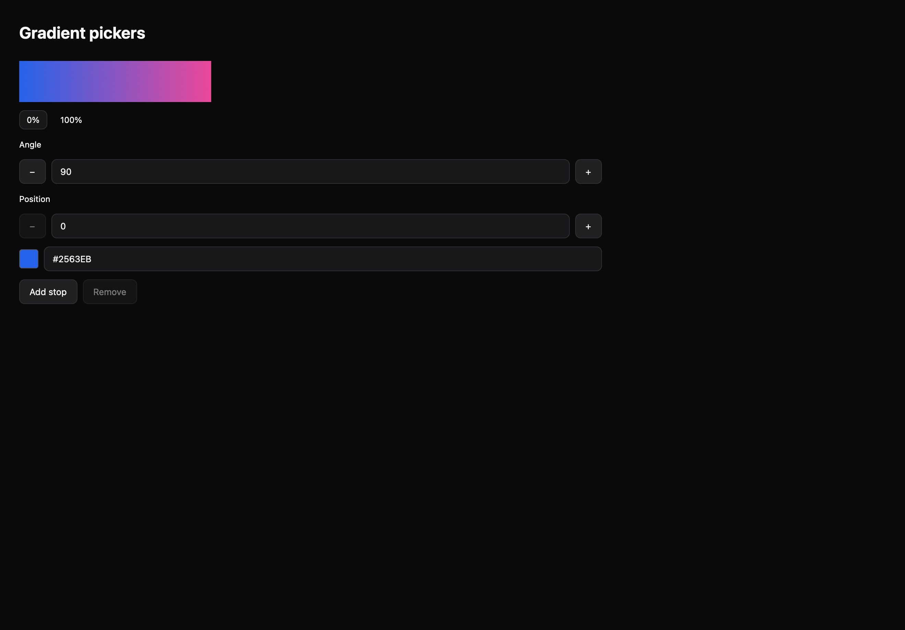

# Gradient pickers

[All components](index.md) · Application components · 应用组件

Public imports: `GradientPicker`, `GradientPreview` from `@mirai/gpuix-kit`.

[Behavior and host boundaries](../../packages/uikit/docs/catalog-completion.md) · [Runnable source](../../apps/gallery/src/examples/application-gradient-pickers.tsx)





## Example

Render inside `UIKitProvider` and `AppShell`; see [quick start](../getting-started.md). State and service callbacks belong to your application.

```tsx
import { useState } from "react";
import * as UI from "@mirai/gpuix-kit";
// 状态由应用管理；接入时替换示例回调。
export default function Example() {
  const [value, setValue] = useState<UI.GradientValue>({
    angle: 90,
    stops: [
      { id: "start", position: 0, color: "#2563EB" },
      { id: "end", position: 1, color: "#EC4899" },
    ],
  });
  return (
    <UI.GradientPicker
      testId="example"
      value={value}
      onValueChange={setValue}
    />
  );
}
```

## Props

Generated from the shipped TypeScript API. For model types and supporting helpers see the [full API index](../api-index.md).

### GradientPicker

[Implementation](../../packages/uikit/src/components/gradient/index.tsx)

| Prop | Required | Type | Description |
| --- | --- | --- | --- |
| value | yes | `GradientValue` |  |
| onValueChange | yes | `(value: GradientValue) => void` |  |
| disabled | no | `boolean \| undefined` |  |
| testId | yes | `string` |  |

### GradientPreview

[Implementation](../../packages/uikit/src/components/gradient/index.tsx)

| Prop | Required | Type | Description |
| --- | --- | --- | --- |
| value | yes | `GradientValue` |  |
| width | no | `number \| undefined` |  |
| height | no | `number \| undefined` |  |
| testId | yes | `string` |  |
