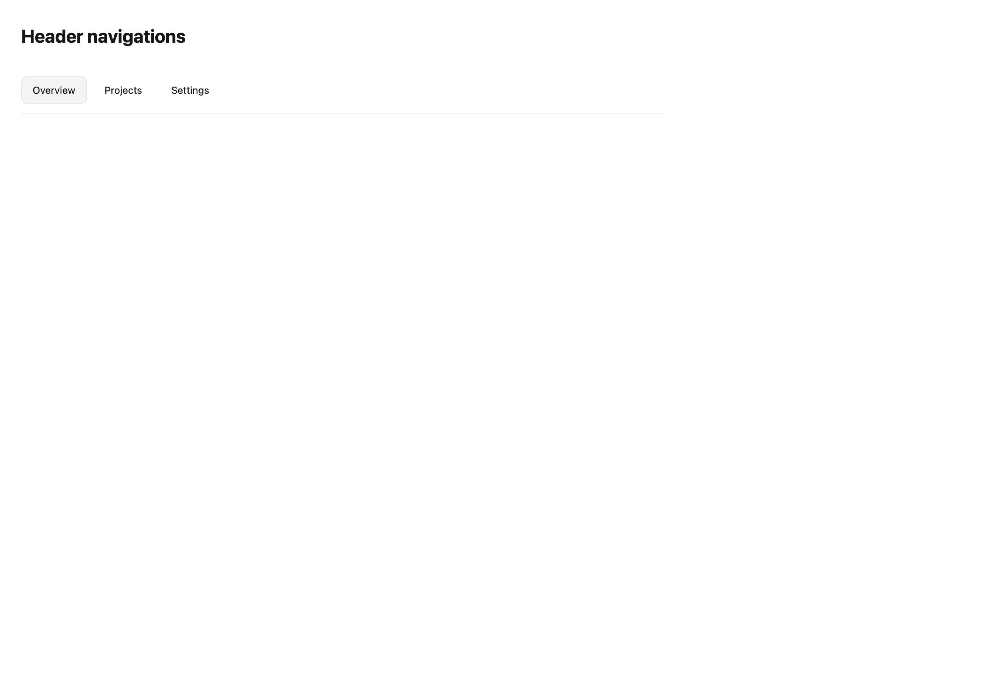

# Header navigations

[All components](index.md) · Application components · 应用组件

Public imports: `HeaderNavigation` from `@mirai/gpuix-kit`.

[Behavior and host boundaries](../../packages/uikit/docs/catalog-completion.md) · [Runnable source](../../apps/gallery/src/examples/application-header-navigations.tsx)




## Example

Render inside `UIKitProvider` and `AppShell`; see [quick start](../getting-started.md). State and service callbacks belong to your application.

```tsx
import { useState } from "react";
import * as UI from "@mirai/gpuix-kit";
// 状态由应用管理；接入时替换示例回调。
export default function Example() {
  const [value, setValue] = useState("overview");
  return (
    <UI.HeaderNavigation
      testId="example"
      value={value}
      onValueChange={setValue}
      items={[
        { id: "overview", label: "Overview" },
        { id: "projects", label: "Projects" },
        { id: "settings", label: "Settings" },
      ]}
    />
  );
}
```

## Props

Generated from the shipped TypeScript API. For model types and supporting helpers see the [full API index](../api-index.md).

### HeaderNavigation

[Implementation](../../packages/uikit/src/components/sections/index.tsx)

| Prop | Required | Type | Description |
| --- | --- | --- | --- |
| brand | no | `ReactNode` |  |
| items | yes | `readonly HeaderNavigationItem[]` |  |
| value | yes | `string` |  |
| onValueChange | yes | `(id: string) => void` |  |
| actions | no | `ReactNode` |  |
| testId | yes | `string` |  |
