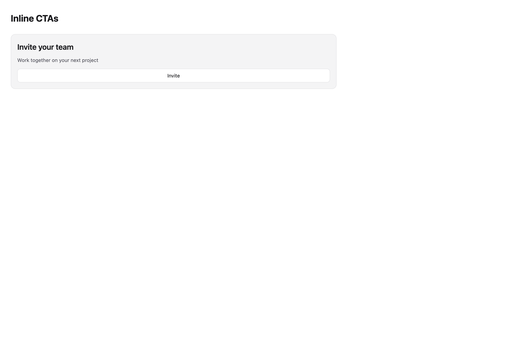
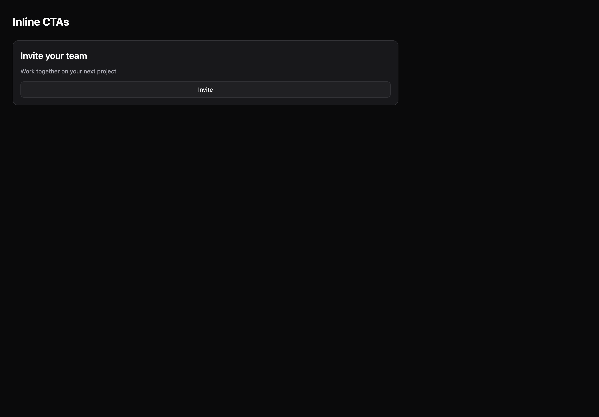

# Inline CTAs

[All components](index.md) · Application components · 应用组件

Public imports: `InlineCTA` from `@mirai/gpuix-kit`.

[Behavior and host boundaries](../../packages/uikit/docs/catalog-completion.md) · [Runnable source](../../apps/gallery/src/examples/application-inline-ctas.tsx)





## Example

Render inside `UIKitProvider` and `AppShell`; see [quick start](../getting-started.md). State and service callbacks belong to your application.

```tsx
import { useState } from "react";
import * as UI from "@mirai/gpuix-kit";
// 状态由应用管理；接入时替换示例回调。
export default function Example() {
  const [value, setValue] = useState("");
  return (
    <UI.InlineCTA
      testId="example-inlinecta"
      title="Invite your team"
      description={value || "Work together on your next project"}
      actions={
        <UI.Button
          testId="example"
          onPress={() => setValue("Invitation requested")}
        >
          Invite
        </UI.Button>
      }
    />
  );
}
```

## Props

Generated from the shipped TypeScript API. For model types and supporting helpers see the [full API index](../api-index.md).

### InlineCTA

[Implementation](../../packages/uikit/src/components/sections/index.tsx)

| Prop | Required | Type | Description |
| --- | --- | --- | --- |
| title | yes | `string` |  |
| description | no | `string \| undefined` |  |
| eyebrow | no | `string \| undefined` |  |
| actions | no | `ReactNode` |  |
| leading | no | `ReactNode` |  |
| testId | yes | `string` |  |
