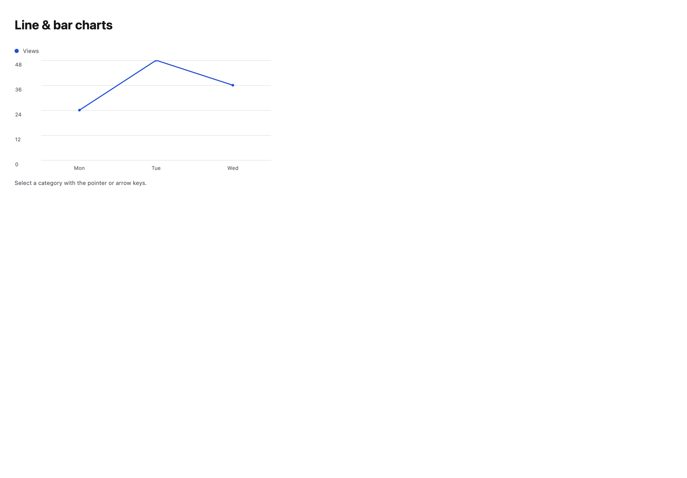
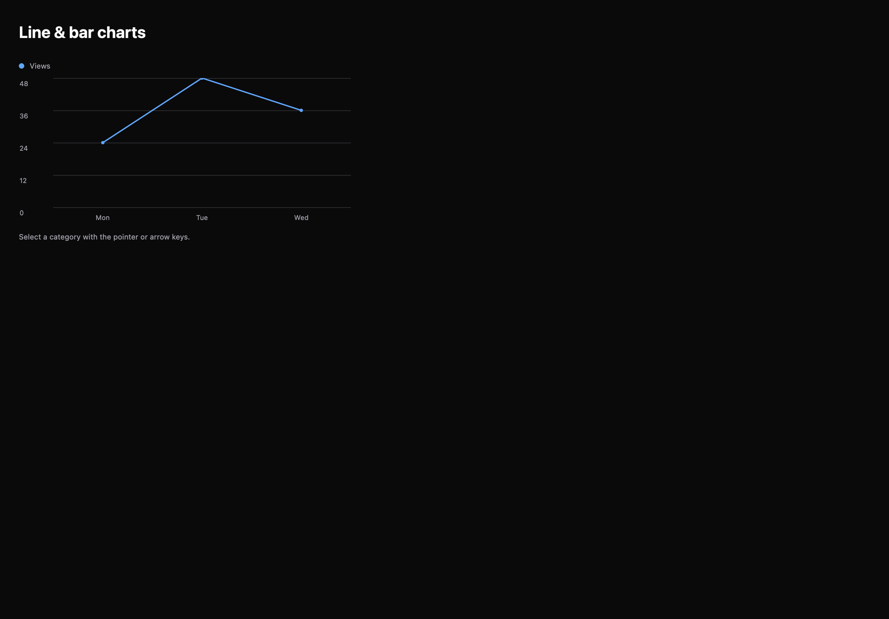

# Line & bar charts

[All components](index.md) · Application components · 应用组件

Public imports: `LineChart`, `AreaChart`, `BarChart` from `@mirai/gpuix-kit`.

[Behavior and host boundaries](../../packages/uikit/README.md) · [Runnable source](../../apps/gallery/src/examples/application-line-bar-charts.tsx)





## Example

Render inside `UIKitProvider` and `AppShell`; see [quick start](../getting-started.md). State and service callbacks belong to your application.

```tsx
import { useState } from "react";
import * as UI from "@mirai/gpuix-kit";
// 状态由应用管理；接入时替换示例回调。
export default function Example() {
  return (
    <UI.LineChart
      testId="example"
      width={500}
      height={220}
      categories={[
        { id: "mon", label: "Mon" },
        { id: "tue", label: "Tue" },
        { id: "wed", label: "Wed" },
      ]}
      series={[{ id: "views", label: "Views", values: [24, 48, 36] }]}
    />
  );
}
```

## Props

Generated from the shipped TypeScript API. For model types and supporting helpers see the [full API index](../api-index.md).

### LineChart

[Implementation](../../packages/uikit/src/components/charts/index.tsx)

| Prop | Required | Type | Description |
| --- | --- | --- | --- |
| height | no | `number \| undefined` |  |
| testId | yes | `string` |  |
| loading | no | `boolean \| undefined` |  |
| formatValue | no | `((value: number) => string) \| undefined` |  |
| categories | yes | `readonly ChartCategory[]` |  |
| series | yes | `readonly ChartSeries[]` |  |
| width | no | `number \| undefined` |  |
| hiddenSeriesIds | no | `readonly string[] \| undefined` |  |
| onHiddenSeriesChange | no | `((ids: string[]) => void) \| undefined` |  |
| activeIndex | no | `number \| null \| undefined` |  |
| onActiveIndexChange | no | `((index: number \| null) => void) \| undefined` |  |
| onActivate | no | `((category: ChartCategory) => void) \| undefined` |  |
| emptyLabel | no | `string \| undefined` |  |

### AreaChart

[Implementation](../../packages/uikit/src/components/charts/index.tsx)

| Prop | Required | Type | Description |
| --- | --- | --- | --- |
| height | no | `number \| undefined` |  |
| testId | yes | `string` |  |
| loading | no | `boolean \| undefined` |  |
| formatValue | no | `((value: number) => string) \| undefined` |  |
| categories | yes | `readonly ChartCategory[]` |  |
| series | yes | `readonly ChartSeries[]` |  |
| width | no | `number \| undefined` |  |
| hiddenSeriesIds | no | `readonly string[] \| undefined` |  |
| onHiddenSeriesChange | no | `((ids: string[]) => void) \| undefined` |  |
| activeIndex | no | `number \| null \| undefined` |  |
| onActiveIndexChange | no | `((index: number \| null) => void) \| undefined` |  |
| onActivate | no | `((category: ChartCategory) => void) \| undefined` |  |
| emptyLabel | no | `string \| undefined` |  |

### BarChart

[Implementation](../../packages/uikit/src/components/charts/index.tsx)

| Prop | Required | Type | Description |
| --- | --- | --- | --- |
| height | no | `number \| undefined` |  |
| testId | yes | `string` |  |
| loading | no | `boolean \| undefined` |  |
| formatValue | no | `((value: number) => string) \| undefined` |  |
| categories | yes | `readonly ChartCategory[]` |  |
| series | yes | `readonly ChartSeries[]` |  |
| width | no | `number \| undefined` |  |
| hiddenSeriesIds | no | `readonly string[] \| undefined` |  |
| onHiddenSeriesChange | no | `((ids: string[]) => void) \| undefined` |  |
| activeIndex | no | `number \| null \| undefined` |  |
| onActiveIndexChange | no | `((index: number \| null) => void) \| undefined` |  |
| onActivate | no | `((category: ChartCategory) => void) \| undefined` |  |
| emptyLabel | no | `string \| undefined` |  |
| stacked | no | `boolean \| undefined` |  |
