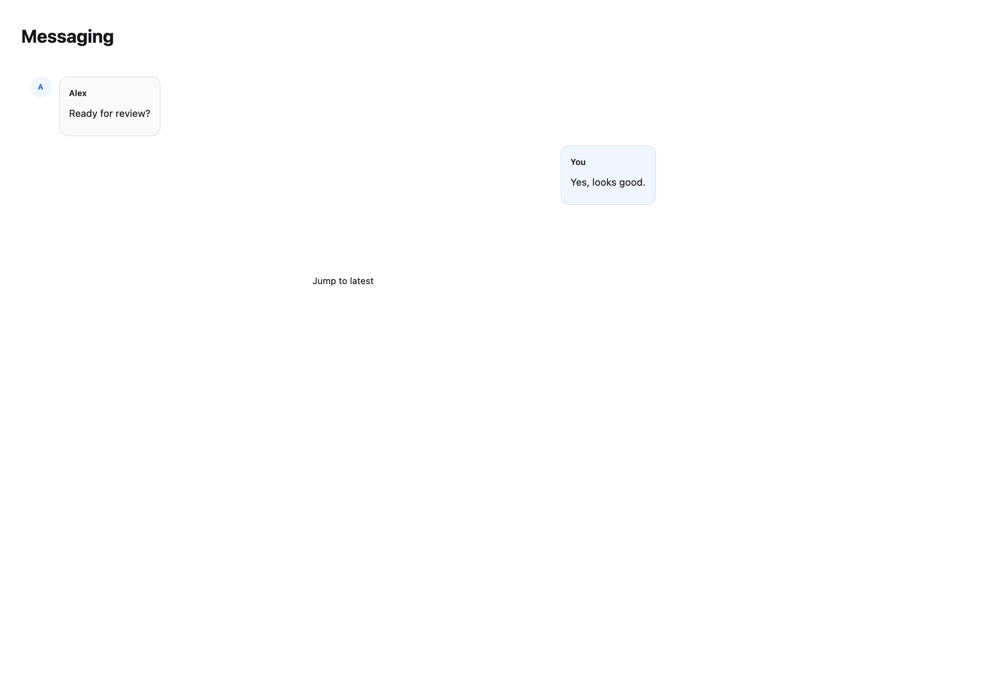
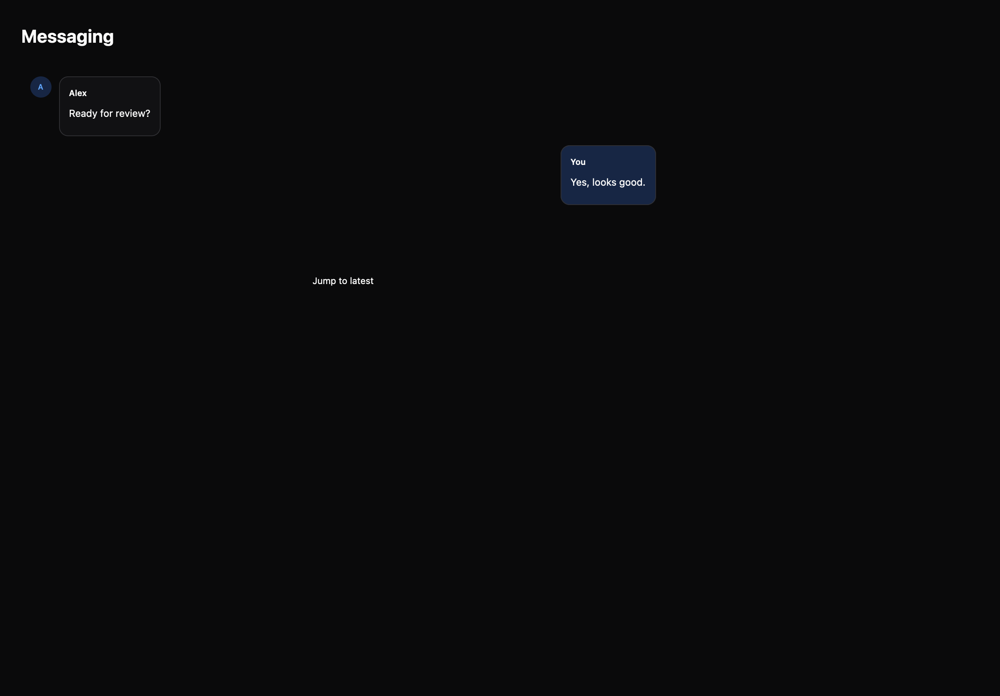

# Messaging

[All components](index.md) · Application components · 应用组件

Public imports: `MessageList`, `MessageComposer` from `@mirai/gpuix-kit`.

[Behavior and host boundaries](../../packages/uikit/README.md) · [Runnable source](../../apps/gallery/src/examples/application-messaging.tsx)





## Example

Render inside `UIKitProvider` and `AppShell`; see [quick start](../getting-started.md). State and service callbacks belong to your application.

```tsx
import { useState } from "react";
import * as UI from "@mirai/gpuix-kit";
// 状态由应用管理；接入时替换示例回调。
export default function Example() {
  return (
    <UI.MessageList
      testId="example"
      messages={[
        {
          id: "one",
          author: "Alex",
          text: "Ready for review?",
          direction: "incoming",
        },
        {
          id: "two",
          author: "You",
          text: "Yes, looks good.",
          direction: "outgoing",
        },
      ]}
      height={260}
    />
  );
}
```

## Props

Generated from the shipped TypeScript API. For model types and supporting helpers see the [full API index](../api-index.md).

### MessageList

[Implementation](../../packages/uikit/src/components/messages/index.tsx)

| Prop | Required | Type | Description |
| --- | --- | --- | --- |
| messages | yes | `readonly Message[]` |  |
| height | no | `number \| undefined` |  |
| loading | no | `boolean \| undefined` |  |
| hasEarlier | no | `boolean \| undefined` |  |
| onLoadEarlier | no | `(() => void) \| undefined` |  |
| followTail | no | `boolean \| undefined` |  |
| onFollowTailChange | no | `((follow: boolean) => void) \| undefined` |  |
| emptyLabel | no | `string \| undefined` |  |
| testId | yes | `string` |  |
| onRetry | no | `((id: string) => void) \| undefined` |  |
| onReply | no | `((id: string) => void) \| undefined` |  |
| onOpenAttachment | no | `((messageId: string, attachmentId: string) => void) \| undefined` |  |

### MessageComposer

[Implementation](../../packages/uikit/src/components/messages/index.tsx)

| Prop | Required | Type | Description |
| --- | --- | --- | --- |
| value | yes | `string` |  |
| onValueChange | yes | `(value: string) => void` |  |
| onSend | yes | `(draft: MessageDraft) => void \| Promise<void>` |  |
| attachments | no | `readonly MessageAttachment[] \| undefined` |  |
| onRemoveAttachment | no | `((id: string) => void) \| undefined` |  |
| onAttach | no | `(() => void) \| undefined` |  |
| replyTo | no | `{ id: string; author: string; text: string; } \| undefined` |  |
| onCancelReply | no | `(() => void) \| undefined` |  |
| state | no | `"idle" \| "sending" \| "streaming" \| undefined` |  |
| onStop | no | `(() => void) \| undefined` |  |
| disabled | no | `boolean \| undefined` |  |
| maxLength | no | `number \| undefined` |  |
| testId | yes | `string` |  |
| placeholder | no | `string \| undefined` |  |
| sendLabel | no | `string \| undefined` |  |
| errorLabel | no | `string \| undefined` |  |
