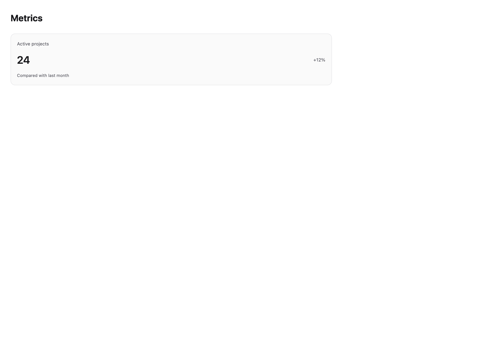
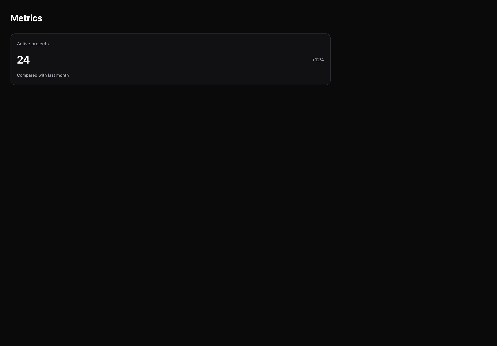

# Metrics

[All components](index.md) · Application components · 应用组件

Public imports: `MetricCard` from `@mirai/gpuix-kit`.

[Behavior and host boundaries](../../packages/uikit/README.md) · [Runnable source](../../apps/gallery/src/examples/application-metrics.tsx)





## Example

Render inside `UIKitProvider` and `AppShell`; see [quick start](../getting-started.md). State and service callbacks belong to your application.

```tsx
import { useState } from "react";
import * as UI from "@mirai/gpuix-kit";
// 状态由应用管理；接入时替换示例回调。
export default function Example() {
  return (
    <UI.MetricCard
      testId="example"
      label="Active projects"
      value="24"
      change="+12%"
      description="Compared with last month"
    />
  );
}
```

## Props

Generated from the shipped TypeScript API. For model types and supporting helpers see the [full API index](../api-index.md).

### MetricCard

[Implementation](../../packages/uikit/src/components/metrics/index.tsx)

| Prop | Required | Type | Description |
| --- | --- | --- | --- |
| label | yes | `string` |  |
| value | yes | `string` |  |
| change | no | `string \| undefined` |  |
| trend | no | `"neutral" \| "positive" \| "negative" \| undefined` |  |
| description | no | `string \| undefined` |  |
| children | no | `ReactNode` |  |
| testId | yes | `string` |  |
