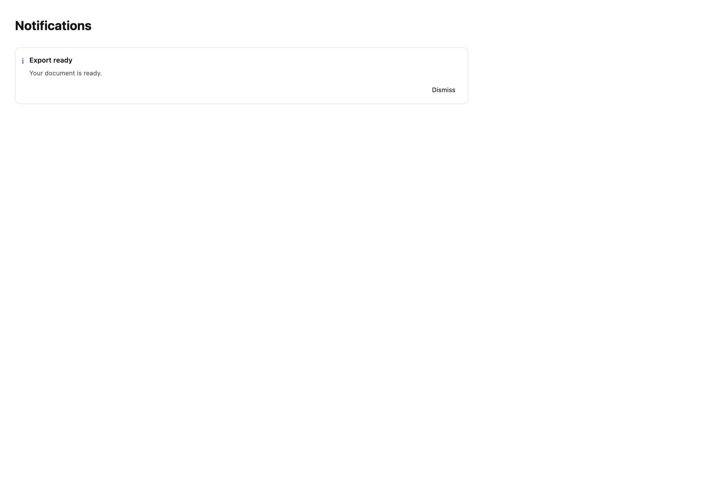
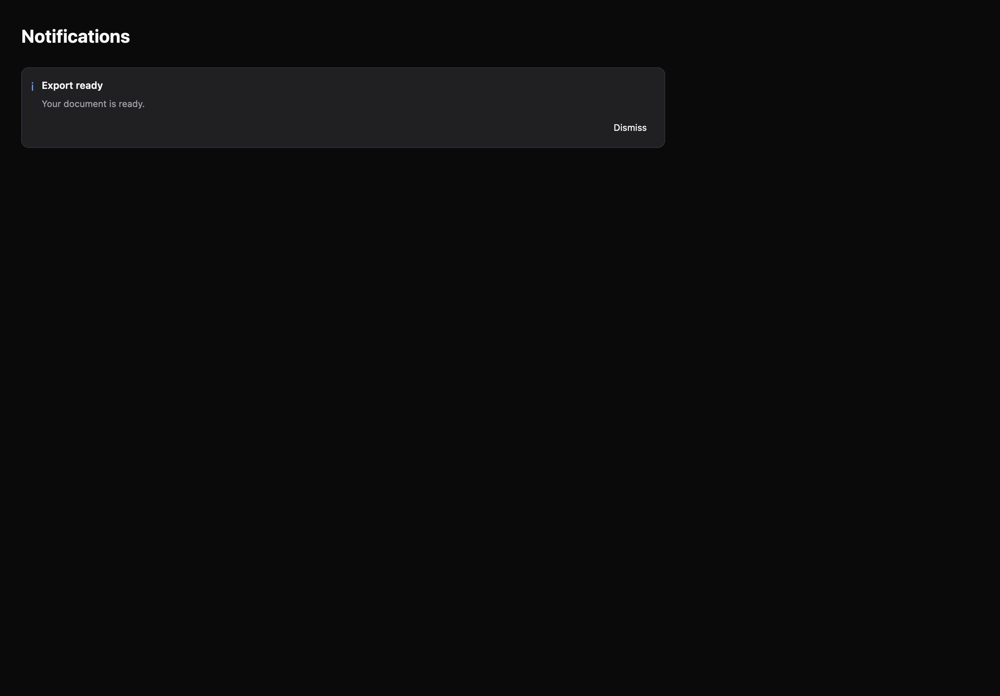

# Notifications

[All components](index.md) · Application components · 应用组件

Public imports: `ToastViewport`, `NoticeCard`, `UndoToast` from `@mirai/gpuix-kit`.

[Behavior and host boundaries](../../packages/uikit/README.md) · [Runnable source](../../apps/gallery/src/examples/application-notifications.tsx)





## Example

Render inside `UIKitProvider` and `AppShell`; see [quick start](../getting-started.md). State and service callbacks belong to your application.

```tsx
import { useState } from "react";
import * as UI from "@mirai/gpuix-kit";
// 状态由应用管理；接入时替换示例回调。
export default function Example() {
  const [visible, setVisible] = useState(true);
  return (
    <UI.Stack>
      {visible ? (
        <UI.NoticeCard
          testId="example"
          title="Export ready"
          description="Your document is ready."
          onDismiss={() => setVisible(false)}
        />
      ) : (
        <UI.Button testId="restore" onPress={() => setVisible(true)}>
          Show notification
        </UI.Button>
      )}
    </UI.Stack>
  );
}
```

## Props

Generated from the shipped TypeScript API. For model types and supporting helpers see the [full API index](../api-index.md).

### ToastViewport

[Implementation](../../packages/uikit/src/components/notifications/index.tsx)

| Prop | Required | Type | Description |
| --- | --- | --- | --- |
| queue | yes | `{ getSnapshot: () => NotificationSnapshot; subscribe(listener: () => void): () => void; enqueue(notice: Notification): { ok: true; revision: number; } \| { ok: false; error: string; }; dismiss(id: string, reason?: DismissReason, expectedRevision?: number \| undefined): boolean; setPaused(id: string, reason: PauseReason, paused: boolean, expectedRevision?: number \| undefined): boolean; setPausedAll(paused: boolean): void; clear(): void; suspend(): void; resume(): void; dispose(): void; }` |  |
| testId | yes | `string` |  |
| onAction | no | `((notice: Readonly<Notification>) => void \| Promise<void>) \| undefined` |  |
| restoreFocusRef | no | `RefObject<Instance \| null> \| undefined` |  |
| placement | no | `"inline" \| "top-right" \| undefined` |  |
| width | no | `number \| undefined` |  |

### NoticeCard

[Implementation](../../packages/uikit/src/components/notifications/index.tsx)

| Prop | Required | Type | Description |
| --- | --- | --- | --- |
| title | yes | `string` |  |
| description | no | `string \| undefined` |  |
| tone | no | `Tone \| undefined` |  |
| testId | yes | `string` |  |
| revision | no | `string \| number \| undefined` |  |
| action | no | `{ label: string; onPress: () => void \| Promise<void>; } \| undefined` |  |
| onActionSuccess | no | `(() => void) \| undefined` |  |
| onActionFailure | no | `(() => void) \| undefined` |  |
| onBusyChange | no | `((busy: boolean) => void) \| undefined` |  |
| onDismiss | no | `(() => void) \| undefined` |  |
| paused | no | `boolean \| undefined` |  |
| onPauseToggle | no | `(() => void) \| undefined` |  |
| pauseDisabled | no | `boolean \| undefined` |  |
| onHoverChange | no | `((hover: boolean) => void) \| undefined` |  |
| onKeyboardInteraction | no | `(() => void) \| undefined` |  |
| disabled | no | `boolean \| undefined` |  |
| errorLabel | no | `string \| undefined` |  |

### UndoToast

[Implementation](../../packages/uikit/src/components/notifications/index.tsx)

| Prop | Required | Type | Description |
| --- | --- | --- | --- |
| state | yes | `"available" \| "undone" \| "expired"` |  |
| onUndo | yes | `() => void \| Promise<void>` |  |
| onStateChange | yes | `(state: "undone") => void` |  |
| undoLabel | no | `string \| undefined` |  |
| disabled | no | `boolean \| undefined` |  |
| testId | yes | `string` |  |
| title | yes | `string` |  |
| description | no | `string \| undefined` |  |
| revision | no | `string \| number \| undefined` |  |
| onActionFailure | no | `(() => void) \| undefined` |  |
| onBusyChange | no | `((busy: boolean) => void) \| undefined` |  |
| onDismiss | no | `(() => void) \| undefined` |  |
| paused | no | `boolean \| undefined` |  |
| onPauseToggle | no | `(() => void) \| undefined` |  |
| pauseDisabled | no | `boolean \| undefined` |  |
| onHoverChange | no | `((hover: boolean) => void) \| undefined` |  |
| onKeyboardInteraction | no | `(() => void) \| undefined` |  |
| errorLabel | no | `string \| undefined` |  |
