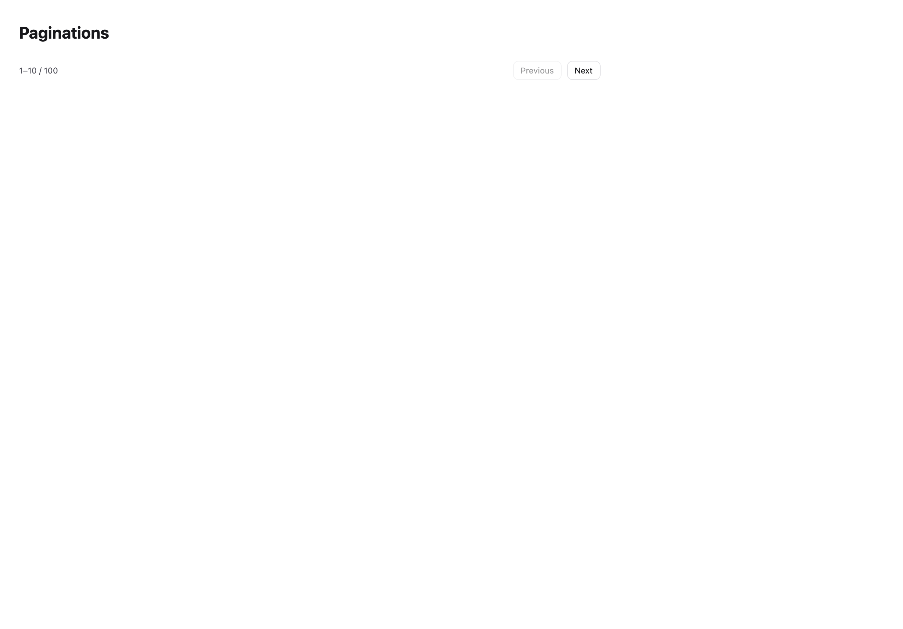

# Paginations

[All components](index.md) · Application components · 应用组件

Public imports: `Pagination` from `@mirai/gpuix-kit`.

[Behavior and host boundaries](../../packages/uikit/README.md) · [Runnable source](../../apps/gallery/src/examples/application-paginations.tsx)




## Example

Render inside `UIKitProvider` and `AppShell`; see [quick start](../getting-started.md). State and service callbacks belong to your application.

```tsx
import { useState } from "react";
import * as UI from "@mirai/gpuix-kit";
// 状态由应用管理；接入时替换示例回调。
export default function Example() {
  const [page, setPage] = useState(1);
  return (
    <UI.Pagination
      testId="example"
      page={page}
      pageSize={10}
      total={100}
      onPageChange={setPage}
    />
  );
}
```

## Props

Generated from the shipped TypeScript API. For model types and supporting helpers see the [full API index](../api-index.md).

### Pagination

[Implementation](../../packages/uikit/src/data/index.tsx)

| Prop | Required | Type | Description |
| --- | --- | --- | --- |
| page | yes | `number` |  |
| pageSize | yes | `number` |  |
| total | yes | `number` |  |
| onPageChange | yes | `(page: number) => void` |  |
| testId | yes | `string` |  |
| labels | no | `{ previous: string; next: string; summary: (start: number, end: number, total: number) => string; } \| undefined` |  |
