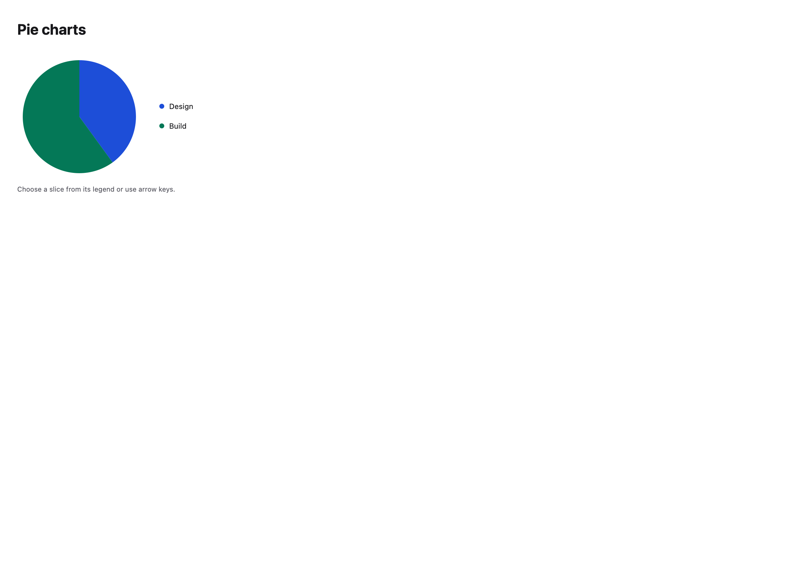
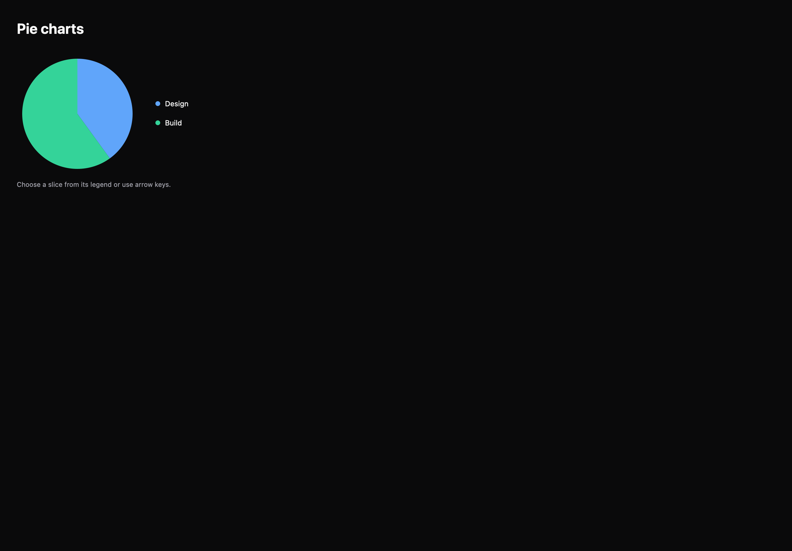

# Pie charts

[All components](index.md) · Application components · 应用组件

Public imports: `PieChart`, `DonutChart` from `@mirai/gpuix-kit`.

[Behavior and host boundaries](../../packages/uikit/README.md) · [Runnable source](../../apps/gallery/src/examples/application-pie-charts.tsx)





## Example

Render inside `UIKitProvider` and `AppShell`; see [quick start](../getting-started.md). State and service callbacks belong to your application.

```tsx
import { useState } from "react";
import * as UI from "@mirai/gpuix-kit";
// 状态由应用管理；接入时替换示例回调。
export default function Example() {
  return (
    <UI.PieChart
      testId="example"
      data={[
        { id: "design", label: "Design", value: 40 },
        { id: "build", label: "Build", value: 60 },
      ]}
      size={200}
    />
  );
}
```

## Props

Generated from the shipped TypeScript API. For model types and supporting helpers see the [full API index](../api-index.md).

### PieChart

[Implementation](../../packages/uikit/src/components/charts/index.tsx)

| Prop | Required | Type | Description |
| --- | --- | --- | --- |
| data | yes | `readonly ChartDatum[]` |  |
| size | no | `number \| undefined` |  |
| selectedId | no | `string \| null \| undefined` |  |
| onSelectionChange | no | `((id: string) => void) \| undefined` |  |
| loading | no | `boolean \| undefined` |  |
| testId | yes | `string` |  |
| donut | no | `boolean \| undefined` |  |

### DonutChart

[Implementation](../../packages/uikit/src/components/charts/index.tsx)

| Prop | Required | Type | Description |
| --- | --- | --- | --- |
| testId | yes | `string` |  |
| size | no | `number \| undefined` |  |
| loading | no | `boolean \| undefined` |  |
| data | yes | `readonly ChartDatum[]` |  |
| selectedId | no | `string \| null \| undefined` |  |
| onSelectionChange | no | `((id: string) => void) \| undefined` |  |
