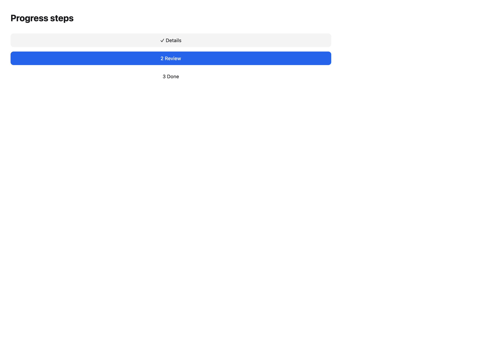
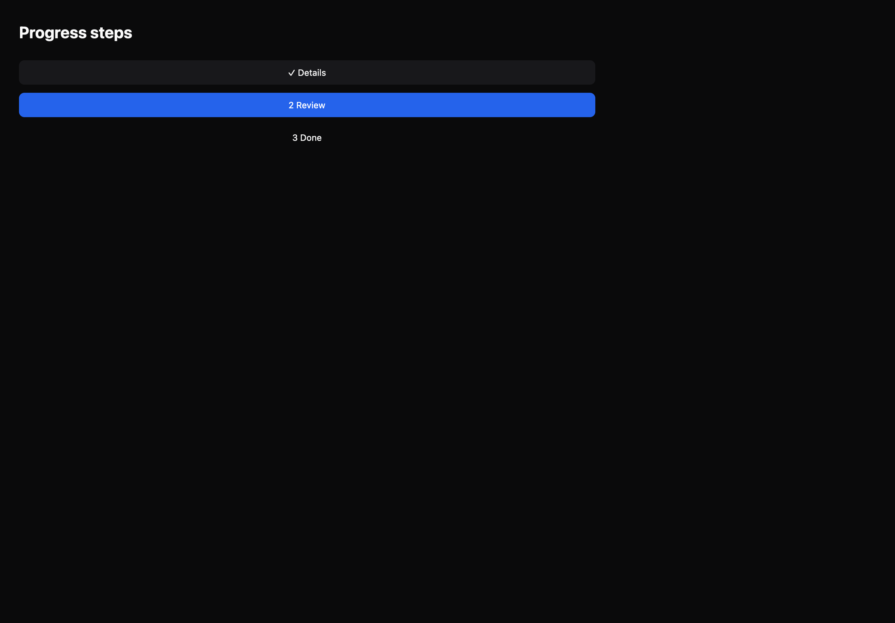

# Progress steps

[All components](index.md) · Application components · 应用组件

Public imports: `ProgressSteps` from `@mirai/gpuix-kit`.

[Behavior and host boundaries](../../packages/uikit/docs/catalog-completion.md) · [Runnable source](../../apps/gallery/src/examples/application-progress-steps.tsx)





## Example

Render inside `UIKitProvider` and `AppShell`; see [quick start](../getting-started.md). State and service callbacks belong to your application.

```tsx
import { useState } from "react";
import * as UI from "@mirai/gpuix-kit";
// 状态由应用管理；接入时替换示例回调。
export default function Example() {
  const [value, setValue] = useState("review");
  return (
    <UI.ProgressSteps
      testId="example"
      steps={[
        { id: "details", label: "Details", status: "complete" },
        {
          id: "review",
          label: "Review",
          status: value === "review" ? "current" : "complete",
        },
        {
          id: "done",
          label: "Done",
          status: value === "done" ? "current" : "pending",
        },
      ]}
      onStepChange={setValue}
    />
  );
}
```

## Props

Generated from the shipped TypeScript API. For model types and supporting helpers see the [full API index](../api-index.md).

### ProgressSteps

[Implementation](../../packages/uikit/src/components/sections/index.tsx)

| Prop | Required | Type | Description |
| --- | --- | --- | --- |
| steps | yes | `readonly ProgressStep[]` |  |
| onStepChange | no | `((id: string) => void) \| undefined` |  |
| orientation | no | `"horizontal" \| "vertical" \| undefined` |  |
| disabled | no | `boolean \| undefined` |  |
| testId | yes | `string` |  |
