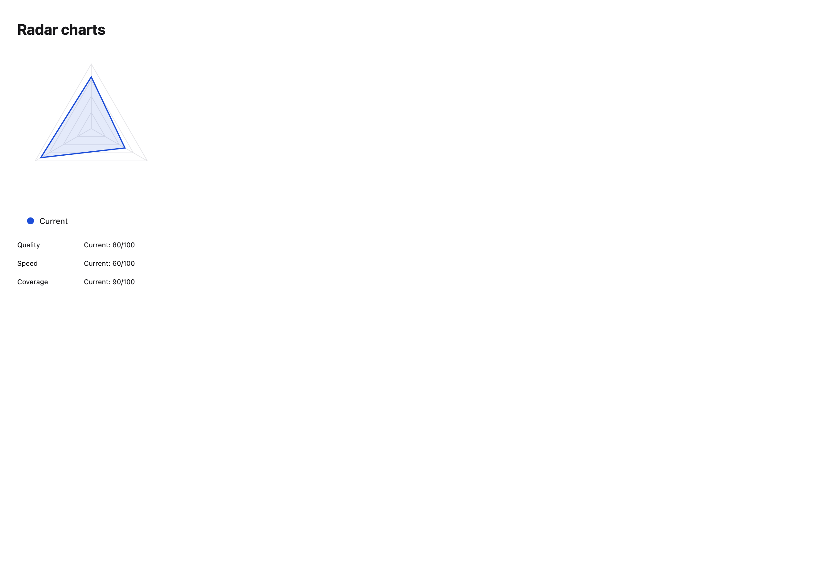
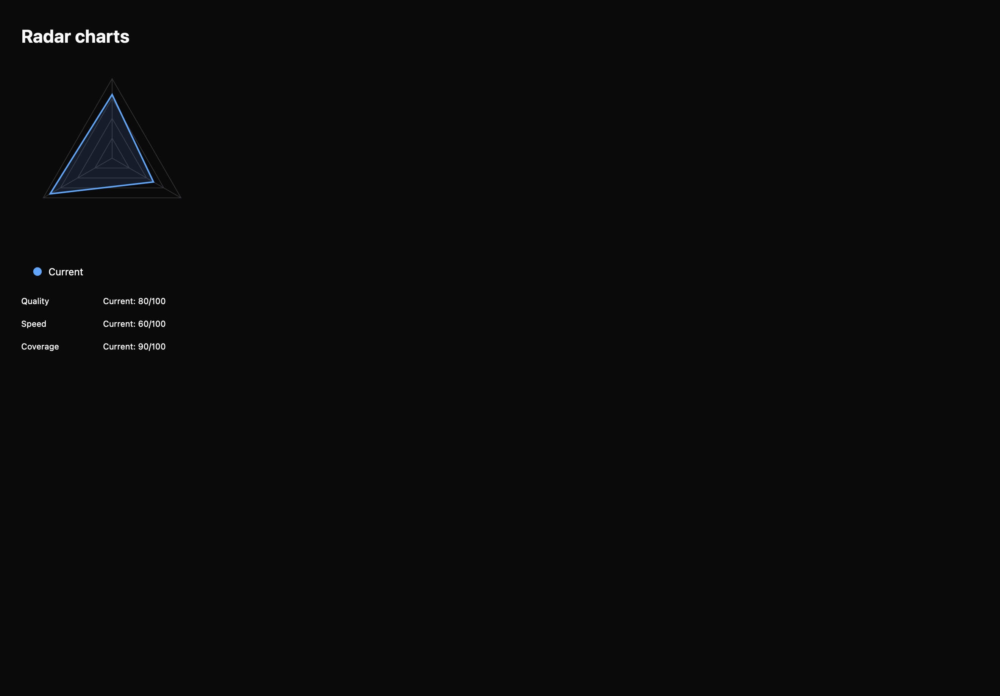

# Radar charts

[All components](index.md) · Application components · 应用组件

Public imports: `RadarChart` from `@mirai/gpuix-kit`.

[Behavior and host boundaries](../../packages/uikit/docs/catalog-completion.md) · [Runnable source](../../apps/gallery/src/examples/application-radar-charts.tsx)





## Example

Render inside `UIKitProvider` and `AppShell`; see [quick start](../getting-started.md). State and service callbacks belong to your application.

```tsx
import { useState } from "react";
import * as UI from "@mirai/gpuix-kit";
// 状态由应用管理；接入时替换示例回调。
export default function Example() {
  const [hidden, setHidden] = useState<string[]>([]);
  return (
    <UI.RadarChart
      testId="example"
      axes={[
        { id: "quality", label: "Quality", max: 100 },
        { id: "speed", label: "Speed", max: 100 },
        { id: "coverage", label: "Coverage", max: 100 },
      ]}
      series={[{ id: "current", label: "Current", values: [80, 60, 90] }]}
      hiddenIds={hidden}
      onHiddenChange={setHidden}
    />
  );
}
```

## Props

Generated from the shipped TypeScript API. For model types and supporting helpers see the [full API index](../api-index.md).

### RadarChart

[Implementation](../../packages/uikit/src/components/gauges/index.tsx)

| Prop | Required | Type | Description |
| --- | --- | --- | --- |
| axes | yes | `readonly RadarAxis[]` |  |
| series | yes | `readonly RadarSeries[]` |  |
| hiddenIds | no | `readonly string[] \| undefined` |  |
| onHiddenChange | no | `((ids: string[]) => void) \| undefined` |  |
| size | no | `number \| undefined` |  |
| testId | yes | `string` |  |
