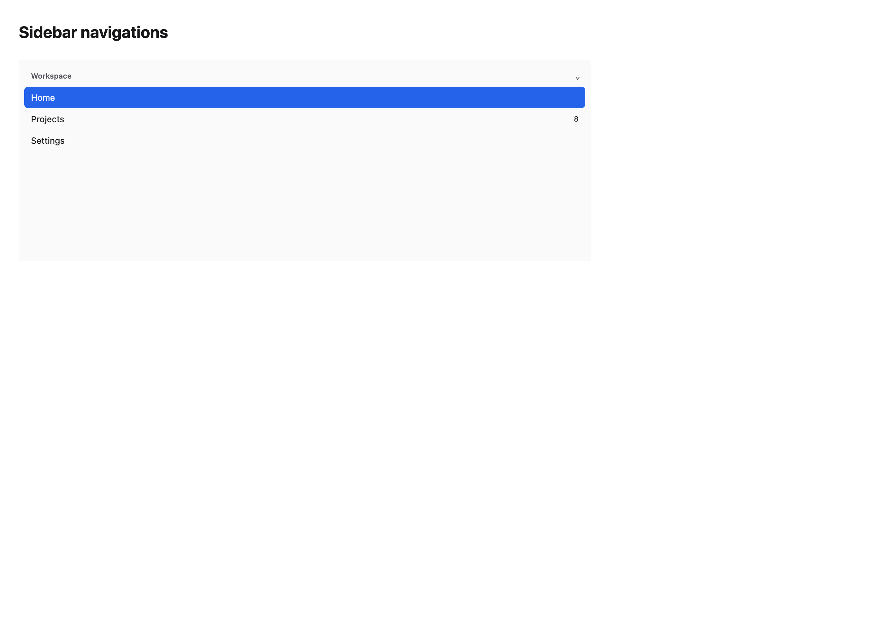
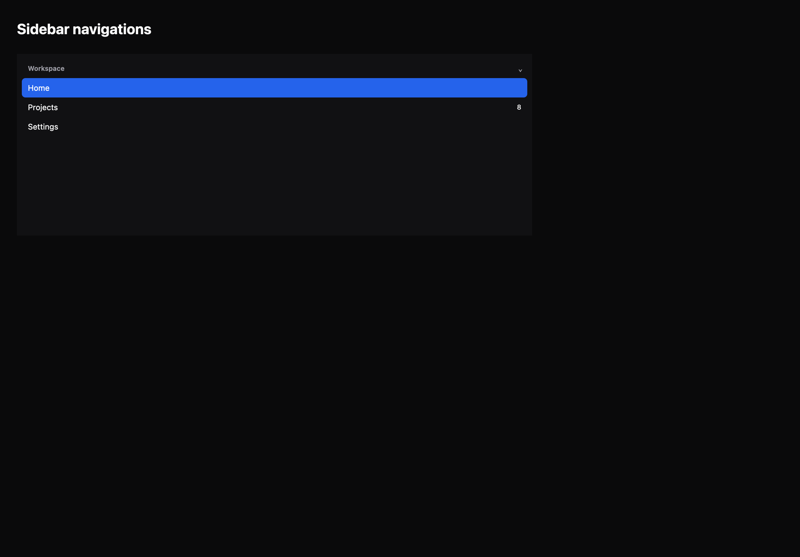

# Sidebar navigations

[All components](index.md) · Application components · 应用组件

Public imports: `SidebarNavigation`, `SourceListSidebar`, `NavigationSplitView` from `@mirai/gpuix-kit`.

[Behavior and host boundaries](../../packages/uikit/README.md) · [Runnable source](../../apps/gallery/src/examples/application-sidebar-navigations.tsx)





## Example

Render inside `UIKitProvider` and `AppShell`; see [quick start](../getting-started.md). State and service callbacks belong to your application.

```tsx
import { useState } from "react";
import * as UI from "@mirai/gpuix-kit";
// 状态由应用管理；接入时替换示例回调。
export default function Example() {
  const [value, setValue] = useState<string | null>("home");
  const [collapsed, setCollapsed] = useState<string[]>([]);
  return (
    <UI.SourceListSidebar
      testId="example"
      height={300}
      groups={[
        {
          id: "workspace",
          label: "Workspace",
          items: [
            { id: "home", label: "Home" },
            { id: "projects", label: "Projects", badge: "8" },
            { id: "settings", label: "Settings" },
          ],
        },
      ]}
      value={value}
      onValueChange={setValue}
      collapsed={collapsed}
      onCollapsedChange={setCollapsed}
    />
  );
}
```

## Props

Generated from the shipped TypeScript API. For model types and supporting helpers see the [full API index](../api-index.md).

### SidebarNavigation

[Implementation](../../packages/uikit/src/components/navigation/index.tsx)

| Prop | Required | Type | Description |
| --- | --- | --- | --- |
| sections | yes | `readonly SidebarSection[]` |  |
| value | yes | `string` |  |
| onValueChange | yes | `(value: string) => void` |  |
| expanded | yes | `readonly string[]` |  |
| onExpandedChange | yes | `(expanded: string[]) => void` |  |
| variant | no | `"simple" \| "slim" \| "dual-tier" \| undefined` |  |
| rail | no | `{ items: readonly SidebarItem[]; value: string; onValueChange: (value: string) => void; } \| undefined` |  |
| header | no | `ReactNode` |  |
| search | no | `ReactNode` |  |
| footer | no | `ReactNode` |  |
| width | no | `number \| undefined` |  |
| testId | yes | `string` |  |

### SourceListSidebar

[Implementation](../../packages/uikit/src/components/source-list/index.tsx)

| Prop | Required | Type | Description |
| --- | --- | --- | --- |
| groups | yes | `readonly SourceListGroup[]` |  |
| value | yes | `string \| null` |  |
| onValueChange | yes | `(id: string) => void` |  |
| collapsed | yes | `readonly string[]` |  |
| onCollapsedChange | yes | `(ids: string[]) => void` |  |
| height | yes | `number` |  |
| testId | yes | `string` |  |
| header | no | `ReactNode` |  |
| search | no | `ReactNode` |  |
| footer | no | `ReactNode` |  |
| headerHeight | no | `number \| undefined` |  |
| searchHeight | no | `number \| undefined` |  |
| footerHeight | no | `number \| undefined` |  |
| density | no | `"compact" \| "comfortable" \| undefined` |  |
| windowActive | no | `boolean \| undefined` |  |
| disabled | no | `boolean \| undefined` |  |
| loading | no | `boolean \| undefined` |  |
| selectionFollowsFocus | no | `boolean \| undefined` |  |
| emptyLabel | no | `string \| undefined` |  |
| loadingLabel | no | `string \| undefined` |  |

### NavigationSplitView

[Implementation](../../packages/uikit/src/components/navigation-split/index.tsx)

| Prop | Required | Type | Description |
| --- | --- | --- | --- |
| height | yes | `number` |  |
| sidebar | yes | `ReactNode` |  |
| content | no | `ReactNode` |  |
| children | yes | `ReactNode` |  |
| inspector | no | `ReactNode` |  |
| testId | yes | `string` |  |
| onSidebarWidthChange | yes | `(width: number) => void` |  |
| onContentWidthChange | no | `((width: number) => void) \| undefined` |  |
| onInspectorWidthChange | no | `((width: number) => void) \| undefined` |  |
| fallbackFocusRef | no | `RefObject<Instance \| null> \| undefined` | 列被卸载且仍持有焦点时，恢复到应用提供的稳定工具栏控件。 |
| disabled | no | `boolean \| undefined` |  |
| width | yes | `number` |  |
| sidebarVisible | no | `boolean \| undefined` |  |
| contentVisible | no | `boolean \| undefined` |  |
| inspectorVisible | no | `boolean \| undefined` |  |
| sidebarWidth | no | `number \| undefined` |  |
| contentWidth | no | `number \| undefined` |  |
| inspectorWidth | no | `number \| undefined` |  |
| detailMinWidth | no | `number \| undefined` |  |
| compactPane | no | `"content" \| "detail" \| undefined` |  |
