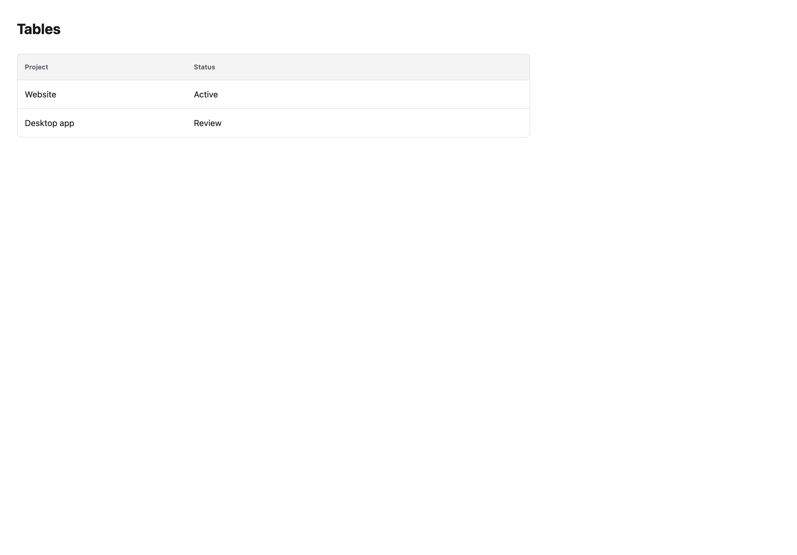
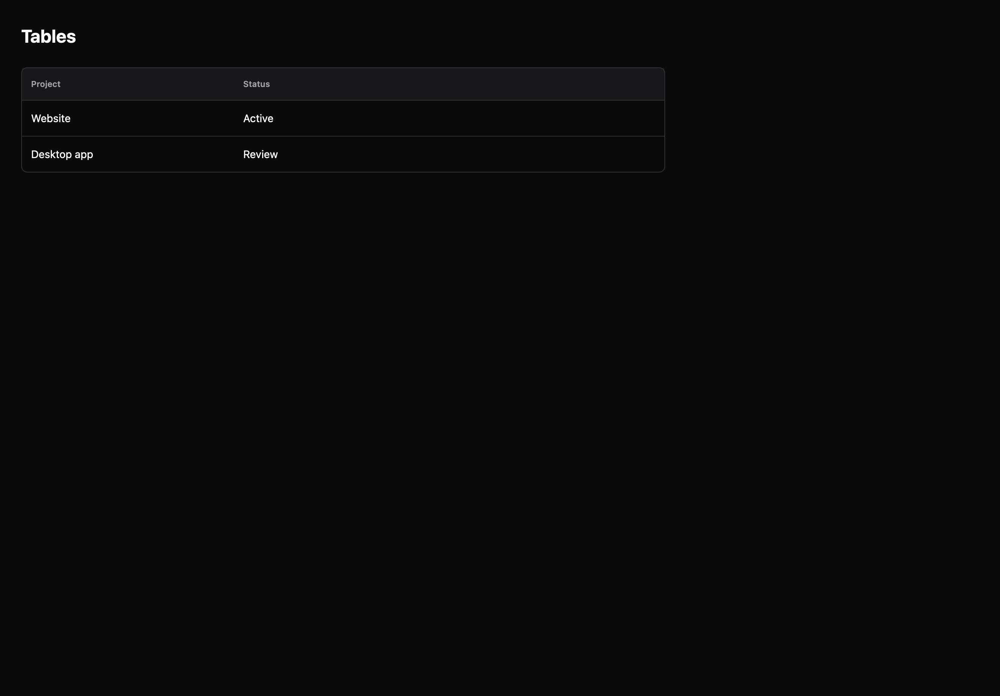

# Tables

[All components](index.md) · Application components · 应用组件

Public imports: `Table`, `DataGrid`, `ConfigurableDataGrid` from `@mirai/gpuix-kit`.

[Behavior and host boundaries](../../packages/uikit/README.md) · [Runnable source](../../apps/gallery/src/examples/application-tables.tsx)





## Example

Render inside `UIKitProvider` and `AppShell`; see [quick start](../getting-started.md). State and service callbacks belong to your application.

```tsx
import { useState } from "react";
import * as UI from "@mirai/gpuix-kit";
// 状态由应用管理；接入时替换示例回调。
export default function Example() {
  return (
    <UI.Table
      testId="example"
      columns={[
        {
          key: "name",
          header: "Project",
          width: 280,
          render: (r) => <UI.Text>{r.name}</UI.Text>,
        },
        {
          key: "status",
          header: "Status",
          width: 160,
          render: (r) => <UI.Text>{r.status}</UI.Text>,
        },
      ]}
      rows={[
        { id: "one", name: "Website", status: "Active" },
        { id: "two", name: "Desktop app", status: "Review" },
      ]}
      rowKey={(r) => r.id}
    />
  );
}
```

## Props

Generated from the shipped TypeScript API. For model types and supporting helpers see the [full API index](../api-index.md).

### Table

[Implementation](../../packages/uikit/src/data/index.tsx)

| Prop | Required | Type | Description |
| --- | --- | --- | --- |
| columns | yes | `readonly TableColumn<T>[]` |  |
| rows | yes | `readonly T[]` |  |
| rowKey | yes | `(row: T) => string` |  |
| empty | no | `string \| undefined` |  |
| testId | yes | `string` |  |
| loading | no | `boolean \| undefined` |  |

### DataGrid

[Implementation](../../packages/uikit/src/components/data-grid/index.tsx)

| Prop | Required | Type | Description |
| --- | --- | --- | --- |
| rows | yes | `readonly T[]` |  |
| columns | yes | `readonly DataColumn<T>[]` |  |
| rowKey | yes | `(row: T) => string` |  |
| rowDisabled | no | `((row: T) => boolean) \| undefined` |  |
| sort | yes | `SortDescriptor \| null` |  |
| onSortChange | yes | `(sort: SortDescriptor \| null) => void` |  |
| selectedIds | yes | `readonly string[]` |  |
| onSelectionChange | yes | `(ids: string[]) => void` |  |
| columnWidths | no | `Readonly<Record<string, number>> \| undefined` |  |
| onColumnWidthsChange | no | `((widths: Record<string, number>) => void) \| undefined` |  |
| onCellEdit | no | `((row: T, columnId: string, value: string) => void) \| undefined` |  |
| onActivate | no | `((row: T) => void) \| undefined` |  |
| height | no | `number \| undefined` |  |
| density | no | `TableDensity \| undefined` |  |
| loading | no | `boolean \| undefined` |  |
| testId | yes | `string` |  |

### ConfigurableDataGrid

[Implementation](../../packages/uikit/src/components/table-preferences/index.tsx)

| Prop | Required | Type | Description |
| --- | --- | --- | --- |
| columns | yes | `readonly ConfigurableDataColumn<T>[]` |  |
| preferences | yes | `TablePreferences` |  |
| onPreferencesChange | yes | `(value: TablePreferences) => void` |  |
| height | no | `number \| undefined` |  |
| testId | yes | `string` |  |
| loading | no | `boolean \| undefined` |  |
| onActivate | no | `((row: T) => void) \| undefined` |  |
| onSelectionChange | yes | `(ids: string[]) => void` |  |
| rows | yes | `readonly T[]` |  |
| rowKey | yes | `(row: T) => string` |  |
| rowDisabled | no | `((row: T) => boolean) \| undefined` |  |
| selectedIds | yes | `readonly string[]` |  |
| columnWidths | no | `Readonly<Record<string, number>> \| undefined` |  |
| onColumnWidthsChange | no | `((widths: Record<string, number>) => void) \| undefined` |  |
| onCellEdit | no | `((row: T, columnId: string, value: string) => void) \| undefined` |  |
