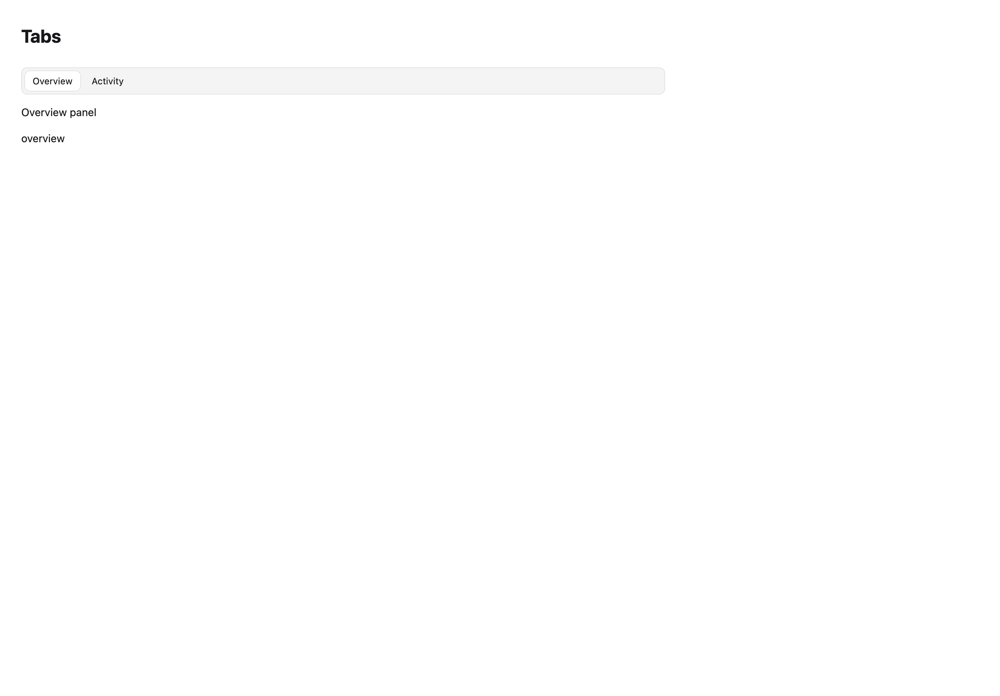
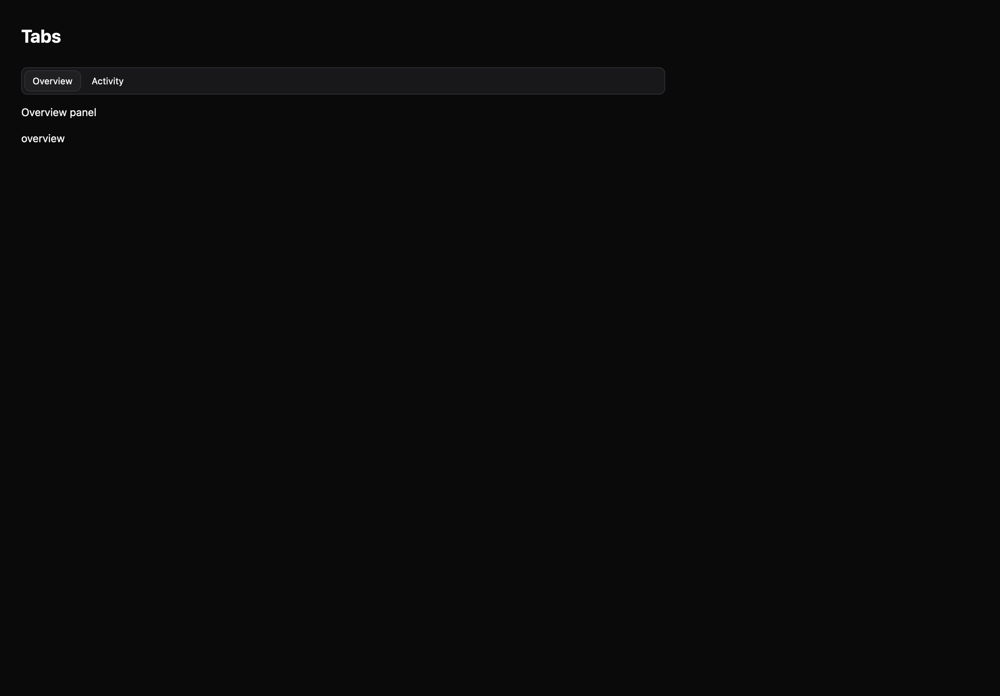

# Tabs

[All components](index.md) · Application components · 应用组件

Public imports: `Tabs`, `DocumentTabs` from `@mirai/gpuix-kit`.

[Behavior and host boundaries](../../packages/uikit/README.md) · [Runnable source](../../apps/gallery/src/examples/application-tabs.tsx)





## Example

Render inside `UIKitProvider` and `AppShell`; see [quick start](../getting-started.md). State and service callbacks belong to your application.

```tsx
import { useState } from "react";
import * as UI from "@mirai/gpuix-kit";
// 状态由应用管理；接入时替换示例回调。
export default function Example() {
  const [value, setValue] = useState("overview");
  return (
    <UI.Stack>
      <UI.Tabs
        testId="example"
        value={value}
        onValueChange={setValue}
        panels={{
          overview: <UI.Text>Overview panel</UI.Text>,
          activity: <UI.Text>Activity panel</UI.Text>,
        }}
        options={[
          { value: "overview", label: "Overview" },
          { value: "activity", label: "Activity" },
        ]}
      />
      <UI.Text>{value}</UI.Text>
    </UI.Stack>
  );
}
```

## Props

Generated from the shipped TypeScript API. For model types and supporting helpers see the [full API index](../api-index.md).

### Tabs

[Implementation](../../packages/uikit/src/layout/index.tsx)

| Prop | Required | Type | Description |
| --- | --- | --- | --- |
| value | yes | `string` |  |
| onValueChange | yes | `(value: string) => void` |  |
| options | yes | `readonly Choice[]` |  |
| testId | yes | `string` |  |
| disabled | no | `boolean \| undefined` |  |
| style | no | `StyleDesc \| undefined` |  |
| panels | yes | `Record<string, ReactNode>` |  |

### DocumentTabs

[Implementation](../../packages/uikit/src/components/document-tabs/index.tsx)

| Prop | Required | Type | Description |
| --- | --- | --- | --- |
| tabs | yes | `readonly DocumentTab[]` |  |
| value | yes | `string \| null` |  |
| onValueChange | yes | `(id: string) => void` |  |
| onClose | yes | `(id: string) => void` |  |
| onAdd | no | `(() => void) \| undefined` |  |
| onReorder | no | `((ids: string[]) => void) \| undefined` |  |
| testId | yes | `string` |  |
| tabWidth | no | `number \| undefined` |  |
