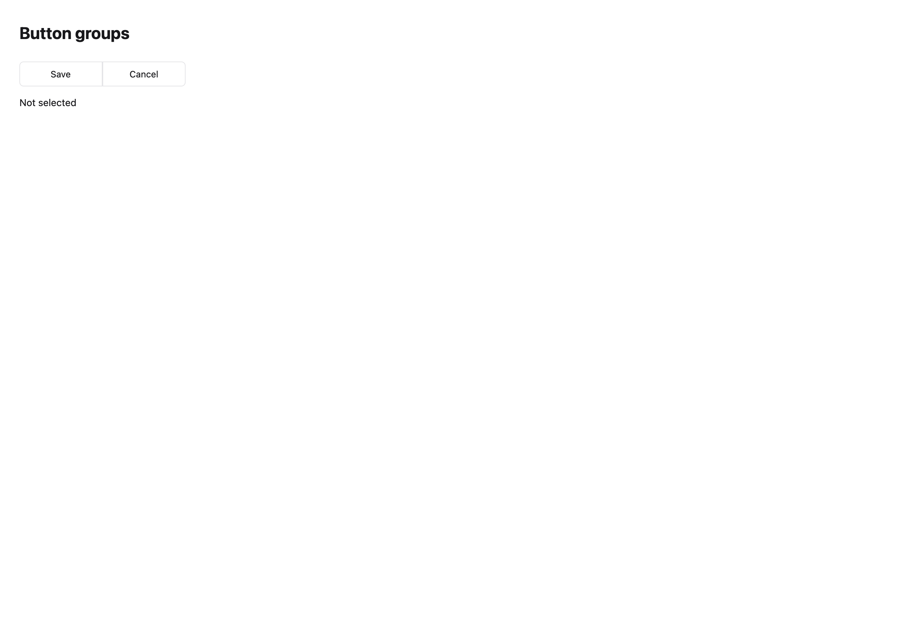
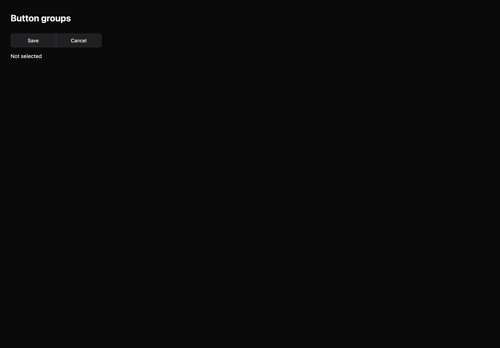

# Button groups

[All components](index.md) · Base components · 基础组件

Public imports: `ButtonGroup` from `@mirai/gpuix-kit`.

[Behavior and host boundaries](../../packages/uikit/README.md) · [Runnable source](../../apps/gallery/src/examples/base-button-groups.tsx)





## Example

Render inside `UIKitProvider` and `AppShell`; see [quick start](../getting-started.md). State and service callbacks belong to your application.

```tsx
import { useState } from "react";
import * as UI from "@mirai/gpuix-kit";
// 状态由应用管理；接入时替换示例回调。
export default function Example() {
  const [value, setValue] = useState("Not selected");
  return (
    <UI.Stack>
      <UI.ButtonGroup
        testId="example"
        items={[
          { id: "save", label: "Save", run: () => setValue("Saved") },
          { id: "cancel", label: "Cancel", run: () => setValue("Cancelled") },
        ]}
      />
      <UI.Text>{value}</UI.Text>
    </UI.Stack>
  );
}
```

## Props

Generated from the shipped TypeScript API. For model types and supporting helpers see the [full API index](../api-index.md).

### ButtonGroup

[Implementation](../../packages/uikit/src/components/actions/index.tsx)

| Prop | Required | Type | Description |
| --- | --- | --- | --- |
| items | yes | `readonly UIKitAction[]` |  |
| testId | yes | `string` |  |
| disabled | no | `boolean \| undefined` |  |
| orientation | no | `"horizontal" \| "vertical" \| undefined` |  |
| variant | no | `ButtonVariant \| undefined` |  |
| itemWidth | no | `number \| undefined` |  |
