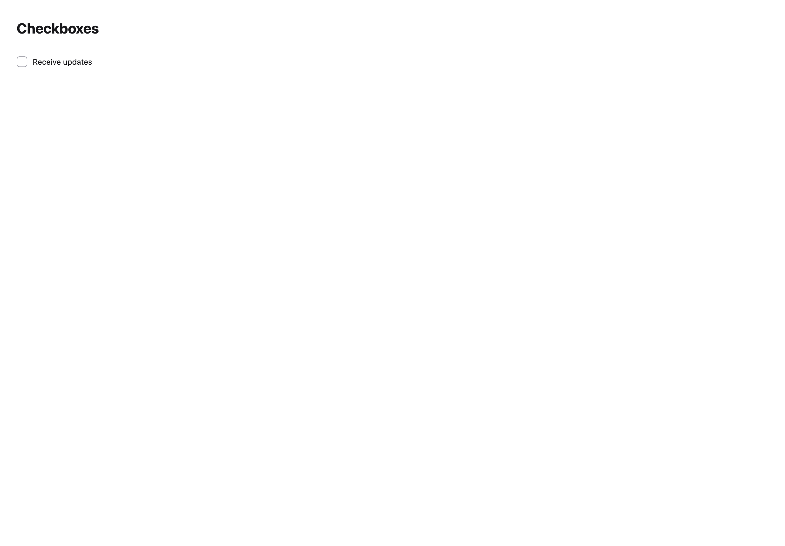
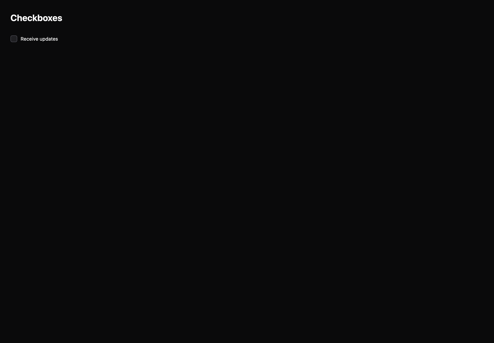

# Checkboxes

[All components](index.md) · Base components · 基础组件

Public imports: `Checkbox`, `CheckboxGroup` from `@mirai/gpuix-kit`.

[Behavior and host boundaries](../../packages/uikit/README.md) · [Runnable source](../../apps/gallery/src/examples/base-checkboxes.tsx)





## Example

Render inside `UIKitProvider` and `AppShell`; see [quick start](../getting-started.md). State and service callbacks belong to your application.

```tsx
import { useState } from "react";
import * as UI from "@mirai/gpuix-kit";
// 状态由应用管理；接入时替换示例回调。
export default function Example() {
  const [checked, setChecked] = useState(false);
  return (
    <UI.Checkbox
      testId="example"
      label="Receive updates"
      checked={checked}
      onCheckedChange={(v) => setChecked(v === true)}
    />
  );
}
```

## Props

Generated from the shipped TypeScript API. For model types and supporting helpers see the [full API index](../api-index.md).

### Checkbox

[Implementation](../../packages/uikit/src/base/selection.tsx)

| Prop | Required | Type | Description |
| --- | --- | --- | --- |
| checked | yes | `CheckboxState` |  |
| onCheckedChange | yes | `(checked: boolean) => void` |  |
| label | yes | `string` |  |
| disabled | no | `boolean \| undefined` |  |
| readOnly | no | `boolean \| undefined` |  |
| testId | yes | `string` |  |
| style | no | `StyleDesc \| undefined` |  |

### CheckboxGroup

[Implementation](../../packages/uikit/src/components/checkbox/index.tsx)

| Prop | Required | Type | Description |
| --- | --- | --- | --- |
| options | yes | `readonly CheckboxOption[]` |  |
| value | yes | `readonly string[]` |  |
| onValueChange | yes | `(value: string[]) => void` |  |
| label | no | `string \| undefined` |  |
| selectAllLabel | no | `string \| undefined` |  |
| showSelectAll | no | `boolean \| undefined` |  |
| disabled | no | `boolean \| undefined` |  |
| readOnly | no | `boolean \| undefined` |  |
| emptyLabel | no | `string \| undefined` |  |
| testId | yes | `string` |  |
