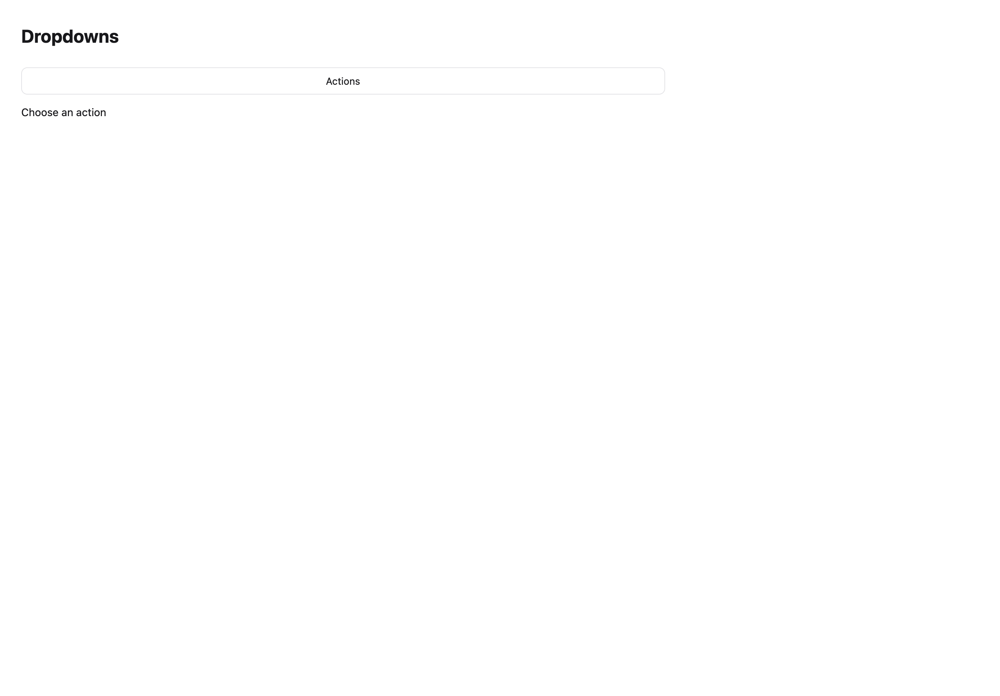
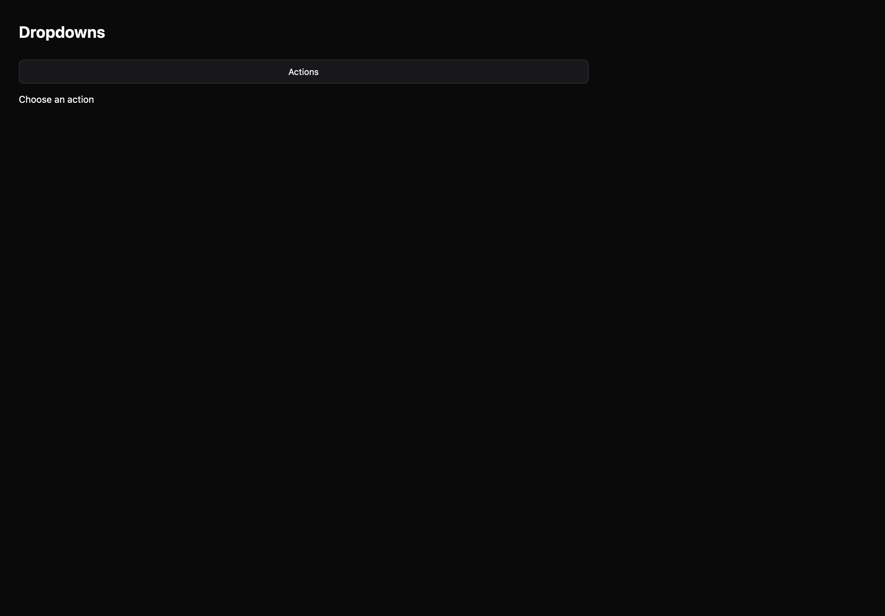

# Dropdowns

[All components](index.md) · Base components · 基础组件

Public imports: `DropdownMenu` from `@mirai/gpuix-kit`.

[Behavior and host boundaries](../../packages/uikit/README.md) · [Runnable source](../../apps/gallery/src/examples/base-dropdowns.tsx)





## Example

Render inside `UIKitProvider` and `AppShell`; see [quick start](../getting-started.md). State and service callbacks belong to your application.

```tsx
import { useState } from "react";
import * as UI from "@mirai/gpuix-kit";
// 状态由应用管理；接入时替换示例回调。
export default function Example() {
  const [open, setOpen] = useState(false);
  const [value, setValue] = useState("Choose an action");
  return (
    <UI.Stack>
      <UI.DropdownMenu
        testId="example"
        label="Actions"
        open={open}
        onOpenChange={setOpen}
        items={[
          {
            id: "rename",
            label: "Rename",
            run: () => setValue("Rename requested"),
          },
          {
            id: "archive",
            label: "Archive",
            run: () => setValue("Archive requested"),
          },
        ]}
      />
      <UI.Text>{value}</UI.Text>
    </UI.Stack>
  );
}
```

## Props

Generated from the shipped TypeScript API. For model types and supporting helpers see the [full API index](../api-index.md).

### DropdownMenu

[Implementation](../../packages/uikit/src/components/menu/index.tsx)

| Prop | Required | Type | Description |
| --- | --- | --- | --- |
| label | yes | `string` |  |
| items | yes | `readonly MenuItem[]` |  |
| open | yes | `boolean` |  |
| onOpenChange | yes | `(open: boolean) => void` |  |
| testId | yes | `string` |  |
| disabled | no | `boolean \| undefined` |  |
