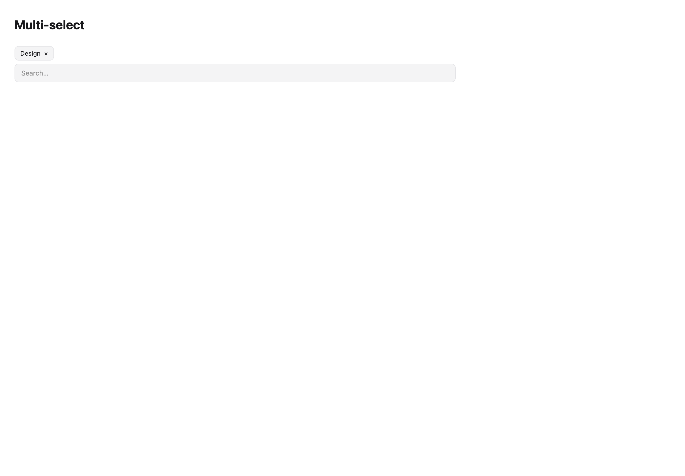

# Multi-select

[All components](index.md) · Base components · 基础组件

Public imports: `MultiSelect` from `@mirai/gpuix-kit`.

[Behavior and host boundaries](../../packages/uikit/README.md) · [Runnable source](../../apps/gallery/src/examples/base-multi-select.tsx)




## Example

Render inside `UIKitProvider` and `AppShell`; see [quick start](../getting-started.md). State and service callbacks belong to your application.

```tsx
import { useState } from "react";
import * as UI from "@mirai/gpuix-kit";
// 状态由应用管理；接入时替换示例回调。
export default function Example() {
  const [value, setValue] = useState<string[]>(["design"]);
  return (
    <UI.MultiSelect
      testId="example"
      value={value}
      onValueChange={setValue}
      options={[
        { value: "design", label: "Design" },
        { value: "engineering", label: "Engineering" },
        { value: "research", label: "Research" },
      ]}
    />
  );
}
```

## Props

Generated from the shipped TypeScript API. For model types and supporting helpers see the [full API index](../api-index.md).

### MultiSelect

[Implementation](../../packages/uikit/src/components/combobox/index.tsx)

| Prop | Required | Type | Description |
| --- | --- | --- | --- |
| value | yes | `readonly string[]` |  |
| onValueChange | yes | `(value: string[]) => void` |  |
| options | yes | `readonly ComboboxOption[]` |  |
| testId | yes | `string` |  |
| placeholder | no | `string \| undefined` |  |
| disabled | no | `boolean \| undefined` |  |
| loading | no | `boolean \| undefined` |  |
| emptyLabel | no | `string \| undefined` |  |
| loadingLabel | no | `string \| undefined` |  |
| query | no | `string \| undefined` |  |
| onQueryChange | no | `((query: string) => void) \| undefined` |  |
| filter | no | `boolean \| undefined` | 服务端已过滤的当前页数据可关闭本地过滤。 |
| popupWidth | no | `number \| undefined` |  |
