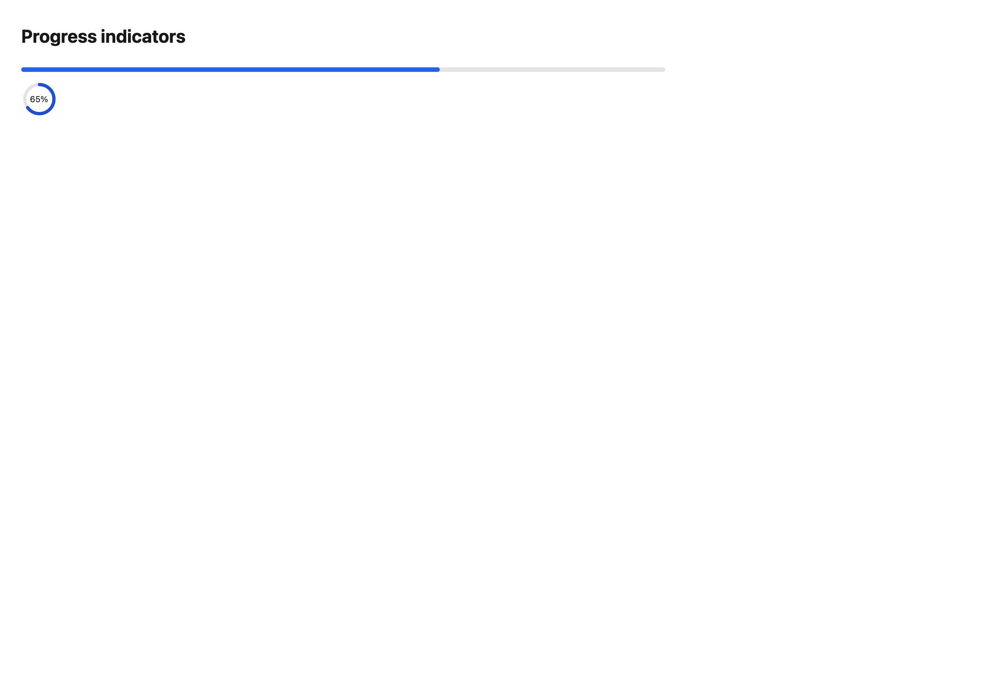
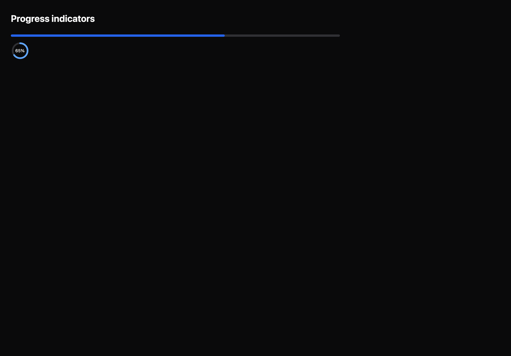

# Progress indicators

[All components](index.md) · Base components · 基础组件

Public imports: `Progress`, `ProgressRing` from `@mirai/gpuix-kit`.

[Behavior and host boundaries](../../packages/uikit/README.md) · [Runnable source](../../apps/gallery/src/examples/base-progress-indicators.tsx)





## Example

Render inside `UIKitProvider` and `AppShell`; see [quick start](../getting-started.md). State and service callbacks belong to your application.

```tsx
import { useState } from "react";
import * as UI from "@mirai/gpuix-kit";
// 状态由应用管理；接入时替换示例回调。
export default function Example() {
  return (
    <UI.Stack>
      <UI.Progress value={65} />
      <UI.ProgressRing testId="example" value={65} />
    </UI.Stack>
  );
}
```

## Props

Generated from the shipped TypeScript API. For model types and supporting helpers see the [full API index](../api-index.md).

### Progress

[Implementation](../../packages/uikit/src/data/index.tsx)

| Prop | Required | Type | Description |
| --- | --- | --- | --- |
| value | yes | `number` |  |
| max | no | `number \| undefined` |  |
| label | no | `string \| undefined` |  |
| testId | no | `string \| undefined` |  |

### ProgressRing

[Implementation](../../packages/uikit/src/components/task-progress/index.tsx)

| Prop | Required | Type | Description |
| --- | --- | --- | --- |
| value | yes | `number \| null` |  |
| max | no | `number \| undefined` |  |
| size | no | `number \| undefined` |  |
| testId | yes | `string` |  |
| label | no | `string \| undefined` |  |
| tone | no | `Tone \| undefined` |  |
