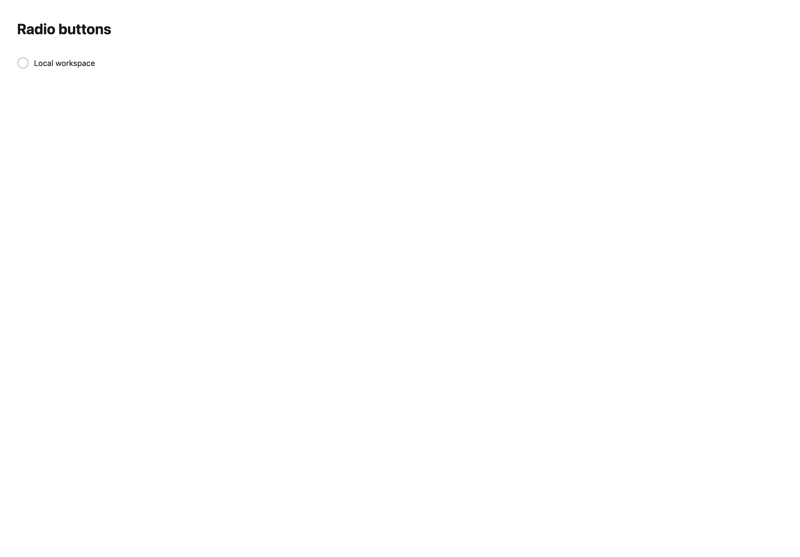
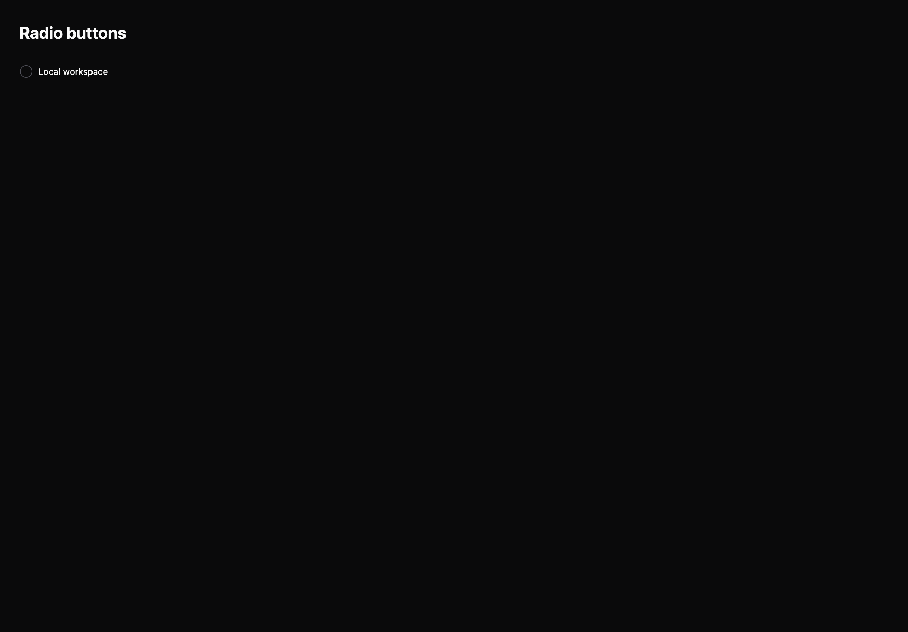

# Radio buttons

[All components](index.md) · Base components · 基础组件

Public imports: `RadioButton` from `@mirai/gpuix-kit`.

[Behavior and host boundaries](../../packages/uikit/docs/catalog-completion.md) · [Runnable source](../../apps/gallery/src/examples/base-radio-buttons.tsx)





## Example

Render inside `UIKitProvider` and `AppShell`; see [quick start](../getting-started.md). State and service callbacks belong to your application.

```tsx
import { useState } from "react";
import * as UI from "@mirai/gpuix-kit";
// 状态由应用管理；接入时替换示例回调。
export default function Example() {
  const [checked, setChecked] = useState(false);
  return (
    <UI.RadioButton
      testId="example"
      label="Local workspace"
      checked={checked}
      onCheckedChange={setChecked}
    />
  );
}
```

## Props

Generated from the shipped TypeScript API. For model types and supporting helpers see the [full API index](../api-index.md).

### RadioButton

[Implementation](../../packages/uikit/src/components/identity/index.tsx)

| Prop | Required | Type | Description |
| --- | --- | --- | --- |
| checked | yes | `boolean` |  |
| onCheckedChange | yes | `(checked: boolean) => void` |  |
| label | yes | `string` |  |
| disabled | no | `boolean \| undefined` |  |
| readOnly | no | `boolean \| undefined` |  |
| testId | yes | `string` |  |
