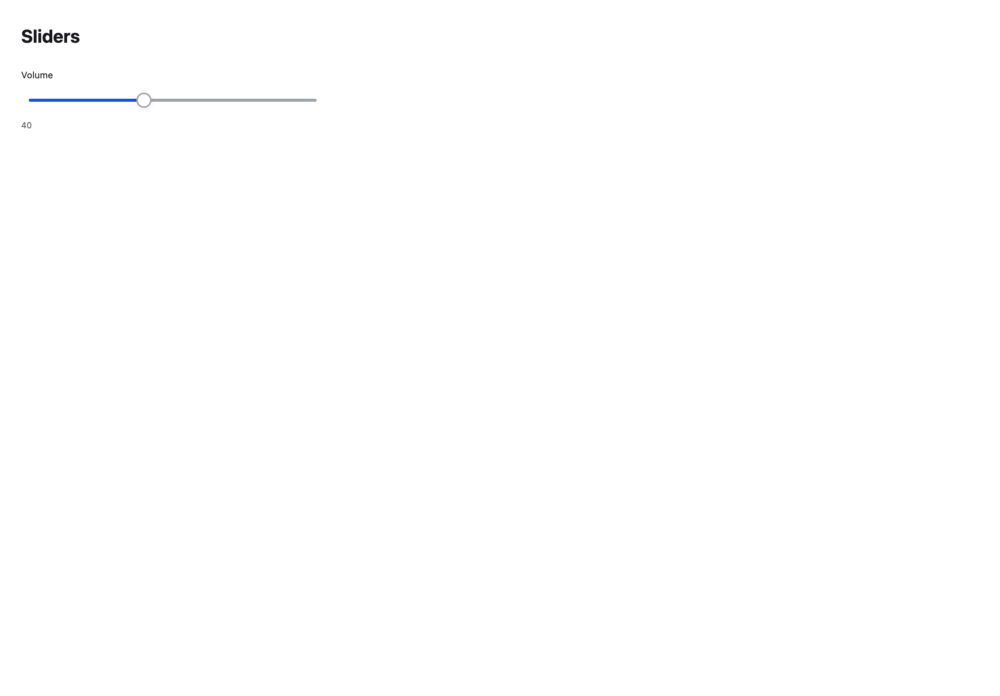
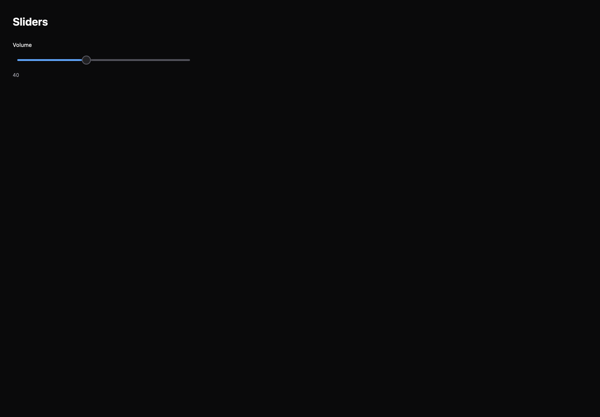

# Sliders

[All components](index.md) · Base components · 基础组件

Public imports: `Slider`, `RangeSlider` from `@mirai/gpuix-kit`.

[Behavior and host boundaries](../../packages/uikit/README.md) · [Runnable source](../../apps/gallery/src/examples/base-sliders.tsx)





## Example

Render inside `UIKitProvider` and `AppShell`; see [quick start](../getting-started.md). State and service callbacks belong to your application.

```tsx
import { useState } from "react";
import * as UI from "@mirai/gpuix-kit";
// 状态由应用管理；接入时替换示例回调。
export default function Example() {
  const [value, setValue] = useState(40);
  return (
    <UI.Slider
      testId="example"
      value={value}
      onValueChange={setValue}
      min={0}
      max={100}
      step={1}
      length={400}
      label="Volume"
    />
  );
}
```

## Props

Generated from the shipped TypeScript API. For model types and supporting helpers see the [full API index](../api-index.md).

### Slider

[Implementation](../../packages/uikit/src/components/slider/index.tsx)

| Prop | Required | Type | Description |
| --- | --- | --- | --- |
| value | yes | `number` |  |
| onValueChange | yes | `(value: number) => void` |  |
| onValueCommit | no | `((value: number) => void) \| undefined` |  |
| min | no | `number \| undefined` |  |
| max | no | `number \| undefined` |  |
| step | no | `number \| undefined` |  |
| length | no | `number \| undefined` |  |
| orientation | no | `"horizontal" \| "vertical" \| undefined` |  |
| disabled | no | `boolean \| undefined` |  |
| readOnly | no | `boolean \| undefined` |  |
| trackPress | no | `boolean \| undefined` | 可选的离散轨道点击，最多 201 个停靠值。 |
| marks | no | `readonly SliderMark[] \| undefined` |  |
| label | no | `string \| undefined` |  |
| showValue | no | `boolean \| undefined` | 组合面板可在通道旁显示值，避免重复标签。 |
| formatValue | no | `((value: number) => string) \| undefined` |  |
| testId | yes | `string` |  |

### RangeSlider

[Implementation](../../packages/uikit/src/components/slider/index.tsx)

| Prop | Required | Type | Description |
| --- | --- | --- | --- |
| value | yes | `readonly [number, number]` |  |
| onValueChange | yes | `(value: [number, number]) => void` |  |
| onValueCommit | no | `((value: [number, number]) => void) \| undefined` |  |
| label | no | `string \| undefined` |  |
| disabled | no | `boolean \| undefined` |  |
| readOnly | no | `boolean \| undefined` |  |
| testId | yes | `string` |  |
| min | no | `number \| undefined` |  |
| max | no | `number \| undefined` |  |
| step | no | `number \| undefined` |  |
| length | no | `number \| undefined` |  |
| orientation | no | `"horizontal" \| "vertical" \| undefined` |  |
| trackPress | no | `boolean \| undefined` | 可选的离散轨道点击，最多 201 个停靠值。 |
| marks | no | `readonly SliderMark[] \| undefined` |  |
| showValue | no | `boolean \| undefined` | 组合面板可在通道旁显示值，避免重复标签。 |
| formatValue | no | `((value: number) => string) \| undefined` |  |
