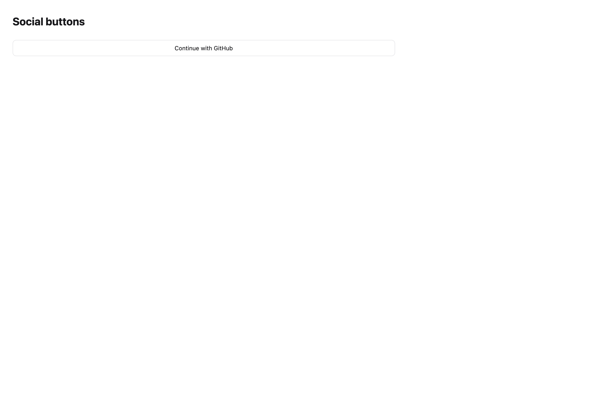
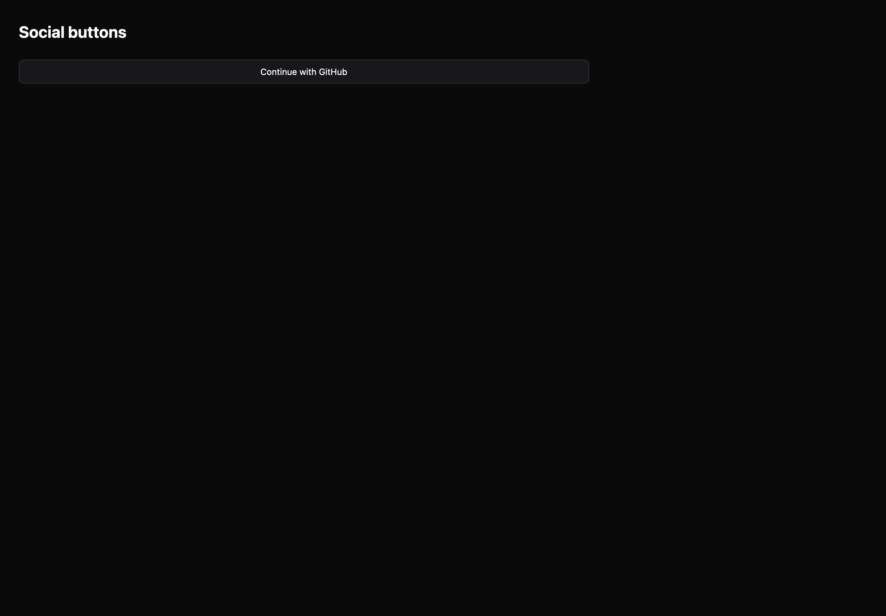

# Social buttons

[All components](index.md) · Base components · 基础组件

Public imports: `SocialButton` from `@mirai/gpuix-kit`.

[Behavior and host boundaries](../../packages/uikit/docs/catalog-completion.md) · [Runnable source](../../apps/gallery/src/examples/base-social-buttons.tsx)





## Example

Render inside `UIKitProvider` and `AppShell`; see [quick start](../getting-started.md). State and service callbacks belong to your application.

```tsx
import { useState } from "react";
import * as UI from "@mirai/gpuix-kit";
// 状态由应用管理；接入时替换示例回调。
export default function Example() {
  const [value, setValue] = useState("");
  return (
    <UI.Stack>
      <UI.SocialButton
        testId="example"
        provider="GitHub"
        onPress={() => setValue("Authentication requested")}
      />
      <UI.Text>{value}</UI.Text>
    </UI.Stack>
  );
}
```

## Props

Generated from the shipped TypeScript API. For model types and supporting helpers see the [full API index](../api-index.md).

### SocialButton

[Implementation](../../packages/uikit/src/components/identity/index.tsx)

| Prop | Required | Type | Description |
| --- | --- | --- | --- |
| disabled | no | `boolean \| undefined` |  |
| testId | yes | `string` |  |
| style | no | `StyleDesc \| undefined` |  |
| onPress | yes | `() => void` |  |
| variant | no | `ButtonVariant \| undefined` |  |
| size | no | `"sm" \| "md" \| "lg" \| undefined` |  |
| loading | no | `boolean \| undefined` |  |
| loadingText | no | `string \| undefined` |  |
| leading | no | `ReactNode` |  |
| trailing | no | `ReactNode` |  |
| fullWidth | no | `boolean \| undefined` |  |
| labelLines | no | `number \| undefined` | 组合控件可显式限制标签行数，避免长名称撑破固定宽度。 |
| ref | no | `ControlRef \| undefined` |  |
| onKeyDown | no | `((event: EventPayload) => boolean \| void) \| undefined` |  |
| provider | yes | `string` |  |
