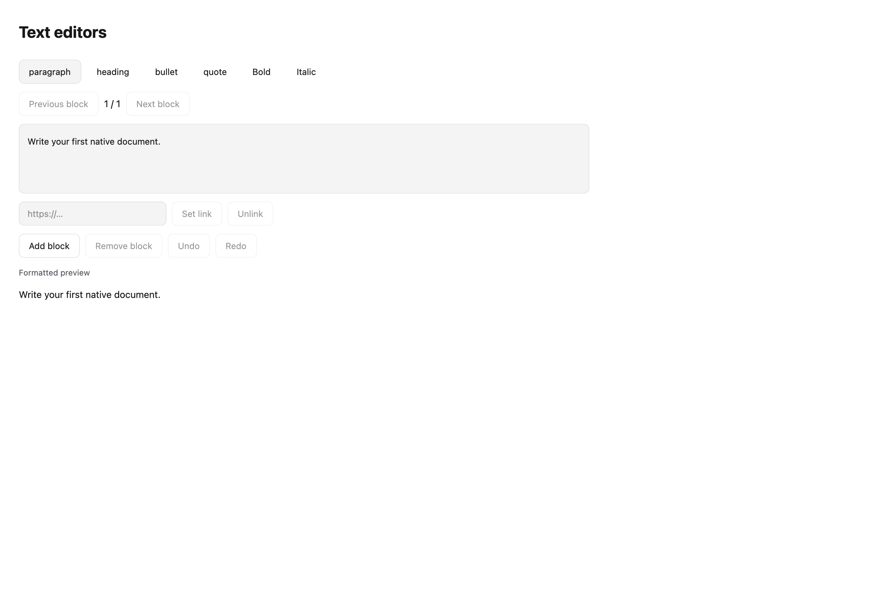
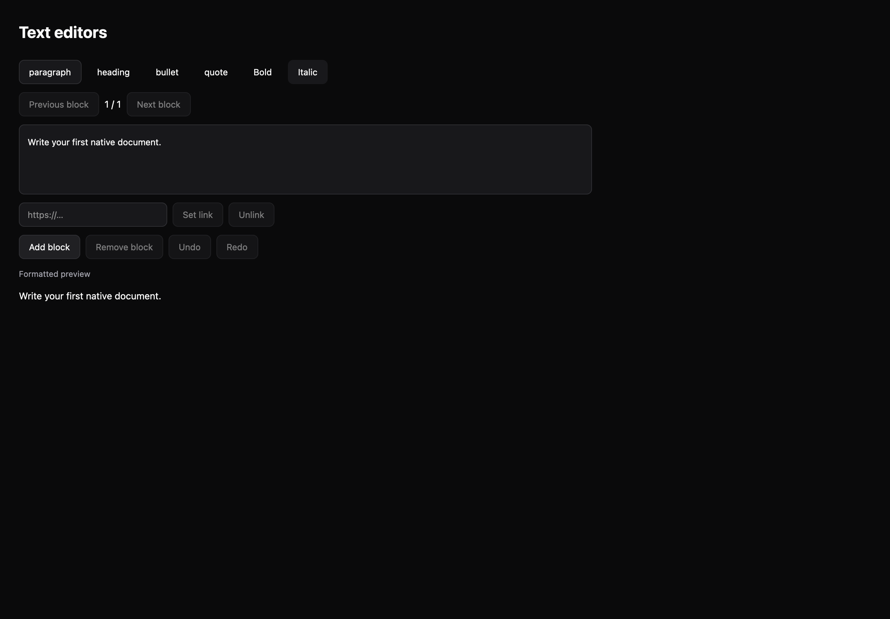

# Text editors

[All components](index.md) · Base components · 基础组件

Public imports: `RichTextEditor` from `@mirai/gpuix-kit`.

[Behavior and host boundaries](../../packages/uikit/docs/catalog-completion.md) · [Runnable source](../../apps/gallery/src/examples/base-text-editors.tsx)





## Example

Render inside `UIKitProvider` and `AppShell`; see [quick start](../getting-started.md). State and service callbacks belong to your application.

```tsx
import { useState } from "react";
import * as UI from "@mirai/gpuix-kit";
// 状态由应用管理；接入时替换示例回调。
export default function Example() {
  const [value, setValue] = useState<UI.RichBlock[]>([
    {
      id: "intro",
      kind: "paragraph",
      text: "Write your first native document.",
    },
  ]);
  return (
    <UI.RichTextEditor
      testId="example"
      value={value}
      onValueChange={setValue}
    />
  );
}
```

## Props

Generated from the shipped TypeScript API. For model types and supporting helpers see the [full API index](../api-index.md).

### RichTextEditor

[Implementation](../../packages/uikit/src/components/rich-editor/index.tsx)

| Prop | Required | Type | Description |
| --- | --- | --- | --- |
| value | yes | `RichDocument` |  |
| onValueChange | yes | `(value: RichBlock[]) => void` |  |
| readOnly | no | `boolean \| undefined` |  |
| disabled | no | `boolean \| undefined` |  |
| revision | no | `string \| number \| undefined` |  |
| testId | yes | `string` |  |
| renderEditor | no | `((props: { value: RichDocument; onValueChange: (value: RichBlock[]) => void; disabled: boolean; readOnly: boolean; }) => ReactNode) \| undefined` |  |
