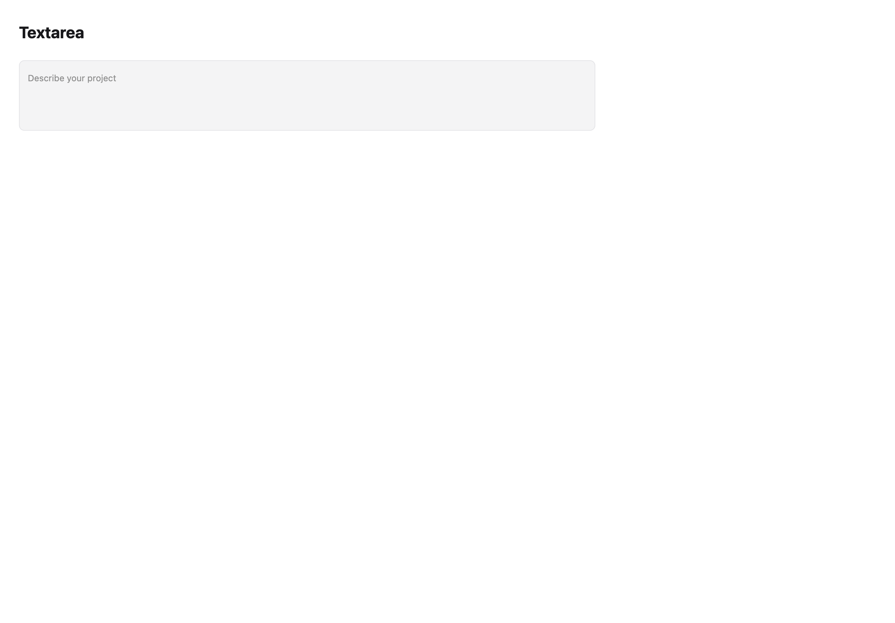
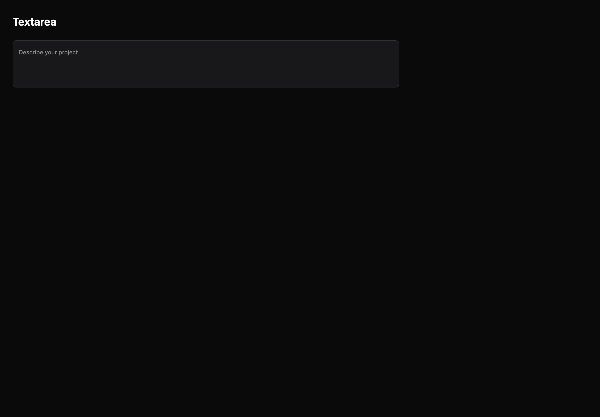

# Textarea

[All components](index.md) · Base components · 基础组件

Public imports: `Textarea` from `@mirai/gpuix-kit`.

[Behavior and host boundaries](../../packages/uikit/README.md) · [Runnable source](../../apps/gallery/src/examples/base-textarea.tsx)





## Example

Render inside `UIKitProvider` and `AppShell`; see [quick start](../getting-started.md). State and service callbacks belong to your application.

```tsx
import { useState } from "react";
import * as UI from "@mirai/gpuix-kit";
// 状态由应用管理；接入时替换示例回调。
export default function Example() {
  const [value, setValue] = useState("");
  return (
    <UI.Textarea
      testId="example"
      value={value}
      onValueChange={setValue}
      placeholder="Describe your project"
      minRows={3}
      maxRows={5}
    />
  );
}
```

## Props

Generated from the shipped TypeScript API. For model types and supporting helpers see the [full API index](../api-index.md).

### Textarea

[Implementation](../../packages/uikit/src/base/input.tsx)

| Prop | Required | Type | Description |
| --- | --- | --- | --- |
| value | yes | `string` |  |
| onValueChange | yes | `(value: string) => void` |  |
| testId | yes | `string` |  |
| placeholder | no | `string \| undefined` |  |
| disabled | no | `boolean \| undefined` |  |
| readOnly | no | `boolean \| undefined` |  |
| invalid | no | `boolean \| undefined` |  |
| size | no | `"sm" \| "md" \| "lg" \| undefined` |  |
| style | no | `StyleDesc \| undefined` |  |
| onSubmit | no | `(() => void) \| undefined` |  |
| onKeyDown | no | `((event: EventPayload) => boolean \| void) \| undefined` |  |
| ref | no | `ControlRef \| undefined` |  |
| resetKey | no | `string \| number \| undefined` | 显式重建原生编辑器；同时重置宿主撤销与光标历史。 |
| minRows | no | `number \| undefined` |  |
| maxRows | no | `number \| undefined` |  |
