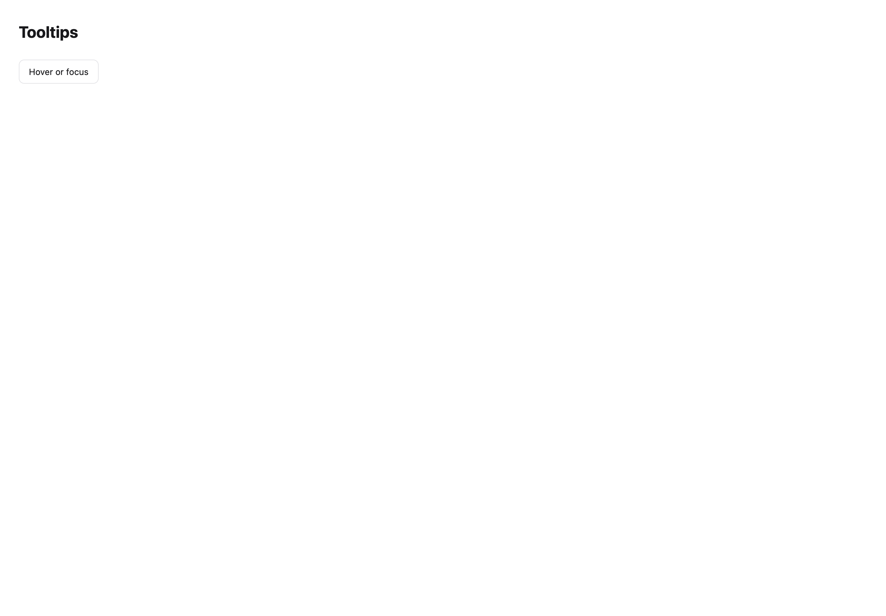
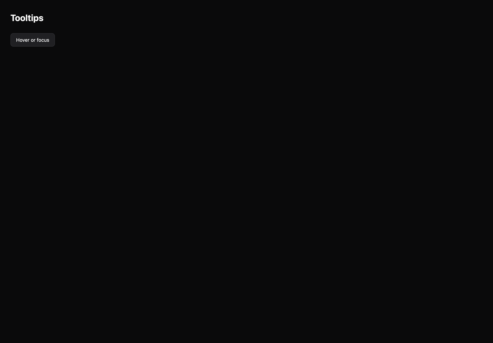

# Tooltips

[All components](index.md) · Base components · 基础组件

Public imports: `Tooltip` from `@mirai/gpuix-kit`.

[Behavior and host boundaries](../../packages/uikit/README.md) · [Runnable source](../../apps/gallery/src/examples/base-tooltips.tsx)





## Example

Render inside `UIKitProvider` and `AppShell`; see [quick start](../getting-started.md). State and service callbacks belong to your application.

```tsx
import { useState } from "react";
import * as UI from "@mirai/gpuix-kit";
// 状态由应用管理；接入时替换示例回调。
export default function Example() {
  return (
    <UI.Tooltip testId="example-tooltip" content="Create a new project">
      <UI.Button testId="example" onPress={() => {}}>
        Hover or focus
      </UI.Button>
    </UI.Tooltip>
  );
}
```

## Props

Generated from the shipped TypeScript API. For model types and supporting helpers see the [full API index](../api-index.md).

### Tooltip

[Implementation](../../packages/uikit/src/overlays/index.tsx)

| Prop | Required | Type | Description |
| --- | --- | --- | --- |
| content | yes | `string` |  |
| children | yes | `ReactNode` |  |
| testId | yes | `string` |  |
| open | no | `boolean \| undefined` |  |
