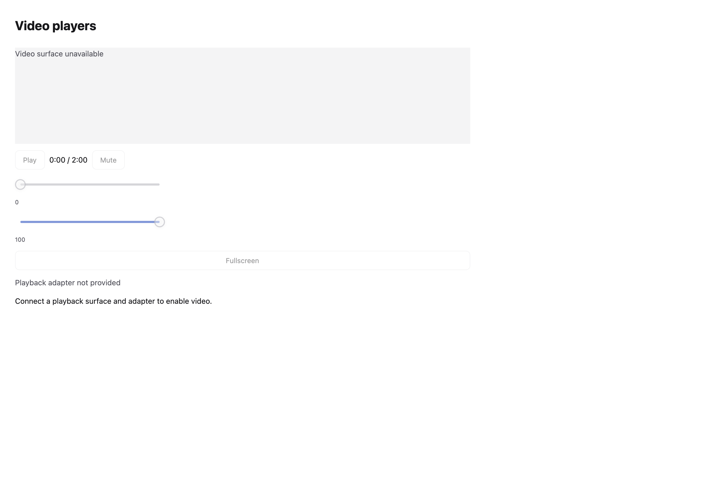
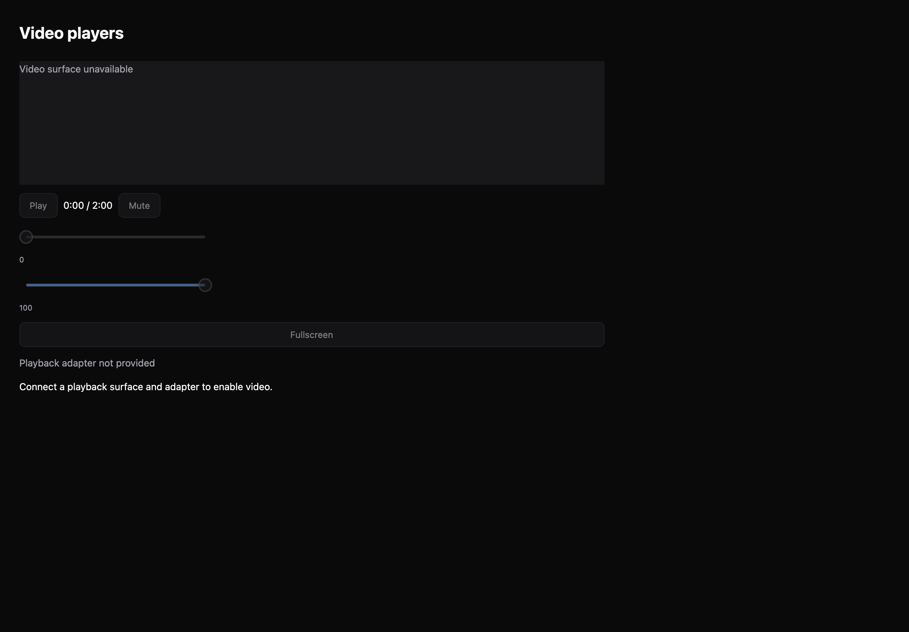

# Video players

[All components](index.md) · Base components · 基础组件

Public imports: `VideoPlayer` from `@mirai/gpuix-kit`.

[Behavior and host boundaries](../../packages/uikit/docs/catalog-completion.md) · [Runnable source](../../apps/gallery/src/examples/base-video-players.tsx)





## Example

Render inside `UIKitProvider` and `AppShell`; see [quick start](../getting-started.md). State and service callbacks belong to your application.

```tsx
import { useState } from "react";
import * as UI from "@mirai/gpuix-kit";
// 状态由应用管理；接入时替换示例回调。
export default function Example() {
  return (
    <UI.Stack>
      <UI.VideoPlayer
        testId="example"
        sourceId="demo"
        state={{
          status: "idle",
          currentTime: 0,
          duration: 120,
          volume: 1,
          muted: false,
        }}
      />
      <UI.Text>Connect a playback surface and adapter to enable video.</UI.Text>
    </UI.Stack>
  );
}
```

## Props

Generated from the shipped TypeScript API. For model types and supporting helpers see the [full API index](../api-index.md).

### VideoPlayer

[Implementation](../../packages/uikit/src/components/media/index.tsx)

| Prop | Required | Type | Description |
| --- | --- | --- | --- |
| sourceId | yes | `string` |  |
| state | yes | `VideoState` |  |
| adapter | no | `VideoPlayerAdapter \| undefined` |  |
| surface | no | `ReactNode` |  |
| poster | no | `string \| undefined` |  |
| height | no | `number \| undefined` |  |
| disabled | no | `boolean \| undefined` |  |
| testId | yes | `string` |  |
