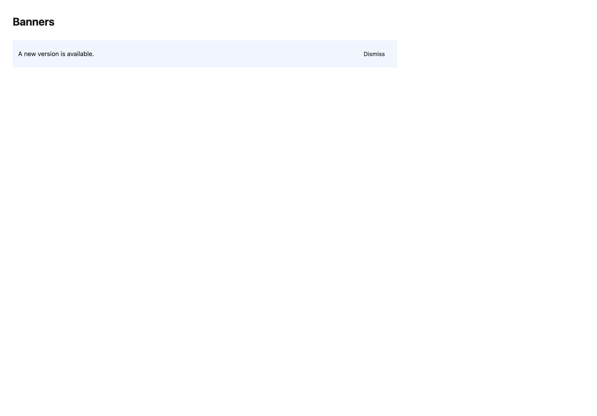
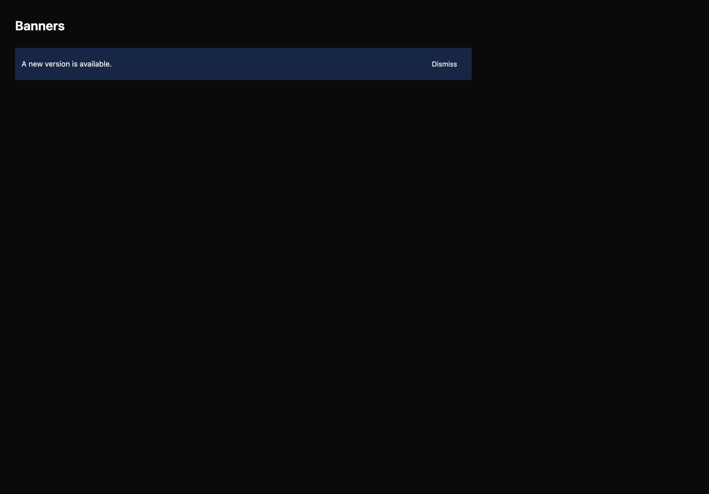

# Banners

[All components](index.md) · Marketing components · 营销组件

Public imports: `Banner` from `@mirai/gpuix-kit`.

[Behavior and host boundaries](../../packages/uikit/docs/catalog-completion.md) · [Runnable source](../../apps/gallery/src/examples/marketing-banners.tsx)





## Example

Render inside `UIKitProvider` and `AppShell`; see [quick start](../getting-started.md). State and service callbacks belong to your application.

```tsx
import { useState } from "react";
import * as UI from "@mirai/gpuix-kit";
// 状态由应用管理；接入时替换示例回调。
export default function Example() {
  const [visible, setVisible] = useState(true);
  return (
    <UI.Stack>
      {visible ? (
        <UI.Banner testId="example" onDismiss={() => setVisible(false)}>
          A new version is available.
        </UI.Banner>
      ) : (
        <UI.Button testId="restore" onPress={() => setVisible(true)}>
          Show banner
        </UI.Button>
      )}
    </UI.Stack>
  );
}
```

## Props

Generated from the shipped TypeScript API. For model types and supporting helpers see the [full API index](../api-index.md).

### Banner

[Implementation](../../packages/uikit/src/components/marketing/index.tsx)

| Prop | Required | Type | Description |
| --- | --- | --- | --- |
| children | yes | `ReactNode` |  |
| onDismiss | no | `(() => void) \| undefined` |  |
| actions | no | `ReactNode` |  |
| testId | yes | `string` |  |
