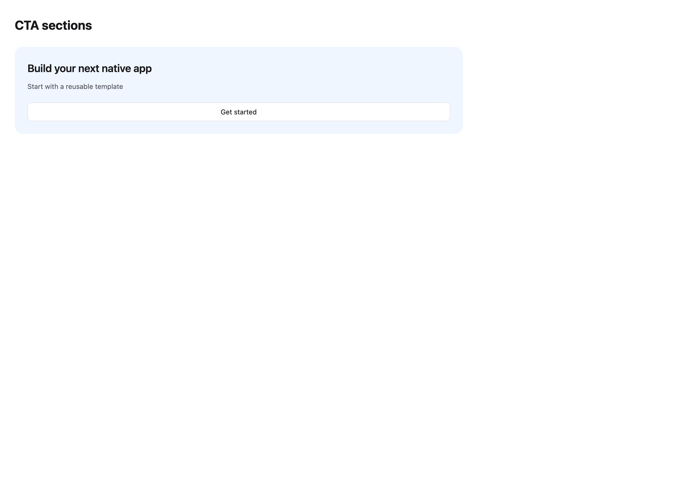
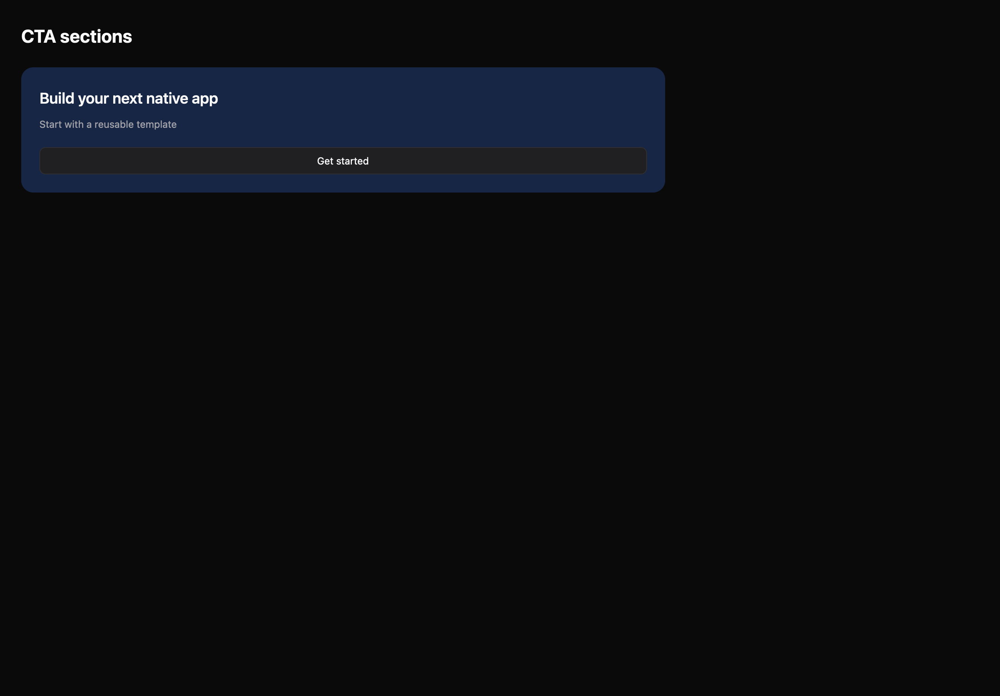

# CTA sections

[All components](index.md) · Marketing components · 营销组件

Public imports: `CTASection` from `@mirai/gpuix-kit`.

[Behavior and host boundaries](../../packages/uikit/docs/catalog-completion.md) · [Runnable source](../../apps/gallery/src/examples/marketing-cta-sections.tsx)





## Example

Render inside `UIKitProvider` and `AppShell`; see [quick start](../getting-started.md). State and service callbacks belong to your application.

```tsx
import { useState } from "react";
import * as UI from "@mirai/gpuix-kit";
// 状态由应用管理；接入时替换示例回调。
export default function Example() {
  return (
    <UI.CTASection
      testId="example-ctasection"
      title="Build your next native app"
      description="Start with a reusable template"
      actions={
        <UI.Button testId="example" onPress={() => {}}>
          Get started
        </UI.Button>
      }
    />
  );
}
```

## Props

Generated from the shipped TypeScript API. For model types and supporting helpers see the [full API index](../api-index.md).

### CTASection

[Implementation](../../packages/uikit/src/components/marketing/index.tsx)

| Prop | Required | Type | Description |
| --- | --- | --- | --- |
| title | yes | `string` |  |
| description | no | `string \| undefined` |  |
| eyebrow | no | `string \| undefined` |  |
| actions | no | `ReactNode` |  |
| media | no | `ReactNode` |  |
| testId | yes | `string` |  |
