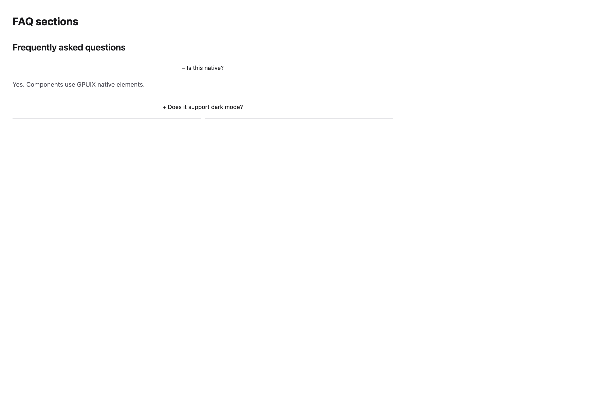
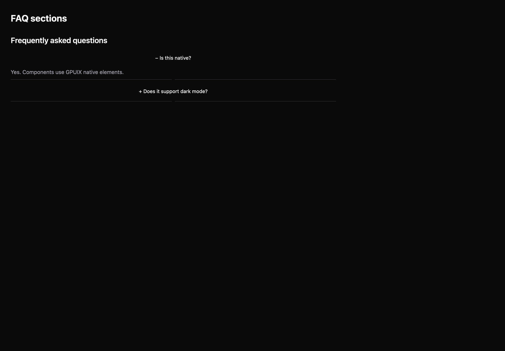

# FAQ sections

[All components](index.md) · Marketing components · 营销组件

Public imports: `FAQSection` from `@mirai/gpuix-kit`.

[Behavior and host boundaries](../../packages/uikit/docs/catalog-completion.md) · [Runnable source](../../apps/gallery/src/examples/marketing-faq-sections.tsx)





## Example

Render inside `UIKitProvider` and `AppShell`; see [quick start](../getting-started.md). State and service callbacks belong to your application.

```tsx
import { useState } from "react";
import * as UI from "@mirai/gpuix-kit";
// 状态由应用管理；接入时替换示例回调。
export default function Example() {
  const [expanded, setExpanded] = useState<string[]>(["native"]);
  return (
    <UI.FAQSection
      testId="example"
      title="Frequently asked questions"
      items={[
        {
          id: "native",
          question: "Is this native?",
          answer: "Yes. Components use GPUIX native elements.",
        },
        {
          id: "theme",
          question: "Does it support dark mode?",
          answer: "Use UIKitProvider with mode set to dark.",
        },
      ]}
      expandedIds={expanded}
      onExpandedChange={setExpanded}
    />
  );
}
```

## Props

Generated from the shipped TypeScript API. For model types and supporting helpers see the [full API index](../api-index.md).

### FAQSection

[Implementation](../../packages/uikit/src/components/marketing/index.tsx)

| Prop | Required | Type | Description |
| --- | --- | --- | --- |
| title | yes | `string` |  |
| items | yes | `readonly { id: string; question: string; answer: string; }[]` |  |
| expandedIds | yes | `readonly string[]` |  |
| onExpandedChange | yes | `(ids: string[]) => void` |  |
| testId | yes | `string` |  |
