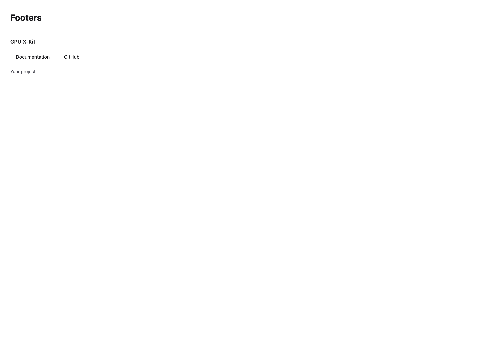

# Footers

[All components](index.md) · Marketing components · 营销组件

Public imports: `FooterSection` from `@mirai/gpuix-kit`.

[Behavior and host boundaries](../../packages/uikit/docs/catalog-completion.md) · [Runnable source](../../apps/gallery/src/examples/marketing-footers.tsx)




## Example

Render inside `UIKitProvider` and `AppShell`; see [quick start](../getting-started.md). State and service callbacks belong to your application.

```tsx
import { useState } from "react";
import * as UI from "@mirai/gpuix-kit";
// 状态由应用管理；接入时替换示例回调。
export default function Example() {
  const [value, setValue] = useState("");
  return (
    <UI.Stack>
      <UI.FooterSection
        testId="example"
        brand="GPUIX-Kit"
        links={[
          { id: "docs", label: "Documentation" },
          { id: "github", label: "GitHub" },
        ]}
        onNavigate={setValue}
        copyright="Your project"
      />
      <UI.Text>{value}</UI.Text>
    </UI.Stack>
  );
}
```

## Props

Generated from the shipped TypeScript API. For model types and supporting helpers see the [full API index](../api-index.md).

### FooterSection

[Implementation](../../packages/uikit/src/components/marketing/index.tsx)

| Prop | Required | Type | Description |
| --- | --- | --- | --- |
| brand | yes | `string` |  |
| links | yes | `readonly FooterLink[]` |  |
| copyright | no | `string \| undefined` |  |
| onNavigate | yes | `(id: string) => void` |  |
| testId | yes | `string` |  |
