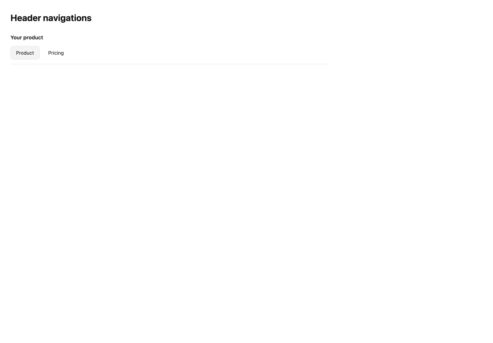

# Header navigations

[All components](index.md) · Marketing components · 营销组件

Public imports: `MarketingHeaderNavigation` from `@mirai/gpuix-kit`.

[Behavior and host boundaries](../../packages/uikit/docs/catalog-completion.md) · [Runnable source](../../apps/gallery/src/examples/marketing-header-navigations.tsx)




## Example

Render inside `UIKitProvider` and `AppShell`; see [quick start](../getting-started.md). State and service callbacks belong to your application.

```tsx
import { useState } from "react";
import * as UI from "@mirai/gpuix-kit";
// 状态由应用管理；接入时替换示例回调。
export default function Example() {
  const [value, setValue] = useState("product");
  return (
    <UI.MarketingHeaderNavigation
      testId="example"
      brand={<UI.Text weight={600}>Your product</UI.Text>}
      items={[
        { id: "product", label: "Product" },
        { id: "pricing", label: "Pricing" },
      ]}
      value={value}
      onValueChange={setValue}
    />
  );
}
```

## Props

Generated from the shipped TypeScript API. For model types and supporting helpers see the [full API index](../api-index.md).

### MarketingHeaderNavigation

[Implementation](../../packages/uikit/src/components/marketing/index.tsx)

| Prop | Required | Type | Description |
| --- | --- | --- | --- |
| brand | no | `ReactNode` |  |
| items | yes | `readonly HeaderNavigationItem[]` |  |
| value | yes | `string` |  |
| onValueChange | yes | `(id: string) => void` |  |
| actions | no | `ReactNode` |  |
| testId | yes | `string` |  |
