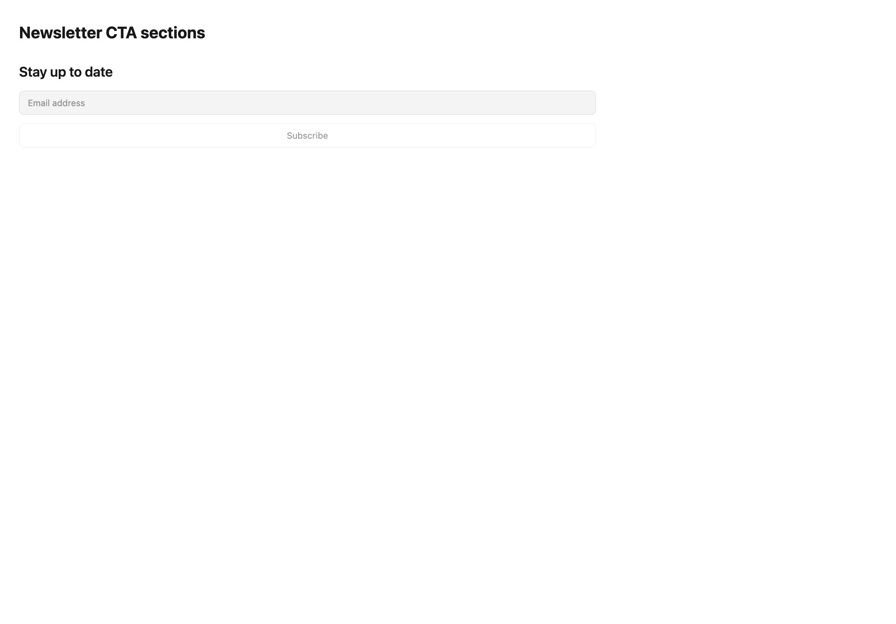
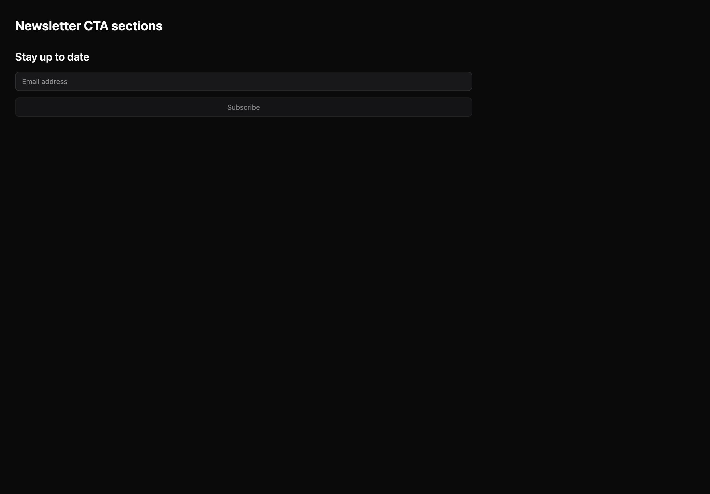

# Newsletter CTA sections

[All components](index.md) · Marketing components · 营销组件

Public imports: `NewsletterCTA` from `@mirai/gpuix-kit`.

[Behavior and host boundaries](../../packages/uikit/docs/catalog-completion.md) · [Runnable source](../../apps/gallery/src/examples/marketing-newsletter-cta-sections.tsx)





## Example

Render inside `UIKitProvider` and `AppShell`; see [quick start](../getting-started.md). State and service callbacks belong to your application.

```tsx
import { useState } from "react";
import * as UI from "@mirai/gpuix-kit";
// 状态由应用管理；接入时替换示例回调。
export default function Example() {
  const [value, setValue] = useState("");
  const [done, setDone] = useState(false);
  return (
    <UI.Stack>
      <UI.NewsletterCTA
        testId="example"
        value={value}
        onValueChange={setValue}
        onSubscribe={() => {
          setDone(true);
        }}
      />
      <UI.Text>
        {done
          ? "Demo submitted locally; connect your own subscription service."
          : ""}
      </UI.Text>
    </UI.Stack>
  );
}
```

## Props

Generated from the shipped TypeScript API. For model types and supporting helpers see the [full API index](../api-index.md).

### NewsletterCTA

[Implementation](../../packages/uikit/src/components/marketing/index.tsx)

| Prop | Required | Type | Description |
| --- | --- | --- | --- |
| value | yes | `string` |  |
| onValueChange | yes | `(value: string) => void` |  |
| onSubscribe | no | `((email: string) => void \| Promise<void>) \| undefined` |  |
| disabled | no | `boolean \| undefined` |  |
| testId | yes | `string` |  |
