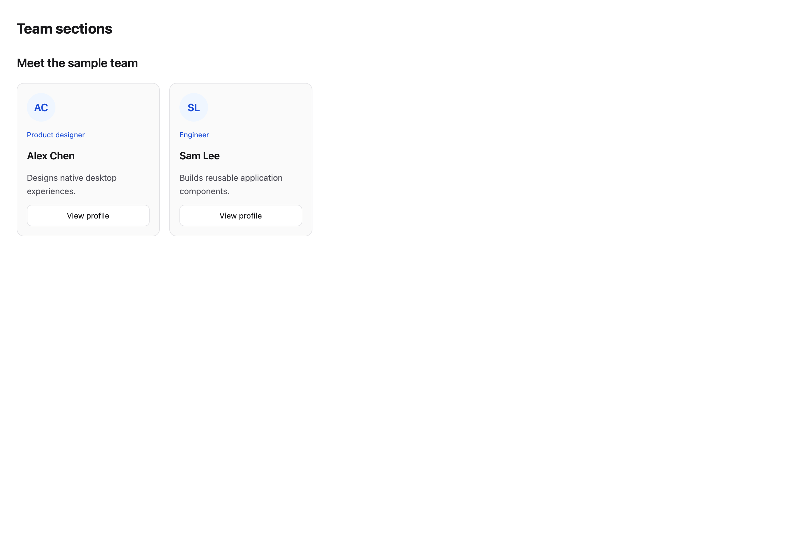
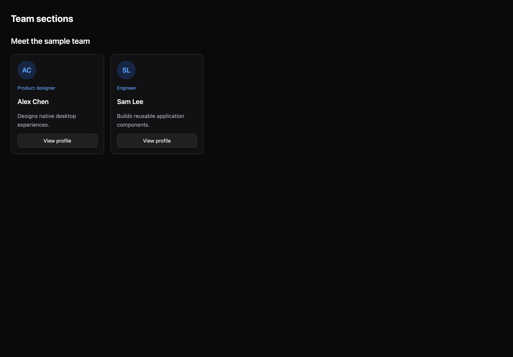

# Team sections

[All components](index.md) · Marketing components · 营销组件

Public imports: `TeamSection` from `@mirai/gpuix-kit`.

[Behavior and host boundaries](../../packages/uikit/docs/catalog-completion.md) · [Runnable source](../../apps/gallery/src/examples/marketing-team-sections.tsx)





## Example

Render inside `UIKitProvider` and `AppShell`; see [quick start](../getting-started.md). State and service callbacks belong to your application.

```tsx
import { useState } from "react";
import * as UI from "@mirai/gpuix-kit";
// 示例数据只说明界面结构；真实内容与操作由应用提供。
export default function Example() {
  const [selected, setSelected] = useState("");
  return (
    <UI.Stack>
      <UI.TeamSection
        testId="example"
        title="Meet the sample team"
        items={[
          {
            id: "alex",
            title: "Alex Chen",
            description: "Designs native desktop experiences.",
            meta: "Product designer",
            actionLabel: "View profile",
          },
          {
            id: "sam",
            title: "Sam Lee",
            description: "Builds reusable application components.",
            meta: "Engineer",
            actionLabel: "View profile",
          },
        ]}
        onAction={setSelected}
      />
      <UI.Text>{selected ? "Selected: " + selected : ""}</UI.Text>
    </UI.Stack>
  );
}
```

## Props

Generated from the shipped TypeScript API. For model types and supporting helpers see the [full API index](../api-index.md).

### TeamSection

[Implementation](../../packages/uikit/src/components/marketing/index.tsx)

| Prop | Required | Type | Description |
| --- | --- | --- | --- |
| title | yes | `string` |  |
| description | no | `string \| undefined` |  |
| items | no | `readonly SectionItem[] \| undefined` |  |
| actions | no | `ReactNode` |  |
| onAction | no | `((id: string) => void) \| undefined` |  |
| testId | yes | `string` |  |
